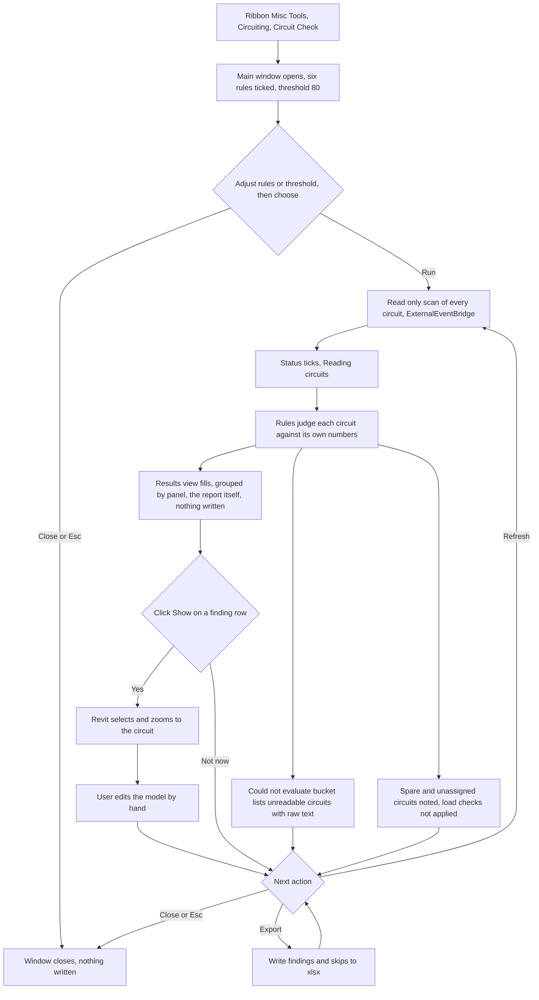

# Circuit Check — UI Mockup & Operation Diagrams

> Visual companion to handoff.md, which is authoritative. Mockups are ASCII wireframes; diagrams are Mermaid (rendered by GitHub).

## Window: Main

Before a run, all six rules are ticked and the threshold defaults to 80:

```
┌──────────────────────────────────────────────────────────────────────────────────────────────┐
│Circuit Check                                                                          _  □  X│
├──────────────────────────────────────────────────────────────────────────────────────────────┤
│ Circuit Check                                                                                │
│ Document: Willow Creek Hospital - Electrical.rvt                                             │
│                                                                                              │
│  ┌────────────────────────────────────────────────────────────────────────────────────────┐  │
│  │ Checks                                                                                 │  │
│  ├────────────────────────────────────────────────────────────────────────────────────────┤  │
│  │ 6 checks selected, 0 unchecked.                       [ Select All ]  [ Select None ]  │  │
│  │  ┌──────────────────────────────────────────────────────────────────────────────────┐  │  │
│  │  │ [x] Load over threshold of breaker rating                                        │  │  │
│  │  │ [x] Breaker rating over frame rating                                             │  │  │
│  │  │ [x] Breaker rating over panel main rating                                        │  │  │
│  │  │ [x] Poles inconsistent with voltage  (heuristic)                                 │  │  │
│  │  │ [x] Load name looks auto-generated  (heuristic)                                  │  │  │
│  │  │ [x] Circuit not assigned to a panel                                              │  │  │
│  │  └──────────────────────────────────────────────────────────────────────────────────┘  │  │
│  │                                                                                        │  │
│  │ Load threshold (%):  [ 80 ]                                                            │  │
│  └────────────────────────────────────────────────────────────────────────────────────────┘  │
│                                                                                              │
├──────────────────────────────────────────────────────────────────────────────────────────────┤
│ Ready. Nothing was changed.                              [   Run   ]  [ Export ]  [  Close  ]│
└──────────────────────────────────────────────────────────────────────────────────────────────┘
```

- Export stays disabled, not hidden, until a run has produced a report; its tooltip reads "Run a check first."
- While the scan runs the status line ticks progress, e.g. "Reading circuits… 180 of 214."
- Both heuristic rules carry a "(heuristic)" suffix on the label itself, matching how their findings are tagged later.

After Run, the body swaps to a read-only results view grouped by panel:

```
┌──────────────────────────────────────────────────────────────────────────────────────────────┐
│Circuit Check                                                                          _  □  X│
├──────────────────────────────────────────────────────────────────────────────────────────────┤
│ Circuit Check                                                                                │
│ Document: Willow Creek Hospital - Electrical.rvt                                             │
│                                                                                              │
│  ▾ Panel LP-2  (3 findings)                                                                  │
│    CHECK                PANEL  CKT#  LOAD NAME        READING        RULE                    │
│    Load over threshold  LP-2   12    RECEP RM 210     86% loaded     80% max    [Show]       │
│    Breaker vs main      LP-2   3,5,7 HVAC RTU-3       70A breaker    60A main   [Show]       │
│    Load name auto-gen   LP-2   9     SPARE1           SPARE1         heuristic  [Show]       │
│                                                                                              │
│  ▾ Panel DP-1  (2 findings)                                                                  │
│    CHECK                PANEL  CKT#  LOAD NAME        READING        RULE                    │
│    Poles vs voltage     DP-1   14    Motor MCC-2      3-pole         120V       [Show]       │
│    Circuit not on panel —      22    Roof RTU-5       no panel       n/a        [Show]       │
│                                                                                              │
│  ▸ Panel MDP  (6 findings)                                                                   │
│                                                                                              │
│  ▾ Could not evaluate  (3)                                                                   │
│    LP-2 / 7 — rating reads '—', not a number                                                 │
│    DP-1 / 2 — ApparentCurrent unavailable, mains parameter missing                           │
│    LP-2 / 16 — spare, load checks not applied                                                │
│                                                                                              │
├──────────────────────────────────────────────────────────────────────────────────────────────┤
│ 214 circuits checked — 11 findings, 3 not evaluable. Nothing was changed.                    │
│                                                          [ Refresh ]  [ Export ]  [  Close  ]│
└──────────────────────────────────────────────────────────────────────────────────────────────┘
```

- Expander open/closed state survives a Refresh; "Panel MDP" is shown collapsed here to illustrate that.
- The "Could not evaluate" bucket and any "spare" note are never counted as findings — they are named skips, kept apart from the 11 findings in the footer count.
- Run relabels to Refresh after the first pass; Close/Esc writes nothing whether pressed before or after a run.
- Every row's Show button selects and zooms to the circuit's elements through ExternalEventBridge; nothing else in this window touches the model.

## User operation flow


