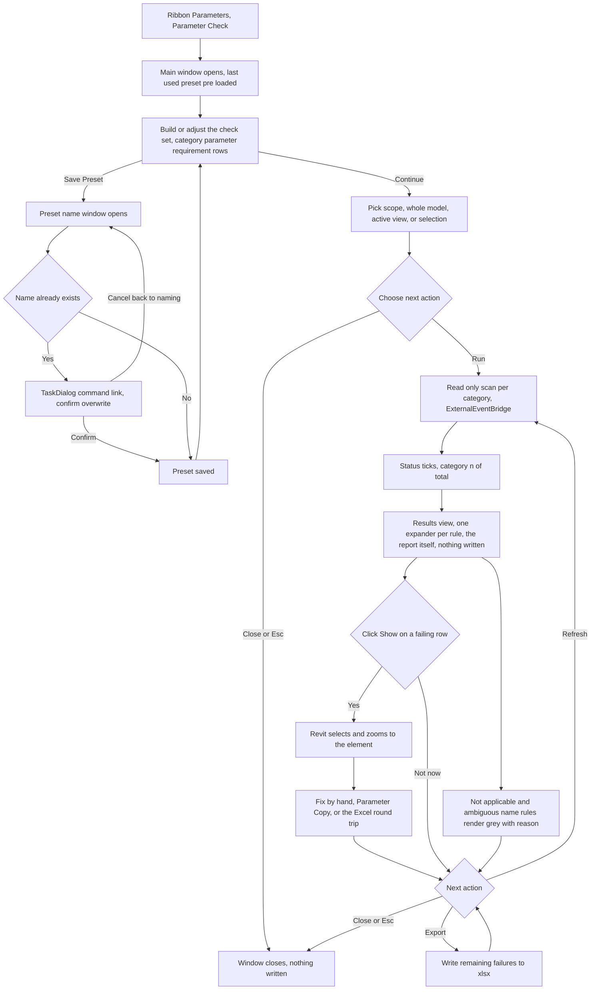

# Parameter Check — UI Mockup & Operation Diagrams

> Visual companion to handoff.md, which is authoritative. Mockups are ASCII wireframes; diagrams are Mermaid (rendered by GitHub).

## Window: Main

Before a run, the check set and scope sit side by side; the subtitle names both the document and the loaded preset:

```
┌────────────────────────────────────────────────────────────────────────────────────────────────┐
│Parameter Check                                                                          _  □  X│
├────────────────────────────────────────────────────────────────────────────────────────────────┤
│ Parameter Check                                                                                │
│ Document: Lakeside Office Tower.rvt   —   Preset: Issue for Construction                       │
│                                                                                                │
│  ┌────────────────────────────────────────────────────────────┐  ┌────────────────────────────┐│
│  │ Check set                [ Save Preset ]  [ Load Preset ]  │  │ Scope                      ││
│  ├────────────────────────────────────────────────────────────┤  ├────────────────────────────┤│
│  │  ┌──────────────────────────────────────────────────────┐  │  │ ( ) Whole model            ││
│  │  │ CATEGORY      PARAMETER      REQUIREMENT ALLOWED     │  │  │ ( ) Active view            ││
│  │  │ Doors         Fire Rating    Non-empty   —           │  │  │ (o) Current selection      ││
│  │  │ Doors         Level          Non-empty   —           │  │  │     342 elements selected  ││
│  │  │ Walls         Fire Rating    One of...   Edit (4)    │  │  │                            ││
│  │  └──────────────────────────────────────────────────────┘  │  │                            ││
│  │                                                            │  │                            ││
│  │ [ + Add Rule ]   [ Remove ]                                │  │                            ││
│  └────────────────────────────────────────────────────────────┘  └────────────────────────────┘│
│                                                                                                │
├────────────────────────────────────────────────────────────────────────────────────────────────┤
│ Ready. Nothing was changed.                                [   Run   ]  [ Export ]  [  Close  ]│
└────────────────────────────────────────────────────────────────────────────────────────────────┘
```

- An allowed-values cell (the "Edit (4)" row) opens into a small text area with its own "Paste from Excel…" button, not shown here.
- Current selection greys out, never hides, when nothing is selected in the model, with the reason in its tooltip — here 342 elements are selected so it renders enabled.
- Export stays disabled until a run has produced a report.

After Run, the body swaps to a read-only results view, one expander per rule:

```
┌────────────────────────────────────────────────────────────────────────────────────────────────┐
│Parameter Check                                                                          _  □  X│
├────────────────────────────────────────────────────────────────────────────────────────────────┤
│ Parameter Check                                                                                │
│ Document: Lakeside Office Tower.rvt   —   Preset: Issue for Construction                       │
│                                                                                                │
│  ▾ Doors — Fire Rating — non-empty   (23 failing)                                              │
│    CATEGORY FAMILY        TYPE         ID       HOLDS  WANTED                                  │
│    Doors    Single-Flush  36in x 84in  4521301  —      non-empty  [Show]                       │
│    Doors    Single-Flush  36in x 84in  4521355  —      non-empty  [Show]                       │
│                                                                                                │
│  ▾ Walls — Fire Rating — one of   (5 failing)                                                  │
│    CATEGORY FAMILY        TYPE         ID       HOLDS  WANTED                                  │
│    Walls    Basic Wall    2-hr Rated   3390221  1-HR   2HR or 3HR  [Show]                      │
│                                                                                                │
│  ▹ AWP Zone — not applicable — no parameter of that name on Walls                              │
│  ▹ Comments — ambiguous — two parameters share this name, see Parameter Audit                  │
│                                                                                                │
│  … 8 more rule expanders not shown …                                                           │
│                                                                                                │
├────────────────────────────────────────────────────────────────────────────────────────────────┤
│ 1,240 elements checked — 87 failing, 2 rules not applicable in this model.                     │
│                                                            [ Refresh ]  [ Export ]  [  Close  ]│
└────────────────────────────────────────────────────────────────────────────────────────────────┘
```

- Only 2 of the 12 rule expanders are expanded here for space; the rest collapse the same way and still count toward the footer totals.
- Grey single-line expanders (not applicable, ambiguous name) never count toward the failing total in the footer.
- While scanning, the status line reads "Scanning Mechanical Equipment… category 4 of 6."; an all-clear run instead reads "Nothing failing. 1,240 elements pass all 12 rules."

## Window: Preset Name

A small modal opens over the Main window when Save Preset is clicked:

```
┌────────────────────────────────────────────────────────┐
│Save Preset                                            X│
├────────────────────────────────────────────────────────┤
│ Preset name:                                           │
│ [ Issue for Construction______________ ]               │
│                                                        │
│ Presets carry category and parameter names only —      │
│ portable to any project.                               │
│                                                        │
├────────────────────────────────────────────────────────┤
│                                  [   OK   ]  [ Cancel ]│
└────────────────────────────────────────────────────────┘
```

- OK is IsDefault, Cancel is IsCancel; the hint line is the only explanation of what a preset actually carries.
- Saving under a name that already exists does not overwrite silently — it raises the native prompt below first.

Saving over an existing name raises Revit's own command-link prompt rather than a custom window:

```
┌────────────────────────────────────────────────────────────┐
│Parameter Check                                            X│
├────────────────────────────────────────────────────────────┤
│ A preset named 'Issue for Construction' already            │
│ exists.                                                    │
│                                                            │
│ > Overwrite the existing preset                            │
│ > Save with a different name                               │
│                                                            │
├────────────────────────────────────────────────────────────┤
│                                                  [ Cancel ]│
└────────────────────────────────────────────────────────────┘
```

- This is native TaskDialog chrome, not a custom EasyBIM window — the house rule of mimicking Revit's own dialogs where a precedent exists.
- "Save with a different name" returns to the Preset Name window with the text box still focused; Cancel abandons the save and returns to the Main window unchanged.

## User operation flow


