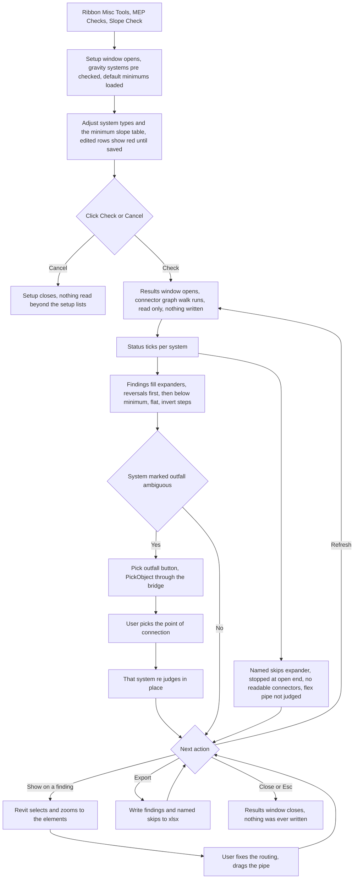

# Slope Check — UI Mockup & Operation Diagrams

> Visual companion to handoff.md, which is authoritative. Mockups are ASCII wireframes; diagrams are Mermaid (rendered by GitHub).

## Window: Setup

Gravity system types and the minimum-slope-by-diameter table sit side by side; nothing is read from the model until Check is pressed:

```
┌────────────────────────────────────────────────────────────────────────────────────────────────┐
│Slope Check                                                                              _  □  X│
├────────────────────────────────────────────────────────────────────────────────────────────────┤
│ Slope Check                                                                                    │
│ Document: Riverside Medical Center - Plumbing.rvt                                              │
│                                                                                                │
│  ┌────────────────────────────────────────────────┐  ┌────────────────────────────────────────┐│
│  │ Gravity systems                                │  │ Minimum slope      [ Save ]  [ Load ]  ││
│  ├────────────────────────────────────────────────┤  ├────────────────────────────────────────┤│
│  │ Search:  [                                    ]│  │ DIAMETER UP TO    MIN SLOPE            ││
│  │ 3 of 11 system types selected.                 │  │ < 3 in            1/4 in/ft            ││
│  │ [ Select All ]   [ Select None ]               │  │ 3 in to 6 in      1/8 in/ft            ││
│  │  ┌──────────────────────────────────────────┐  │  │ * > 6 in          1/16 in/ft           ││
│  │  │ [x] Sanitary                             │  │  │                                        ││
│  │  │ [x] Storm                                │  │  │ * edited since load — red until Save   ││
│  │  │ [x] Condensate                           │  │  │                                        ││
│  │  │ [ ] Sanitary Vent                        │  │  │                                        ││
│  │  │ [ ] Domestic Cold Water                  │  │  │                                        ││
│  │  └──────────────────────────────────────────┘  │  │                                        ││
│  │ + 6 more — scroll for full list                │  │                                        ││
│  └────────────────────────────────────────────────┘  └────────────────────────────────────────┘│
│                                                                                                │
├────────────────────────────────────────────────────────────────────────────────────────────────┤
│ Pumped mains left unchecked are excluded, and the report will say so.   [  Check  ]  [ Cancel ]│
└────────────────────────────────────────────────────────────────────────────────────────────────┘
```

- Rows in the Minimum slope grid render red as soon as they are edited; the leading * above marks that state since the wireframe cannot show colour. They turn black again only after Save.
- Sanitary, Storm, and Condensate are pre-checked as the built-in gravity classifications; any other system type must be ticked on by hand, and anything left unticked is footer-listed as excluded once the walk runs.
- Cancel here reads nothing beyond the two setup lists — the connector graph is never walked.

## Window: Results

A modeless, read-only table grouped by system, with one expander per finding kind:

```
┌────────────────────────────────────────────────────────────────────────────────────────────────┐
│Slope Check — Results                                                                    _  □  X│
├────────────────────────────────────────────────────────────────────────────────────────────────┤
│ Slope Check — Results                                                                          │
│ Document: Riverside Medical Center - Plumbing.rvt                                              │
│                                                                                                │
│  ▾ Reversals  (3)                                                                              │
│    SYSTEM  ELEMENT IDS      LEVEL MEASURED      REQUIRED                                       │
│    SAN 1   412200, 412204   L1    falls uphill  toward outfall   [Show]                        │
│                                                                                                │
│  ▾ Below minimum  (17)                                                                         │
│    SYSTEM  ELEMENT IDS      LEVEL MEASURED      REQUIRED                                       │
│    SAN 2   412310           L1    1/16 in/ft    1/4 in/ft   [Show]                             │
│                                                                                                │
│  ▸ Flat  (5)                                                                                   │
│  ▸ Invert steps  (2)                                                                           │
│                                                                                                │
│    SAN 3 — outfall ambiguous                                                   [ Pick outfall ]│
│                                                                                                │
│  ▾ Named skips                                                                                 │
│    SAN 2 — traversal stopped at open end at id 400123 — downstream not judged                  │
│    Fitting id 512907 — no readable connectors                                                  │
│                                                                                                │
├────────────────────────────────────────────────────────────────────────────────────────────────┤
│ Walked 41 runs; 2 stopped at open ends (listed). Nothing was changed.                          │
│                                                            [ Refresh ]  [ Export ]  [  Close  ]│
└────────────────────────────────────────────────────────────────────────────────────────────────┘
```

- Reversals, Below minimum, Flat, and Invert steps are each their own expander with an independent count; Flat and Invert steps are shown collapsed here only to save space.
- "SAN 3 — outfall ambiguous" carries its own Pick outfall button; clicking it prompts PickObject through the bridge and re-judges only that system in place.
- The session's outfall picks and every expander's open or closed state survive Refresh; only the underlying findings change.
- Named skips are listed by reason and are never counted as findings — a traversal that stops at an open end names Open Ends as the tool that resolves it.

## User operation flow


