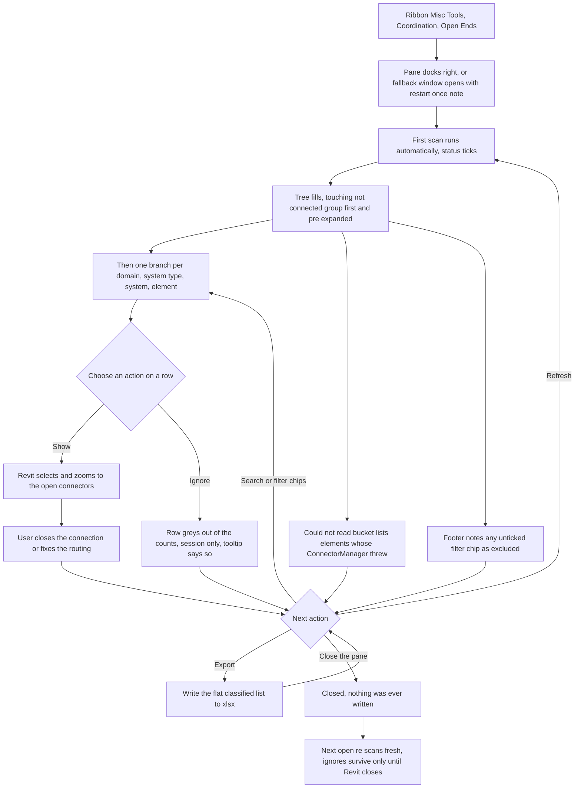

# Open Ends — UI Mockup & Operation Diagrams

> Visual companion to handoff.md, which is authoritative. Mockups are ASCII wireframes; diagrams are Mermaid (rendered by GitHub).

## Window: Open Ends Pane

A dockable pane, right by default, scanning the model as soon as it opens:

```
┌──────────────────────────────────────────────────────────────────────────────────────────┐
│Open Ends                                                                          _  □  X│
├──────────────────────────────────────────────────────────────────────────────────────────┤
│ Open Ends                                                                                │
│ Document: Harbor Point Data Center - MEP.rvt                                             │
│                                                                                          │
│ Search:  [ 12                                        ]                                   │
│ [x] Duct  [x] Pipe  [x] Cable Tray  [x] Conduit   [ ] Include electrical connectors      │
│ Touching tolerance:  [ 5 mm ]                                                            │
├──────────────────────────────────────────────────────────────────────────────────────────┤
│  ▾ Touching, not connected  (7)                                                          │
│      Duct  SA-1   AHU-3 discharge / VAV-12 inlet                          [Show] [Ignore]│
│      Pipe  SAN 2  Fitting 512907 / Fitting 512910                         [Show] [Ignore]│
│                                                                                          │
│  ▾ Duct                                                                                  │
│    ▾ Supply Air                                                                          │
│      ▾ SA-1                                                                              │
│          VAV-08 inlet — spare tap                                         [Show] [Ignore]│
│                                                                                          │
│  ▾ Pipe                                                                                  │
│    ▾ Sanitary                                                                            │
│      ▾ SAN 3                                                                             │
│          Cleanout CO-14                                                   [Show] [Ignore]│
│          could not read (2) — ids 550012, 550014                                         │
│                                                                                          │
│  ▸ Cable Tray  (12)                                                                      │
│  ▸ Conduit  (31)                                                                         │
│                                                                                          │
├──────────────────────────────────────────────────────────────────────────────────────────┤
│ Scanned 8,412 elements in 1.9 s — 63 open ends, 7 touching pairs. Electrical excluded.   │
│                                                                   [ Refresh ]  [ Export ]│
└──────────────────────────────────────────────────────────────────────────────────────────┘
```

- Docks to the right by default; if the pane cannot register this session, a modeless fallback window opens in its place with a restart-once note in its subtitle — not shown here.
- Ignore lasts only for the current Revit session; its tooltip says so, and the row simply greys out of the counts rather than disappearing.
- Electrical physical connectors are excluded by default (the "Include electrical connectors" chip above is unticked), which is why the footer names them excluded rather than silently omitting them.
- There is no Cancel or Close button in the footer — closing the pane itself is the whole cancel path, since nothing here is ever written.

## User operation flow


