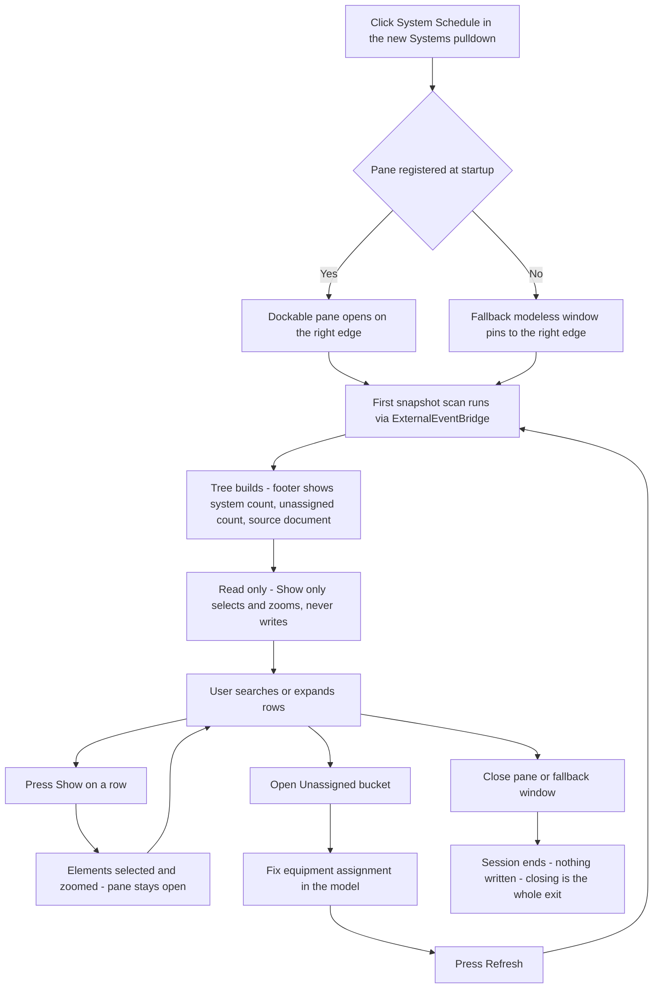

# System Schedule — UI Mockup & Operation Diagrams

> Visual companion to handoff.md, which is authoritative. Mockups are ASCII wireframes; diagrams are Mermaid (rendered by GitHub).

## Window: System Schedule pane

```
┌─ System Schedule ───────────────────────────────────────────────────── docked · right edge ┐
│ Search: [ AHU-3                    ]              [Expand All]  [Collapse All]  [Refresh] │
├───────────────────────────────────────────────────────────────────────────────────────────┤
│ Breadcrumb: AHU-3 › Supply Air 3 › VAV-214 › Supply Air 3B                                │
├───────────────────────────────────────────────────────────────────────────────────────────┤
│ ▾ AHU-1                                                                        [Show]     │
│   ▾ Supply Air 1 — 5,100 CFM                                                  [Show]      │
│       • Diffuser 02-101                                                        [Show]     │
│ ▾ AHU-3                                                                        [Show]     │
│   ▾ Supply Air 3 — 4,200 CFM                                                  [Show]      │
│     ▾ VAV-214                                                                  [Show]     │
│       ▾ Supply Air 3B — 380 CFM                                              [Show]       │
│           • Diffuser 03-114        no connectors readable                     [Show]      │
│ ▾ Pump P-1                                                                     [Show]     │
│   ▾ HW Supply 1 — 62 GPM, 4 fixture units                                    [Show]       │
│ ▾ Unassigned (4)                                                                          │
│       • Supply Air 14 — no equipment                                          [Show]      │
│       • Return Air 2 — no equipment                                           [Show]      │
├───────────────────────────────────────────────────────────────────────────────────────────┤
│ Scanned 62 systems, 4 unassigned. Search filters in place — selection survives.           │
│ Snapshot read from HOSP-M-Central.rvt. Refresh to re-read.                                │
└───────────────────────────────────────────────────────────────────────────────────────────┘
```

- Depth accents darken row by row toward the plant equipment at the root; the wireframe shows
  only indentation, not the color ramp.
- Row detail text — flow values, fixture units, and the "no connectors readable" subtitle —
  renders in DimGray in the real pane, not distinguishable from the tree glyphs here.
- The breadcrumb line tracks whatever row is currently selected; this wireframe freezes it on
  one example path.
- If dockable registration was missed at startup, this exact content opens instead as a modeless
  window pinned to the right edge, and the second footer line reads "Dockable registration
  missed — floating window pinned right. Restart Revit to dock."

## User operation flow


