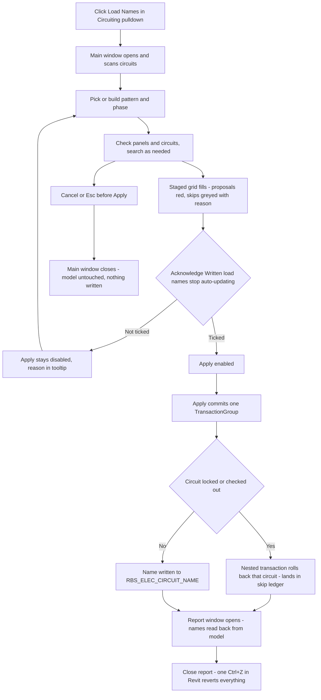

# Load Names — UI Mockup & Operation Diagrams

> Visual companion to handoff.md, which is authoritative. Mockups are ASCII wireframes; diagrams are Mermaid (rendered by GitHub).

## Window: Main window

```
┌─ Load Names ────────────────────────────────────────────────────────────────────────────────┐
│ Pattern                                    │ Panels & circuits                              │
│ ───────────────────────────────────────────┼─────────────────────────────────────────────── │
│ Preset: [ Office Standard        ▾]        │ 14 panels, 212 circuits —                      │
│ Insert: [panel][number][category]          │ 96 checked, 116 unchecked.                     │
│         [type][level][room]                │ [Select All]  [Select None]                    │
│ Phase:  [ 2 - New Construction   ▾]        │ Search: [ LP-2            ]                    │
│                                             │ ▾ LP-2                                         │
│ Example:                                   │   [x] Ckt 14  Duplex Receptacle x3             │
│ RECEPT — LEVEL 2 OFFICE 214                │   [x] Ckt 22  Duplex Receptacle x2             │
│                                             │   [ ] Ckt 31  Fire Alarm Device                │
│                                             │ ▾ RP-1                                         │
│                                             │   [x] Ckt 03  Motor - Exhaust Fan              │
├────────────────────────────────────────────────────────────────────────────────────────────┤
│ Panel   Ckt   Current Name                       New Name                                   │
│ LP-2    14    Duplex Receptacle, Duplex Rec...   *RECEPT — LEVEL 2 OFFICE 214               │
│ LP-2    22    Duplex Receptacle, Duplex Rec...   *RECEPT — LEVEL 2 OFFICE 212               │
│ LP-2    31    Duplex Receptacle                  skipped - spare/space circuit              │
├────────────────────────────────────────────────────────────────────────────────────────────┤
│ 96 renames staged, 41 skipped — 22 already named, 11 nothing to name from, 8 spare.         │
│                                              [x] Written load names stop auto-updating      │
│                                                                    [ Apply ]   [ Cancel ]   │
└────────────────────────────────────────────────────────────────────────────────────────────┘
```

- New Name cells prefixed with `*` are staged red until Apply; the skip row (Ckt 31) greys out
  instead, with its bucket named in place of a proposal.
- Apply stays disabled — never hidden — until "Written load names stop auto-updating" is
  ticked; hovering it explains why.
- The Example line re-evaluates live from the first checked circuit whenever the pattern, preset,
  or Phase ComboBox changes.
- Search on circuit numbers matches whole tokens only, so typing "12" would not also match "112".

## Window: Report window

```
┌─ Load Names — Report ────────────────────────────────────────────────────────────────────┐
│ Panel   Ckt   Name                                   Result                              │
│ LP-2    14    RECEPT — LEVEL 2 OFFICE 214            Written                             │
│ LP-2    22    RECEPT — LEVEL 2 OFFICE 212            Written                             │
│ LP-2    31    Duplex Receptacle                      Skipped - spare/space circuit       │
│ RP-1    03    Motor - Exhaust Fan                    Rolled back - checked out mid-apply │
├──────────────────────────────────────────────────────────────────────────────────────────┤
│ 94 written, 41 skipped, 2 rolled back — read back from the model.                        │
│                                                             [ Close ]                    │
└──────────────────────────────────────────────────────────────────────────────────────────┘
```

- Names shown here are read back from the committed model, not copied from the plan, so the
  table reflects what Revit actually stored.
- Skips are grouped under their named bucket; a rolled-back row (a refused nested transaction)
  is listed separately from a skip, never merged into the same count.
- This window is read-only WPF, never a stack of message boxes; the only affordance is Close —
  one Ctrl+Z in Revit reverts the whole batch.

## User operation flow


