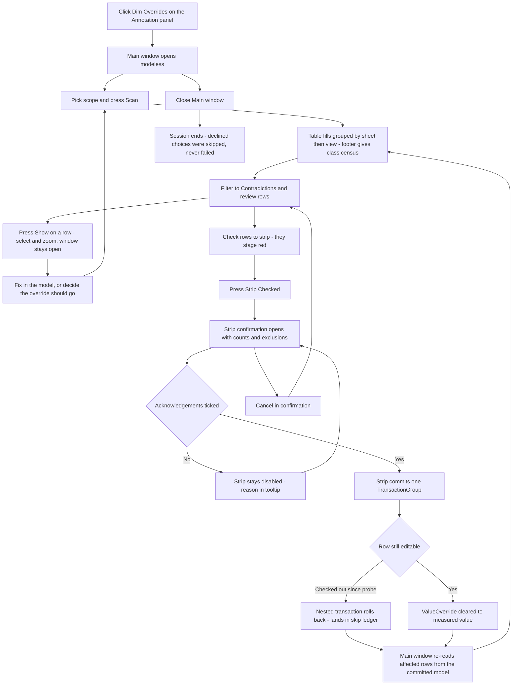

# Dim Overrides — UI Mockup & Operation Diagrams

> Visual companion to handoff.md, which is authoritative. Mockups are ASCII wireframes; diagrams are Mermaid (rendered by GitHub).

## Window: Main window

```
┌─ Dim Overrides ─────────────────────────────────────────────────────────────── modeless ┐
│ Scope: (o) Active view ( ) Print set ( ) Whole model   Print set: [ CD Set - Iss 3 ▾]  │
│                                                                             [ Scan ]   │
├────────────────────────────────────────────────────────────────────────────────────────┤
│ [x] Contradictions  [x] Text  [ ] Retypes  [ ] Affixes       Search: [            ]    │
├────────────────────────────────────────────────────────────────────────────────────────┤
│ Sheet / View                     Override      Measured        Class                   │
│ A-201  Level 2 - Dimension Plan                                                        │
│   [x] Dim 12'-0"                 12'-0"         11' 7-7/8"      *Contradiction  [Show] │
│   [ ] Dim VARIES                 VARIES         -               Text            [Show] │
│ A-204  Level 3 - Dimension Plan                                                        │
│   [ ] Dim 8'-6"                  8'-6"          8'-6"           Retype          [Show] │
│   [ ] Dim 4'-0" grouped          4'-0"          3' 11-1/2"      Contradiction   (grey) │
├────────────────────────────────────────────────────────────────────────────────────────┤
│ 214 overrides — 3 contradictions, 41 text, 158 retypes, 12 affixes.                    │
│ 6 skipped: 4 in groups, 2 owned by another user.                                       │
│                                                   [ Strip Checked... ]   [ Close ]     │
└────────────────────────────────────────────────────────────────────────────────────────┘
```

- Checked rows (like the 12'-0" contradiction) are marked with `*` and render red until Strip
  Checked commits; the grouped row greys out with "in a group — acknowledge in the confirmation
  to include" in its tooltip instead of a checkbox.
- Only length-bearing dimension shapes get a Class verdict of Retype or Contradiction; angular,
  radial, arc-length, spot, and ordinate rows would show "Text — not parsed" here instead of a
  guess.
- The Print set ComboBox enables only when Scope is Print set; for Active view or Whole model it
  greys out.
- Show zooms to the dimension via ExternalEvent without closing the window, so a fix made in the
  model mid-session is possible before the next Scan.

## Window: Strip confirmation window

```
┌─ Strip Checked Dimensions ──────────────────────────────────────┐
│ Counts of what will be stripped:                                │
│     Contradictions ............ 2                               │
│     Retypes ................. 10                                │
│ Excluded from this batch:                                       │
│     In a group, not acknowledged ... 4                          │
│     Owned by another user ......... 2                           │
├─────────────────────────────────────────────────────────────────┤
│ [ ] Stripping inside a group edits every instance of that group │
│ [ ] The typed text is discarded; the dimension returns to its   │
│     measured value                                              │
├─────────────────────────────────────────────────────────────────┤
│ 12 dimensions will be stripped — 2 contradictions, 10 retypes.  │
│ 4 group rows excluded.                                          │
│                               [ Strip ]   [ Cancel ]            │
└─────────────────────────────────────────────────────────────────┘
```

- Ticking the first checkbox only unlocks the 4 excluded group rows; Strip itself stays disabled
  — reason in tooltip — until the second checkbox is also ticked.
- This small modal sits over the modeless Main window; Cancel returns to the table with every
  stage intact and the model untouched.
- There is no separate report window for this tool — after commit, the Main window re-reads the
  stripped rows from the model and becomes the report in place.

## User operation flow


