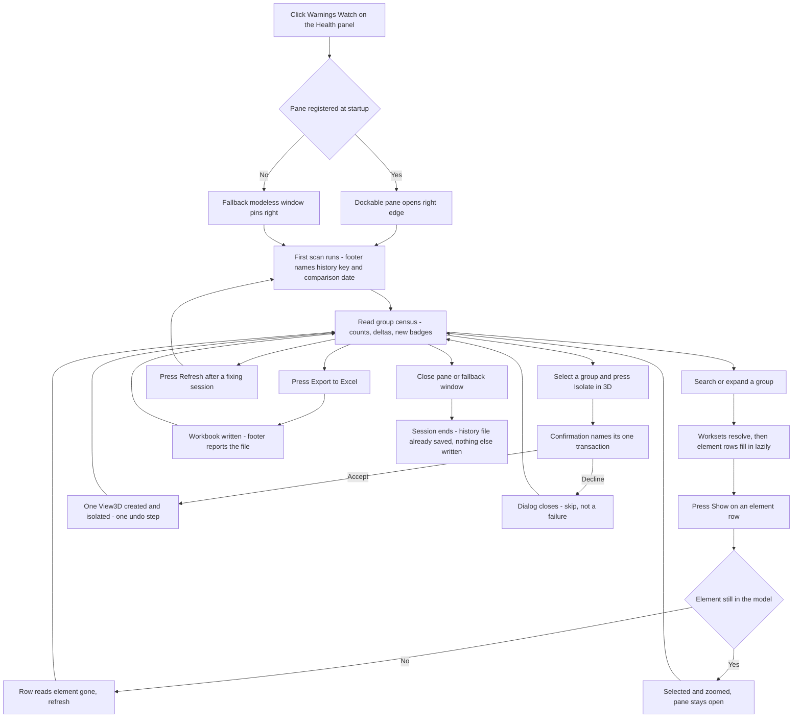
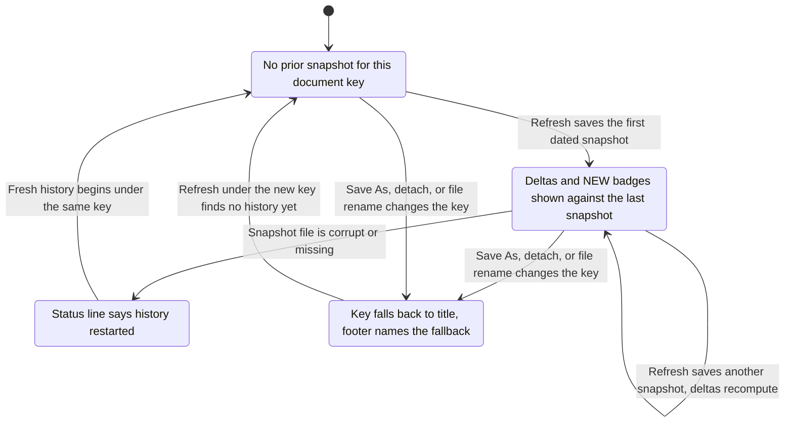

# Warnings Watch — UI Mockup & Operation Diagrams

> Visual companion to handoff.md, which is authoritative. Mockups are ASCII wireframes; diagrams are Mermaid (rendered by GitHub).

## Window: Warnings pane

```
┌─ Warnings Watch ─────────────────────────────────────────────── docked · right edge ┐
│ Search: [                      ]     [Refresh]  [Export to Excel]  [Isolate in 3D] │
├────────────────────────────────────────────────────────────────────────────────────┤
│ ! Identical instances — 412 (+38)                                                  │
│   ▾ Level 2 - Electrical (261)                                                     │
│       Duplex Receptacle   id 881204   jsmith / aleung                    [Show]    │
│       Duplex Receptacle   id 881205   jsmith / jsmith                    [Show]    │
│       ... 259 more — capped                                                        │
│   ▸ Level 3 - Electrical (151)                                                     │
│ ! Room not enclosed — 14 (+2)                                                      │
│   ▸ Level 1 - Architectural (14)                                                   │
│ ! Duplicate mark value — 6 (0)                                              NEW    │
│   ▸ Unassigned (6)                                                                 │
├────────────────────────────────────────────────────────────────────────────────────┤
│ 412 warnings in 9 groups. Snapshot saved — compared against Aug 18.                │
└────────────────────────────────────────────────────────────────────────────────────┘
```

- The `!` severity glyph and the NEW badge mark a group absent from the prior snapshot; the
  delta in parentheses goes negative once a fix is made and the model is refreshed.
- Creator and last-changed-by (shown here as `jsmith / aleung`) resolve lazily per expanded
  branch and appear only in workshared documents; a non-workshared model hides both columns
  entirely rather than showing them empty.
- Isolate in 3D stays disabled — reason in tooltip — until a group row is selected; nothing
  else in this pane ever writes to the model.
- Not shown: a missed pane registration opens this same content in a modeless window pinned
  right, and a detached model swaps the second footer line for "History keyed by title —
  detached model. Trend restarts if the file is renamed."

## Window: Isolate confirmation dialog

```
┌─ Warnings Watch ─────────────────────────────────────────────────────────┐
│ Isolate the Identical instances group in a new 3D view?                  │
│                                                                          │
│   ┌────────────────────────────────────────────────────────────────────┐ │
│   │ Create one 3D view isolating these 412 elements                    │ │
│   │ One transaction, one undo step.                                    │ │
│   └────────────────────────────────────────────────────────────────────┘ │
│                                                                          │
│   ┌────────────────────────────────────────────────────────────────────┐ │
│   │ Cancel                                                             │ │
│   └────────────────────────────────────────────────────────────────────┘ │
└──────────────────────────────────────────────────────────────────────────┘
```

- This is the tool's one loudly-named write path — a native TaskDialog with command links, not
  a checkbox dialog; every other action in Warnings Watch is read-only.
- The element count in the first command link comes from whichever group is currently selected,
  so the wording changes per group.
- Declining (closing the dialog, or picking Cancel) is a skip, not a failure — nothing happens
  without the click.

## User operation flow



## States and modes


