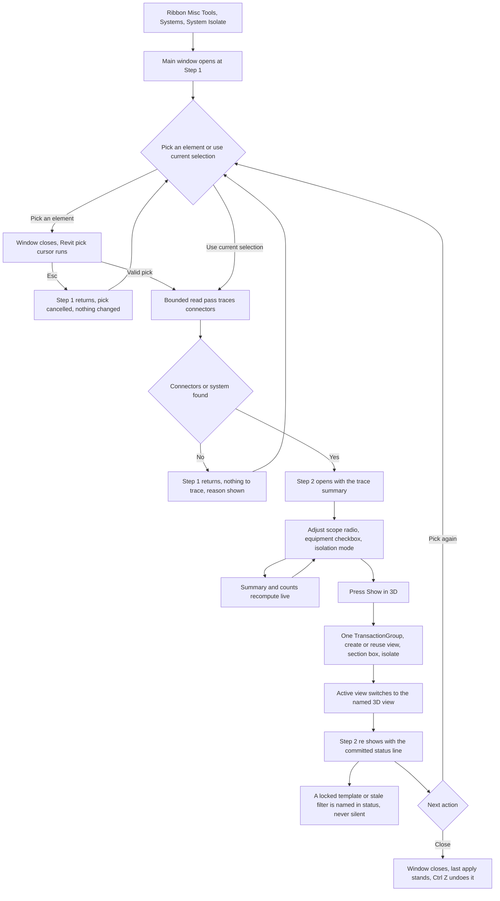

# System Isolate — UI Mockup & Operation Diagrams

> Visual companion to handoff.md, which is authoritative. Mockups are ASCII wireframes; diagrams are Mermaid (rendered by GitHub).

## Window: Main window (wizard)

Step 1 opens with the pick options; "Use current selection" only enables when something is already selected in the model:

```
┌────────────────────────────────────────────────────────────────────────────────────────┐
│System Isolate                                                                  _  □  X│
├────────────────────────────────────────────────────────────────────────────────────────┤
│ System Isolate                                                                         │
│ Trace a connected run from one pick and frame it in a named 3D view.                   │
│                                                                                         │
│  ┌─────────────────────────────────────────────────────────────────────────────────┐  │
│  │ Step 1 of 2 — Start the trace                                                    │  │
│  ├─────────────────────────────────────────────────────────────────────────────────┤  │
│  │                                                                                   │  │
│  │      >  Pick an element                                                          │  │
│  │                                                                                   │  │
│  │      >  Use current selection (3 elements)                                       │  │
│  │                                                                                   │  │
│  └─────────────────────────────────────────────────────────────────────────────────┘  │
│                                                                                         │
├────────────────────────────────────────────────────────────────────────────────────────┤
│ Pick a duct, pipe, fitting, or a piece of equipment.                           [Close]│
└────────────────────────────────────────────────────────────────────────────────────────┘
```

- Both options render as command links, matching Revit's own TaskDialog chrome; "Use current selection" greys out with "Nothing is selected" in its tooltip when the selection is empty.
- Esc during the pick cursor returns to this step with "Pick cancelled — nothing changed." in the footer; nothing was read or written.
- A pick with no readable connectors and no system does nothing and stays on this step, with the reason in the footer instead of a wider fallback ("Picked element has no MEP connectors and belongs to no system — nothing to trace.").

After a valid pick the window re-shows at Step 2 with the trace summary and live options; the frame below also shows the footer as it reads right after Show in 3D commits:

```
┌────────────────────────────────────────────────────────────────────────────────────────┐
│System Isolate                                                                  _  □  X│
├────────────────────────────────────────────────────────────────────────────────────────┤
│ System Isolate                                                                         │
│ Trace a connected run from one pick and frame it in a named 3D view.                   │
│                                                                                         │
│  ┌─────────────────────────────────────────────────────────────────────────────────┐  │
│  │ Step 2 of 2 — Trace summary                                                      │  │
│  ├─────────────────────────────────────────────────────────────────────────────────┤  │
│  │ 214 elements · 2 systems (SA-AHU-1, RA-AHU-1) · levels L1-L4 · stopped at 3      │  │
│  │ open ends.                                                                       │  │
│  │                                                                                   │  │
│  │  (o) Connected network (214)                                                     │  │
│  │  ( ) System membership: SA-AHU-1 (89)                                            │  │
│  │                                                                                   │  │
│  │  [ ] Trace through equipment                                                     │  │
│  │                                                                                   │  │
│  │  Isolation mode: [ Temporary isolate (this session only)             ▾]          │  │
│  │                                                                                   │  │
│  └─────────────────────────────────────────────────────────────────────────────────┘  │
│                                                                                         │
├────────────────────────────────────────────────────────────────────────────────────────┤
│ Traced 214 elements across 2 systems; view EB System - SA-AHU-1 updated.               │
│                                    [ Show in 3D ]    [ Pick again ]      [ Close ]     │
└────────────────────────────────────────────────────────────────────────────────────────┘
```

- The scope radio pair only appears when the pick carries one clean MEPSystem; otherwise only "Connected network" shows. Toggling "Trace through equipment" re-traces and every count on this card recomputes live.
- "View filter on System Name" in the Isolation mode list greys out with its reason in tooltip on cable tray, conduit, or a Revit generation missing the living filter constructor.
- Other footer lines this same step can show, none pictured above: "Section box spans 12 levels — expect a tall view.", "Trace truncated at 5000 elements — counts read 'at least'.", and a partial skip such as "View template 'MEP 3D' controls V/G — filter not applied; section box set."
- The window stays open after Show in 3D, ready for the next pick; one Ctrl+Z undoes the whole last apply (one TransactionGroup).

## User operation flow


