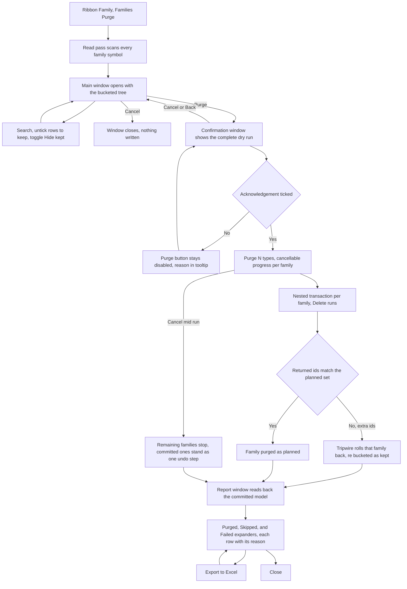

# Families Purge — UI Mockup & Operation Diagrams

> Visual companion to handoff.md, which is authoritative. Mockups are ASCII wireframes; diagrams are Mermaid (rendered by GitHub).

## Window: Main window

```
┌────────────────────────────────────────────────────────────────────────────────────────┐
│Families Purge                                                                  _  □  X│
├────────────────────────────────────────────────────────────────────────────────────────┤
│ Families Purge                                                                         │
│ Every unused type, with the reason it is safe — and every kept type, with the reason   │
│ it is not.                                                                             │
│                                                                                         │
│  ┌─────────────────────────────────────────────────────────────────────────────────┐  │
│  │ 214 purgeable — 198 selected, 16 unchecked.      [ Select All ]  [ Select None ]│  │
│  │ Search: [                        ]                                [ ] Hide kept │  │
│  ├─────────────────────────────────────────────────────────────────────────────────┤  │
│  │ ▾ Doors                                                                          │  │
│  │   ▾ Single-Flush                                                                 │  │
│  │      [x] 36in x 84in — 0 instances · 0 legends · not nested · no filter        │  │
│  │      [x] 32in x 84in — 0 instances · 0 legends · not nested · no filter        │  │
│  │      [ ] 30in x 84in — kept — 12 instances                          (grey)     │  │
│  │   ▾ Fire-Rated 90min                                                             │  │
│  │      [ ] 36in x 84in — kept — nested in Door-Frame-Assembly          (grey)     │  │
│  │ ▾ Generic Annotations                                                           │  │
│  │      [x] Symbols (Metric) — 0 instances · 0 legends · not nested · no filter   │  │
│  │      [ ] Room Tag Leader — kept — named by view filter Rooms No Tag  (grey)     │  │
│  └─────────────────────────────────────────────────────────────────────────────────┘  │
│                                                                                         │
├────────────────────────────────────────────────────────────────────────────────────────┤
│ 214 purgeable, 38 kept, 12 unknown — kept.                                             │
│                                  [ Purge... ]    [ Export to Excel ]     [ Cancel ]    │
└────────────────────────────────────────────────────────────────────────────────────────┘
```

- Kept rows sit greyed in place with their reason and are never hidden; "Hide kept" only filters them out of view at rebuild time, it does not change the bucket.
- **Purge...** stays disabled, with "Nothing is checked" in its tooltip, until at least one purgeable row is ticked.
- Search matches type names by substring; category and family branches auto-expand to show a match.
- The tree is the same category → family → type engine Circuit Schedule uses, so expand state and search text survive a rebuild.

## Window: Confirmation window

```
┌────────────────────────────────────────────────────────────────────────────────────────┐
│Confirm Purge                                                                        X│
├────────────────────────────────────────────────────────────────────────────────────────┤
│ Confirm Purge — 198 types across 61 families                                          │
│                                                                                         │
│  ┌─────────────────────────────────────────────────────────────────────────────────┐  │
│  │ ▾ Single-Flush (Doors)                                                           │  │
│  │      Delete type 36in x 84in — 0 uses found                                     │  │
│  │      Delete type 32in x 84in — 0 uses found                                     │  │
│  │      kept — 30in x 84in — 12 instances                                          │  │
│  │ ▾ Symbols (Metric) family (Generic Annotations)                                 │  │
│  │      Delete family Symbols (Metric) — all 4 types unused                        │  │
│  │      kept — Room Tag Leader — named by view filter Rooms No Tag                 │  │
│  │ ▾ Fire-Rated 90min (Doors)                                                       │  │
│  │      kept — 36in x 84in — nested in Door-Frame-Assembly                         │  │
│  └─────────────────────────────────────────────────────────────────────────────────┘  │
│                                                                                         │
│  [ ] I understand deleted types are recoverable only by Ctrl+Z in this session.        │
│                                                                                         │
├────────────────────────────────────────────────────────────────────────────────────────┤
│ 198 types across 61 families will be deleted; 38 kept, 12 unknown — kept.              │
│                                                 [ Purge 198 types ]      [ Cancel ]    │
└────────────────────────────────────────────────────────────────────────────────────────┘
```

- **Purge 198 types** (`IsDefault`) stays disabled until the acknowledgement checkbox is ticked; nothing else gates this window.
- Kept near-misses render inline for context right beside the deletions they sit next to, and never count toward the 198.
- **Cancel** here writes nothing — this is the complete dry run, so the plan itself is the gate; the model is untouched either way.

## Window: Report window

```
┌────────────────────────────────────────────────────────────────────────────────────────┐
│Families Purge — Report                                                              X│
├────────────────────────────────────────────────────────────────────────────────────────┤
│ Families Purge — Report                                                                │
│ Read back from the committed model.                                                    │
│                                                                                         │
│  ▾ Purged (196)                                                                         │
│      Doors / Single-Flush — 36in x 84in                                                │
│      Doors / Single-Flush — 32in x 84in                                                │
│      Generic Annotations — family Symbols (Metric) — all 4 types                       │
│  ▾ Skipped (52)                                                                         │
│      Doors / Single-Flush — 30in x 84in — unchecked by user                            │
│      Generic Annotations — Room Tag Leader — named by view filter Rooms No Tag         │
│  ▾ Failed (2)                                                                           │
│      Doors / Fire-Rated 90min — 34in x 84in — kept, deleting it would also delete 3    │
│        other elements                                                                  │
│      Walls / CMU 8in — rolled back: owned by user jsmith                               │
│                                                                                         │
├────────────────────────────────────────────────────────────────────────────────────────┤
│ 196 purged, 2 failed (rolled back), 52 kept. Model now holds 1,412 types.              │
│ 2 families became unused during this purge — run again to see them.                   │
│                                                 [ Export to Excel ]      [ Close ]     │
└────────────────────────────────────────────────────────────────────────────────────────┘
```

- Expander open/closed state survives Export and any rebuild; nothing here recollapses on its own.
- The Fire-Rated 90min row under Failed is the tripwire: `Delete` returned ids outside the planned set, so that family's nested transaction rolled back and it re-bucketed as kept, not as tool-caused damage.
- The checkout row (CMU 8in) carries Revit's own exception message verbatim, never paraphrased.
- The "2 families became unused" closing line only appears when the run's own deletions actually freed something; otherwise it is omitted.

## User operation flow


