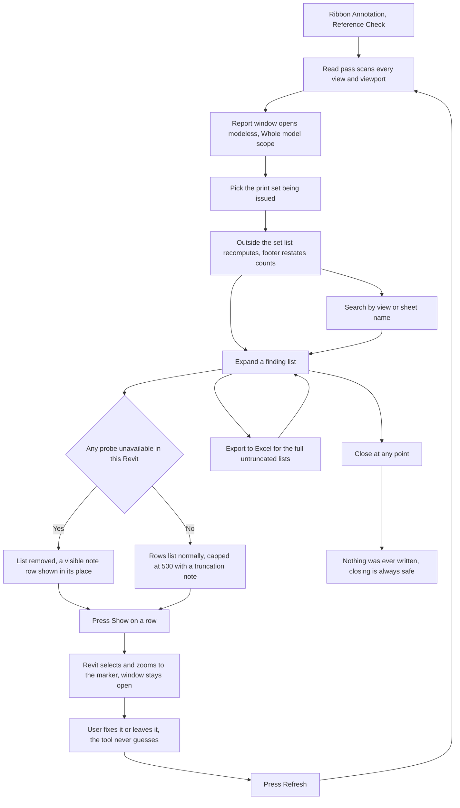

# Reference Check — UI Mockup & Operation Diagrams

> Visual companion to handoff.md, which is authoritative. Mockups are ASCII wireframes; diagrams are Mermaid (rendered by GitHub).

## Window: Report window (the only window)

```
┌────────────────────────────────────────────────────────────────────────────────────────┐
│Reference Check                                                                 _  □  X│
├────────────────────────────────────────────────────────────────────────────────────────┤
│ Reference Check                                                                        │
│ Every marker and reference that will not print a real number.                         │
│                                                                                         │
│ Print set: [ Print Set 90% CD                        ▾]                 [ Refresh ]  │
│ Search: [                              ]                                              │
├────────────────────────────────────────────────────────────────────────────────────────┤
│ ▾ Will print "?" (3)                                                                   │
│     Section A-A       — marker in FP-L2 Plan · target on no sheet          [Show]     │
│     Callout 5/A-402   — marker in RP-L3 Plan · target on no sheet          [Show]     │
│     Elevation 2/A-501 — marker in FP-L1 Plan · target on no sheet          [Show]     │
│ ▾ Points outside the print set (7)                                                     │
│     Callout 5/A-401 — target on sheet A-902, not in Print Set 90% CD       [Show]     │
│     Section B-B     — target on sheet A-910, not in Print Set 90% CD       [Show]     │
│ ▾ Unreferenced but on sheets (5)                                                       │
│     Detail 7/A-503   — on sheet, referenced by nothing.                    [Show]     │
│     Drafting - Roof Curb — on sheet, referenced by nothing.                [Show]     │
├────────────────────────────────────────────────────────────────────────────────────────┤
│ 3 will print ?, 7 point outside Print Set 90% CD, 5 views on sheets never referenced.  │
│                                              [ Export to Excel ]         [ Close ]    │
└────────────────────────────────────────────────────────────────────────────────────────┘
```

- "Unreferenced but on sheets" renders with informational styling only — no red, no warning glyph — and never shares a counter with the two real-defect lists above it.
- A probe that fails removes its whole list and replaces it with a visible note row instead, e.g. "Reference elevations unavailable in this Revit — list removed." in place of that expander's rows — never a silently shorter list claiming a clean model (not pictured above, since all three probes are healthy here).
- Search filters by view and sheet name substring; identifiers match by token, so "12" does not match "112".
- Scope defaults to "Whole model", which skips the outside-the-print-set test entirely since there is no set to be outside of; a truncated list instead reads "Will print ? truncated at 500 rows — export to Excel for all 612." in the footer.

## User operation flow


