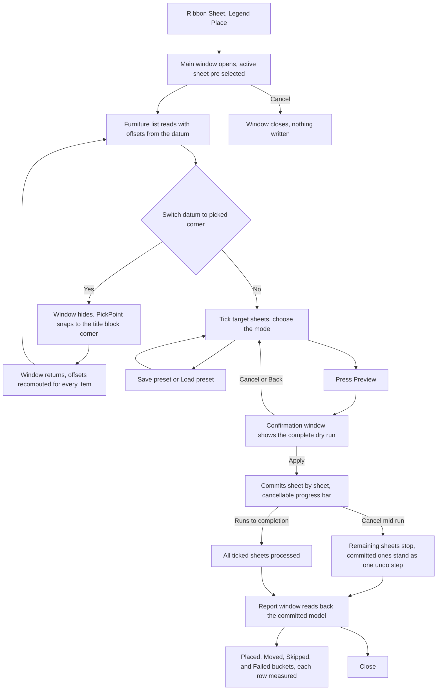

# Legend Place — UI Mockup & Operation Diagrams

> Visual companion to handoff.md, which is authoritative. Mockups are ASCII wireframes; diagrams are Mermaid (rendered by GitHub).

## Window: Main window

```
┌────────────────────────────────────────────────────────────────────────────────────────┐
│Legend Place                                                                    _  □  X│
├────────────────────────────────────────────────────────────────────────────────────────┤
│ Legend Place                                                                           │
│ Put the same legends and schedules on every sheet, in the same place.                 │
│                                                                                         │
│ Reference sheet: [ A-101 - Symbols and Abbreviations ▾]   Datum: [ Title block origin ▾]│
│                                                                                         │
│  ┌───────────────────────────────────────────────┐  ┌────────────────────────────────┐│
│  │ Furniture on A-101                             │  │ Target sheets                  ││
│  │ 3 selected, 1 unchecked.  [Select All] [None]  │  │ 58 selected, 4 unchecked.       ││
│  │                                                 │  │ Search: [ A-1 ] [All] [None]   ││
│  │ [x] Legend: General Notes                      │  │ [x] A-102 - Life Safety Plan    ││
│  │      12.5, 261.0 mm from datum                 │  │ [x] A-103 - Demolition Plan     ││
│  │ [x] Legend: Symbols                            │  │ [ ] A-104 - Site Plan (no       ││
│  │      12.5, 340.0 mm from datum                 │  │     title block)                ││
│  │ [x] Schedule: Door Schedule                    │  │ [x] A-105 - Enlarged Plans      ││
│  │      210.0, 12.0 mm from datum                 │  │                                 ││
│  │ [ ] Schedule: Abbreviations                    │  │                                 ││
│  │      12.5, 420.0 mm from datum                 │  │                                 ││
│  └───────────────────────────────────────────────┘  └────────────────────────────────┘│
│                                                                                         │
│  (o) Place missing only        ( ) Place and re-align existing                        │
├────────────────────────────────────────────────────────────────────────────────────────┤
│ 58 sheets ticked; 4 items from A-101.                                                  │
│              [ Preview... ]  [ Save preset ]  [ Load preset ]         [ Cancel ]      │
└────────────────────────────────────────────────────────────────────────────────────────┘
```

- The unchecked Abbreviations row and the greyed A-104 target are both named skips shown before Preview even runs: a schedule the datum cannot anchor, or one a user chose to leave out, are refused rather than guessed.
- Switching the datum to "Picked corner of title block…" hides the window for a `PickPoint` hop, then returns with every furniture row's offset recomputed against the new corner.
- **Preview…** stays disabled, reason in tooltip, until at least one furniture item and one target sheet are ticked.
- After a preset load the footer names anything the model lacks instead of dropping it silently, e.g. "Preset 'Office A1 furniture' loaded — not in this model: Legend 'Symbols (Metric)'."

## Window: Confirmation window

```
┌────────────────────────────────────────────────────────────────────────────────────────┐
│Confirm Legend Place                                                                 X│
├────────────────────────────────────────────────────────────────────────────────────────┤
│ Confirm Legend Place — the complete dry run                                           │
│                                                                                         │
│  ▾ Create (112)                                                                         │
│      A-102: Legend General Notes — create at 12.5, 261.0 mm from datum                │
│      A-102: Schedule Door Schedule — create at 210.0, 12.0 mm from datum              │
│  ▾ Move (40)                                                                            │
│      A-104: General Notes — move 12.3 mm                                              │
│      A-107: Door Schedule — move 4.1 mm                                               │
│  ▾ Already in place (6)                                                                 │
│      A-103: Symbols — within 0.25 mm tolerance                                         │
│  ▾ Skipped (2)                                                                          │
│      A-902: no title block                                                             │
│      A-905: two title blocks — datum ambiguous                                         │
│                                                                                         │
├────────────────────────────────────────────────────────────────────────────────────────┤
│ 58 sheets — 112 placed, 40 moved, 6 already in place, 2 skipped (no title block).      │
│                                        [ Apply ]        [ Back ]        [ Cancel ]     │
└────────────────────────────────────────────────────────────────────────────────────────┘
```

- Every skip names its reason inline — no title block, two title blocks, datum ambiguous — never a silent drop.
- No acknowledgement checkbox: nothing in this run deletes anything, so the plan itself, shown complete before any write, is the gate.
- **Back** returns to the Main window with every tick and the mode choice intact; **Cancel** and **Back** both leave the model untouched.

## Window: Report window

```
┌────────────────────────────────────────────────────────────────────────────────────────┐
│Legend Place — Report                                                                X│
├────────────────────────────────────────────────────────────────────────────────────────┤
│ Legend Place — Report                                                                  │
│ Read back from the committed model.                                                    │
│                                                                                         │
│  ▾ Placed (111)                                                                         │
│      A-102: Legend General Notes — placed, residual 0.0 mm                            │
│      A-102: Schedule Door Schedule — placed, residual 0.1 mm                          │
│  ▾ Moved (40)                                                                           │
│      A-104: General Notes — in place, residual 0.0 mm                                 │
│  ▾ Failed (1)                                                                           │
│      A-106: Door Schedule — rolled back: owned by user jsmith                         │
│  ▾ Skipped (8)                                                                          │
│      A-902: skipped — no title block                                                  │
│                                                                                         │
├────────────────────────────────────────────────────────────────────────────────────────┤
│ 111 placed, 40 moved, 1 failed (rolled back), 8 skipped. One undo step.                │
│                                                                          [ Close ]     │
└────────────────────────────────────────────────────────────────────────────────────────┘
```

- Every count here is measured after commit, never carried over from the plan — "placed" and "in place" both carry a residual distance, so the report never claims a placement the model does not actually show.
- The one failed sheet rolled back as a whole under its own nested transaction; every other sheet's work stands as part of the same one undo step.
- **Close** is the only button; this tool has no Excel round-trip.

## User operation flow


