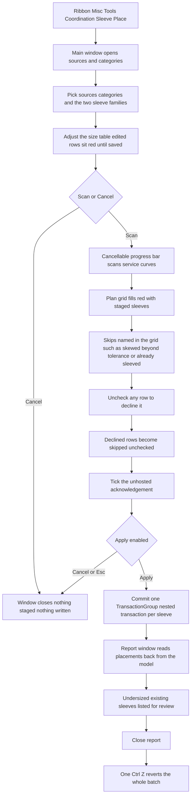

# Sleeve Place — UI Mockup & Operation Diagrams

> Visual companion to handoff.md, which is authoritative. Mockups are ASCII wireframes; diagrams are Mermaid (rendered by GitHub).

## Window: Main window

```
┌────────────────────────────────────────────────────────────────────────────────────────────────┐
│ Sleeve Place                                                                                   │
│ Sleeves are placed unhosted in this model. Nested links cannot be reached.                     │
├────────────────────────────────────────────────────────────────────────────────────────────────┤
│ ┌────────────────────────────────────────────┐  ┌────────────────────────────────────────────┐ │
│ │ Structural sources                         │  │ Services & sizing                          │ │
│ ├────────────────────────────────────────────┤  ├────────────────────────────────────────────┤ │
│ │ 3 of 5 sources selected.                   │  │ [x] Pipe [x] Duct [x] Conduit [ ] Tray     │ │
│ │ [Select All]  [Select None]                │  │                                            │ │
│ │ Search: [__________]                       │  │ Round sleeve...   Sleeve-Round : 150mm     │ │
│ │                                            │  │ Rect opening...   Sleeve-Rect : 300x150mm  │ │
│ │ [x] Host model                             │  │                                            │ │
│ │ [x] Struct-Podium.rvt                      │  │ Diameter -> Diameter    Width  -> Width    │ │
│ │ [x] Struct-Roof.rvt                        │  │ Height   -> Height      Length -> Length   │ │
│ │ [ ] Struct-Annex.rvt  (unloaded)           │  │ Stamp Service -> Comments                  │ │
│ │ [ ] Site-Civil.rvt    (unloaded)           │  │ Stamp Size    -> Comments 2                │ │
│ │                                            │  │                                            │ │
│ │                                            │  │ Size table    Clear  Round  Proj.          │ │
│ │                                            │  │ 0-100mm     +20mm  10mm   50mm             │ │
│ │                                            │  │ 101-250mm   +30mm  25mm   75mm *           │ │
│ │                                            │  │ 251mm+      +40mm  25mm  100mm             │ │
│ └────────────────────────────────────────────┘  └────────────────────────────────────────────┘ │
├────────────────────────────────────────────────────────────────────────────────────────────────┤
│ Level Host                Service         Size       Skew   Status                             │
│ L2    Host model          PIPE CHW-S 3in  RND 4in    0deg   STAGED *                           │
│ L2    Struct-Podium.rvt   DUCT SA 24x12   RECT 27x15 0deg   STAGED *                           │
│ L3    Struct-Roof.rvt     COND EMT 2in    RND 3in    27deg  skewed 27 - place by hand          │
│ [ ] Hide Un-checked                                                                            │
├────────────────────────────────────────────────────────────────────────────────────────────────┤
│ Scanned 1,240 service curves against 3 links -- 96 sleeves staged, 12 skipped (named in the    │
│ grid).                                                                                         │
│ [x] Sleeves are unhosted: they stay when a service moves or a link reloads.                    │
│     Re-run to re-check.                                                                        │
│                                                                                                │
│                                                             [ Scan ]  [ Apply ]  [ Cancel ]    │
└────────────────────────────────────────────────────────────────────────────────────────────────┘
```

- Rows marked `STAGED *` render solid red until **Apply**; the skewed-pipe row renders grey instead, with its reason written inline rather than in a separate legend.
- The size-table row marked `*` is red because it was edited since the table was last loaded — a different red than the plan grid's, and it clears on **Save**, which targets this computer, this model, or a shared folder (only the current selection shows in the row).
- `Struct-Annex.rvt` and `Site-Civil.rvt` are greyed with "unloaded" in a tooltip, never hidden from the source list.
- **Apply** stays disabled — never hidden — until both families map to their parameters cleanly and the acknowledgement checkbox is ticked; the tooltip on the disabled button names whichever condition is still unmet.

## Window: Report window

```
┌────────────────────────────────────────────────────────────────────────────────────────────────┐
│ Sleeve Place - Report                                                                          │
│ Read only. Read back from the committed model, not from the plan.                              │
├────────────────────────────────────────────────────────────────────────────────────────────────┤
│ Sleeve                       Level  Size         Result                                        │
│ PIPE CHW-S 3in (id 512907)   L2     RND 4in      Placed                                        │
│ DUCT SA 24x12 (id 512944)    L2     RECT 27x15   Placed                                        │
│ COND EMT 2in                 L3     --           Skipped - skewed 27, place by hand            │
│ PIPE SAN 3in                 L1     --           Rolled back - creation failed                 │
│                                                                                                │
│ > Existing sleeves undersized (3) - review, not moved                                          │
├────────────────────────────────────────────────────────────────────────────────────────────────┤
│ 94 placed, 12 skipped, 2 rolled back -- read back from the model. One undo step.               │
│                                                                                                │
│                                                                                 [ Close ]      │
└────────────────────────────────────────────────────────────────────────────────────────────────┘
```

- Every row is read back from the committed model, never from the plan — a Placed row shows the id Revit actually assigned.
- "Existing sleeves undersized" is its own review list, not mixed into the placement table, because those sleeves were never moved or resized.
- Rolled-back rows are listed apart from ordinary skips, and their counters are zeroed so the report never claims work that is gone.

## User operation flow



