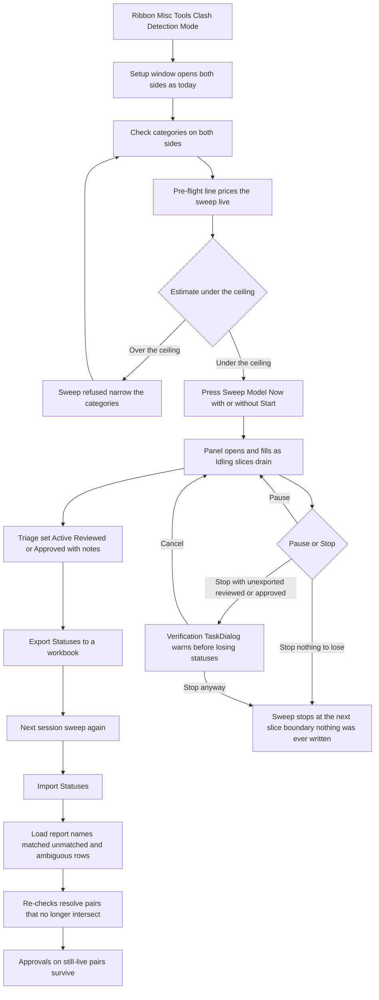
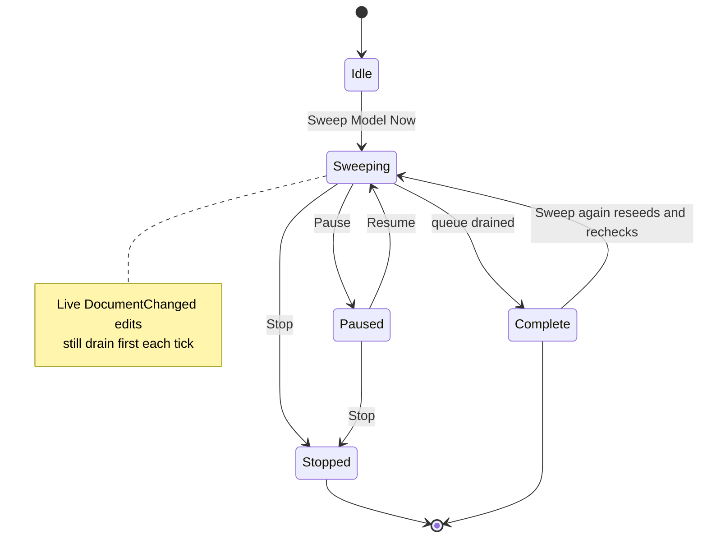

# Clash Sweep — UI Mockup & Operation Diagrams

> Visual companion to handoff.md, which is authoritative. Mockups are ASCII wireframes; diagrams are Mermaid (rendered by GitHub).

## Window: Setup window (existing, grown)

*The Interference-Check-shaped window Clash Detection Mode already ships; this adds one button and one status line.*

```
┌────────────────────────────────────────────────────────────────────────────────────────────────┐
│ Clash Detection Mode - Setup                                                                   │
│ Live mode is forward-only. Sweep Model Now adds a one-time whole-model pass.                   │
├────────────────────────────────────────────────────────────────────────────────────────────────┤
│ ┌────────────────────────────────────────────┐  ┌────────────────────────────────────────────┐ │
│ │ Side A - this model                        │  │ Side B - links & categories                │ │
│ ├────────────────────────────────────────────┤  ├────────────────────────────────────────────┤ │
│ │ [x] Mechanical Equipment                   │  │ [x] Struct-Podium.rvt                      │ │
│ │ [x] Ducts                                  │  │     [x] Structural Framing                 │ │
│ │ [x] Pipes                                  │  │     [x] Structural Columns                 │ │
│ │ [ ] Cable Tray                             │  │ [ ] Struct-Roof.rvt                        │ │
│ └────────────────────────────────────────────┘  └────────────────────────────────────────────┘ │
├────────────────────────────────────────────────────────────────────────────────────────────────┤
│ ≈ 41,000 candidate pairs -- estimated 2-4 min in the background.                               │
│                                                                                                │
│                               [ Sweep Model Now ]      [ Start ]      [ Cancel ]               │
└────────────────────────────────────────────────────────────────────────────────────────────────┘
```

- **Sweep Model Now** is disabled — never hidden — until both sides validate; the reason sits in its tooltip.
- The pre-flight line is DimGray and updates live as categories are checked; past the ceiling it swaps to a refusal: "beyond the sweep ceiling — narrow the categories; Everything vs Everything is a Navisworks job."
- Nested categories under a link (Structural Framing, Structural Columns) grey out together if their parent link checkbox is unchecked.

## Window: Clash panel (existing dockable pane, grown)

*Same dockable panel Clash Detection Mode already docks to the right edge (modeless right-edge window fallback unchanged); grown with two columns and two toolbar buttons.*

```
┌──────────────────────────────────────────────────────────────────────────────────────┐
│ Clash Detection - Results   (dockable panel)                                         │
│ Statuses are not written to the model.                                               │
├──────────────────────────────────────────────────────────────────────────────────────┤
│ [ Pause ]  [ Stop ]                    [ Export Statuses ]  [ Import Statuses ]      │
├──────────────────────────────────────────────────────────────────────────────────────┤
│ Pair                               Level Origin        Status                        │
│ SAN Riser 4in vs W14x30 beam       L3    pre-existing  Active   v                    │
│    note: RFI 204 - awaiting structural review                                        │
│ CHW Supply vs Beam B-12            L2    live          Approved v                    │
│ Sprinkler Main vs Duct SA-6        L1    pre-existing  Reviewed v                    │
│                                                                                      │
│ > Named skips (2 links unloaded)                                                     │
├──────────────────────────────────────────────────────────────────────────────────────┤
│ Sweep: 12,400 of 38,000 checked -- 214 clashes so far. Revit stays usable.           │
└──────────────────────────────────────────────────────────────────────────────────────┘
```

- The Status ComboBox per row is Active, Reviewed, or Approved; changing it updates the note line beneath the row without rebuilding the list.
- The footer status line above is what shows **during** a sweep, ticking per Idling slice; once drained it reads "Sweep complete: 38,000 checked, 291 pre-existing clashes recorded, 2 links skipped (unloaded — named)."
- Origin (`pre-existing` / `live`) is a plain column, not a color — a sweep hit and a live `DocumentChanged` hit look the same otherwise.
- **Export Statuses** and **Import Statuses** open no dialog beyond the file picker; results of an import land in the Load report window below.

## Window: Load report window

```
┌────────────────────────────────────────────────────────────────────────────────────────────┐
│ Clash Sweep - Import Statuses                                                              │
├────────────────────────────────────────────────────────────────────────────────────────────┤
│ Pair                           Applied    Note                                             │
│ SAN Riser 4in vs W14x30        Approved   matched                                          │
│ CHW Supply vs Beam B-9         --         unmatched - renamed since export?                │
│ Duct SA-6 vs Beam B-4          --         ambiguous - 2 candidates, applied to neither     │
├────────────────────────────────────────────────────────────────────────────────────────────┤
│ Matched 96 -- 4 unmatched (renamed since export?), 2 ambiguous (applied to neither,        │
│ listed).                                                                                   │
│                                                                                            │
│                                                                             [ Close ]      │
└────────────────────────────────────────────────────────────────────────────────────────────┘
```

- Matched rows show the status they received; unmatched and ambiguous rows are named buckets, never silently dropped.
- An ambiguous row is applied to neither candidate — guessing is worse than asking — and both candidate names appear so the collision is diagnosable.

## Window: Stop prompt

*Native-style TaskDialog with command links and a verification checkbox, in the house's overwrite-prompt shape — appears only when Stop would lose non-Active statuses.*

```
┌────────────────────────────────────────────────────────────────────────┐
│ Clash Detection Mode                                                   │
├────────────────────────────────────────────────────────────────────────┤
│ 14 reviewed/approved statuses are not exported. Stop anyway?           │
│                                                                        │
│ [ Export then Stop ]                                                   │
│ [ Stop without exporting ]                                             │
│ [ Cancel ]                                                             │
│                                                                        │
│ [ ] I understand: unexported statuses will be lost                     │
└────────────────────────────────────────────────────────────────────────┘
```

- This prompt only appears when Reviewed or Approved statuses are not yet exported; stopping with everything Active or already exported skips straight through with nothing to warn about.
- Nothing is ever written to the model by this tool, so there is never an undo step to offer here — only the export decision.

## User operation flow



## States and modes

*Clash Sweep is the one idea in this batch with a real running session: the seed pass drains through bounded Idling slices alongside the live forward-only mode, and can be paused, stopped, or re-run without losing triage.*



