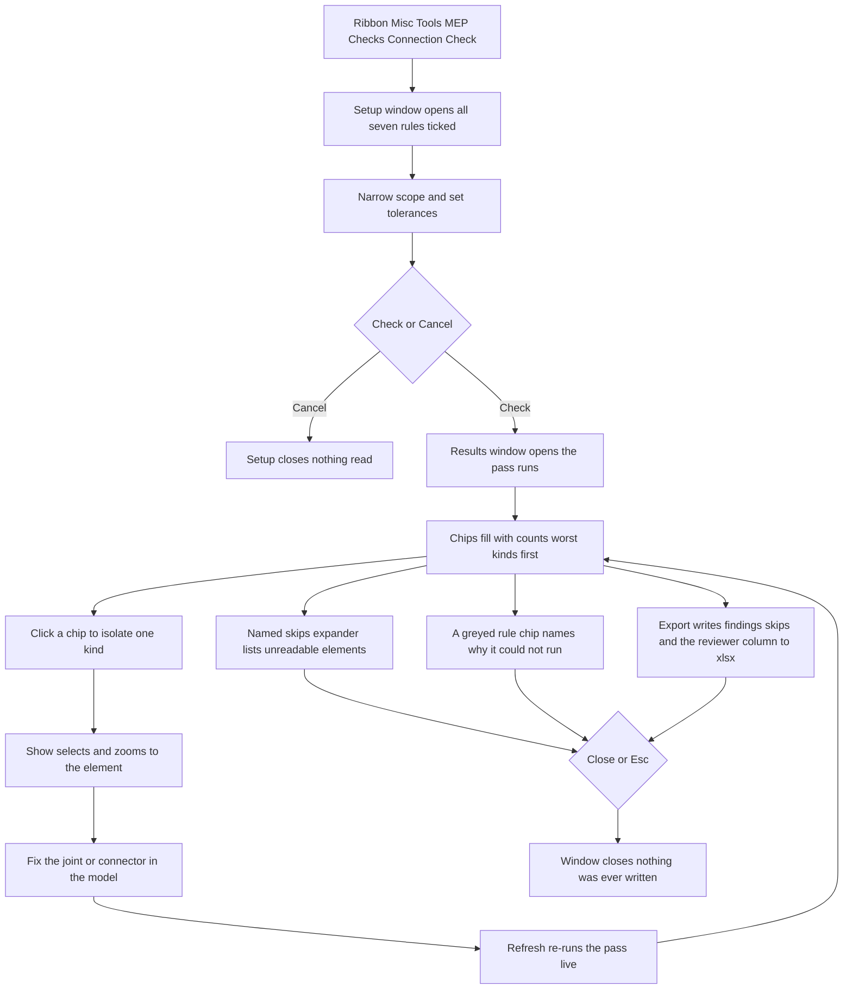

# Connection Check — UI Mockup & Operation Diagrams

> Visual companion to handoff.md, which is authoritative. Mockups are ASCII wireframes; diagrams are Mermaid (rendered by GitHub).

## Window: Setup window

```
┌────────────────────────────────────────────────────────────────────────────────────────────────┐
│ Connection Check                                                                               │
│ Read-only. Open ends are Open Ends' job -- this judges the connections that exist.             │
├────────────────────────────────────────────────────────────────────────────────────────────────┤
│ ┌──────────────────────────────────────────────────────────────────────────────────────────┐   │
│ │ Rules                                                                                    │   │
│ ├──────────────────────────────────────────────────────────────────────────────────────────┤   │
│ │ 7 of 7 rules selected.                                 [Select All] [Select None]        │   │
│ │ [x] Mates                                                                                │   │
│ │     conflicting system classification at a live joint                                    │   │
│ │ [x] Direction                                                                            │   │
│ │     fires rarely - each hit is a backwards valve or pump                                 │   │
│ │ [x] Size                                                                                 │   │
│ │     two mated connectors differ beyond tolerance                                         │   │
│ │ [x] Undefined                                                                            │   │
│ │     element rides the default or undefined classification                                │   │
│ │ [x] Voltage                                                                              │   │
│ │     device connector voltage vs the circuit it sits on                                   │   │
│ │ [x] Poles                                                                                │   │
│ │     device pole count vs the circuit it sits on                                          │   │
│ │ [x] No connectors                                                                        │   │
│ │     MEP family exposes none, can never join a system                                     │   │
│ └──────────────────────────────────────────────────────────────────────────────────────────┘   │
│ ┌──────────────────────────────────────────────────────────────────────────────────────────┐   │
│ │ Scope                                                                                    │   │
│ ├──────────────────────────────────────────────────────────────────────────────────────────┤   │
│ │ Scope:  [ Picked systems                v ]                                              │   │
│ │                                                                                          │   │
│ │ Search: [______]                                                                         │   │
│ │ [x] CHW-1 Hydronic Cooling                                                               │   │
│ │ [x] SAN-1 Sanitary                                                                       │   │
│ │ [ ] PWR-DB2 Feeders                                                                      │   │
│ └──────────────────────────────────────────────────────────────────────────────────────────┘   │
│ ┌──────────────────────────────────────────────────────────────────────────────────────────┐   │
│ │ Tolerances & exclusions                                                                  │   │
│ ├──────────────────────────────────────────────────────────────────────────────────────────┤   │
│ │ Size tolerance:     [ 10 ] mm      Voltage tolerance:  [ 5 ] %                           │   │
│ │ Exclude equipment classification (all unticked by default):                              │   │
│ │ [ ] Fire protection standpipe risers                                                     │   │
│ │ [ ] Temporary construction power                                                         │   │
│ └──────────────────────────────────────────────────────────────────────────────────────────┘   │
├────────────────────────────────────────────────────────────────────────────────────────────────┤
│ Rules that cannot run on this Revit version will appear greyed with the reason.                │
│                                                                                                │
│                                                                   [ Check ]  [ Cancel ]        │
└────────────────────────────────────────────────────────────────────────────────────────────────┘
```

- All seven rules start ticked and every exclusion starts unticked — a default exclusion would be a silent drop wearing a nicer name.
- A rule whose accessor is unreadable on this Revit version greys its checkbox with the reason in a tooltip, rather than pretending to run it.
- Scope is a single ComboBox (Whole model / Active view / Picked systems); the system checklist and Search box only appear once **Picked systems** is chosen.
- Each rule's DimGray why-line sits directly beneath its own checkbox label, in its own TextBlock, not packed onto the same line — that is why Direction reads as two rows above.

## Window: Results window

*Resizable and modeless — it stays open beside Revit while the model is fixed and Refreshed.*

```
┌────────────────────────────────────────────────────────────────────────────────────────────────┐
│ Connection Check - Results                                                                     │
├────────────────────────────────────────────────────────────────────────────────────────────────┤
│ Search: [______]   Mates 12 | Direction 2 | Size 9 | Undefined 21 | Voltage 3 | Poles 1 | No   │
│ connectors 8                                                                                   │
├────────────────────────────────────────────────────────────────────────────────────────────────┤
│ v Mates (12)                                                                                   │
│   v CHW Hydronic                                                                               │
│     v L3                                                                                       │
│       CHW Supply <-> CHW Return                                                 [Show]         │
│         declared Supply -- declared Return, mated at fitting 512907                            │
│ v Voltage (3)                                                                                  │
│   v PWR-DB2                                                                                    │
│     v L2                                                                                       │
│       AHU-7 panel feed                                                          [Show]         │
│         208 V connector -- 480 V circuit                                                       │
│ > Direction (2)                                                                                │
│ > Size (9)                                                                                     │
│ > Undefined (21)                                                                               │
│ > Poles (1)                                                                                    │
│ > No connectors (8)                                                                            │
│ > Named skips (9)                                                                              │
├────────────────────────────────────────────────────────────────────────────────────────────────┤
│ 18,240 connectors read in one pass -- 56 findings, 9 elements skipped (unreadable - listed).   │
│ Nothing was changed.                                                                           │
│                                                                                                │
│                                                           [ Refresh ]  [ Export ]  [ Close ]   │
└────────────────────────────────────────────────────────────────────────────────────────────────┘
```

- Clicking a rule chip ("Voltage 3") filters the tree to that kind without rebuilding it — search text, chip selection, and branch expansion all survive a Refresh.
- Each leaf's second line is the two compared values side by side, exactly as declared ("208 V connector — 480 V circuit"), never an inferred verdict.
- A branch that hits its display cap states the truncation on the branch itself, for example "Undefined (21, showing 20) — search to narrow."
- **Show** selects and zooms to the element via the same ExternalEvent bridge the house uses everywhere else; **Close** and Cancel are the same door because nothing here is ever written.

## User operation flow



