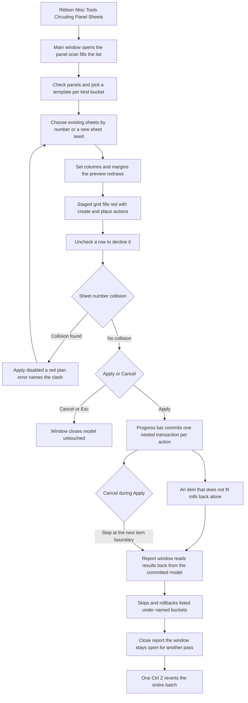

# Panel Sheets — UI Mockup & Operation Diagrams

> Visual companion to handoff.md, which is authoritative. Mockups are ASCII wireframes; diagrams are Mermaid (rendered by GitHub).

## Window: Main window

```
┌────────────────────────────────────────────────────────────────────────────────────────────────┐
│ Panel Sheets                                                                                   │
│ Creates missing panel schedule views and places them inside titleblock margins. Placed         │
│ schedules are never moved.                                                                     │
├────────────────────────────────────────────────────────────────────────────────────────────────┤
│ ┌────────────────────────────────────────────┐  ┌────────────────────────────────────────────┐ │
│ │ Panels                                     │  │ Placement                                  │ │
│ ├────────────────────────────────────────────┤  ├────────────────────────────────────────────┤ │
│ │ 23 panels -- 14 need a view, 9 need        │  │ Template Branch:      [ BP 42-row      v ] │ │
│ │ placing, 5 already done.                   │  │ Template Switchboard: [ SWBD 34-row    v ] │ │
│ │ [Select All]  [Select None]                │  │ Target: [ New sheets, numbered from... v ] │ │
│ │ Search: [__________]                       │  │ Seed:   [ E-603 ]                          │ │
│ │                                            │  │ Columns/sheet: [ 3 ]  Margins: [ 12mm ]    │ │
│ │ [x] PP-1A   needs view + placing           │  │                                            │ │
│ │ [x] LP-2    needs placing                  │  │ Preview:                                   │ │
│ │ [ ] MSB-1   already on E-600               │  │   col1: PP-1A   col2: LP-2   col3: occ     │ │
│ │ [x] PP-4    needs view + placing           │  │   col1: PP-4                               │ │
│ │                                            │  │ Exact fit is measured at Apply.            │ │
│ └────────────────────────────────────────────┘  └────────────────────────────────────────────┘ │
├────────────────────────────────────────────────────────────────────────────────────────────────┤
│ Action                                   Target     Result                                     │
│ Create view (Branch, BP 42-row) - PP-1A  --         STAGED *                                   │
│ Place PP-1A                              E-601 c1   STAGED *                                   │
│ Create sheet E-603                       --         STAGED *                                   │
│ Place LP-2                               E-603 c1   STAGED *                                   │
│ Place PP-9                               E-603 c2   COLLISION: E-603 already exists            │
├────────────────────────────────────────────────────────────────────────────────────────────────┤
│ 14 views and 9 placements staged across 3 sheets (1 new) -- 5 panels already done, skipped.    │
│                                                                                                │
│                                                                   [ Apply ]  [ Cancel ]        │
└────────────────────────────────────────────────────────────────────────────────────────────────┘
```

- Rows marked `STAGED *` render solid red until **Apply**; `MSB-1` is greyed out in the Panels list rather than removed, and stays uncheckable — "already on E-600" is written inline above for legibility, but in the app it sits in a tooltip on the greyed row.
- A sheet-number collision, like `Place PP-9` above, renders as a **red plan error** — not an ordinary staged row — and disables Apply until the seed or target sheet changes.
- Template and Target are both ComboBoxes, not radio buttons; a template picker for a kind bucket with no checked panels of that kind greys out entirely, since there is nothing for it to apply to.
- The Preview canvas is schematic (column bands and flow order only) with the note "Exact fit is measured at Apply" — real footprints are only known after each schedule view actually exists.

## Window: Report window

```
┌────────────────────────────────────────────────────────────────────────────────────────┐
│ Panel Sheets - Report                                                                  │
├────────────────────────────────────────────────────────────────────────────────────────┤
│ Panel    View      Sheet   Column  Result                                              │
│ PP-1A    created   E-601   1       Placed                                              │
│ LP-2     existed   E-602   2       Placed                                              │
│ PP-4     created   --      --      Did not fit - rolled back                           │
│ MSB-1    --        E-600   --      Already done - skipped                              │
├────────────────────────────────────────────────────────────────────────────────────────┤
│ 14 views created, 8 placed, 1 did not fit (rolled back, named), 5 skipped -- read back │
│ from the model. One undo step.                                                         │
│                                                                                        │
│                                                                         [ Close ]      │
└────────────────────────────────────────────────────────────────────────────────────────┘
```

- Every row is read back from the committed model — which views exist, which instances sit on which sheet — never from the plan.
- "Did not fit" rows are rolled back individually inside their own nested transaction; the schedule view stage one created still exists and is said so, ready for a hand placement.
- During Apply, a cancellable progress bar reads "Placing LP-2 on E-602 (7 of 9)..." — Cancel stops before the next item and the report names exactly where the run stopped.

## User operation flow



