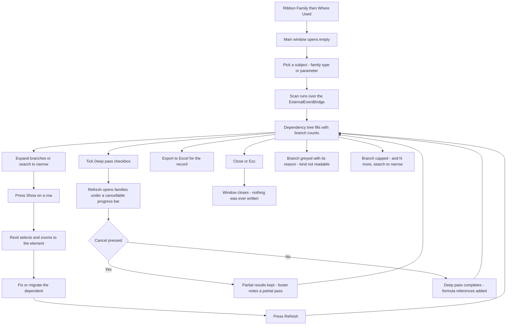

# Where Used — UI Mockup & Operation Diagrams

> Visual companion to handoff.md, which is authoritative. Mockups are ASCII wireframes; diagrams are Mermaid (rendered by GitHub).

## Window: Main Window

```
┌─ Where Used ─────────────────────────────────────────────────────────────────────────────────────┐
│ Where Used                                                                                       │
│ What the model does with this - by id and by name. Host document only;                           │
│ formulas need the deep pass.                                                                     │
│                                                                                                  │
│ [ Pick family/type... ]   [ Pick parameter... ]                                                  │
│ Type: Single-Flush : 36" x 84"                                                                   │
│                                                                                                  │
│ Search: [ door______________________ ]                             [ ] Deep pass (open families) │
├─ Dependency tree ────────────────────────────────────────────────────────────────────────────────┤
│ Breadcrumb:  Single-Flush : 36" x 84"                                                            │
│                                                                                                  │
│ v Instances (212)                                                                by id    [Show] │
│       Level 2 - 84 doors                                                                         │
│       Level 3 - 128 doors                                                                        │
│ v Schedules (2)                                                                                  │
│       Door Schedule - filter value                                               by name  [Show] │
│ v View filters (3)                                                                               │
│       FR Doors - rule on Type Name                                               by name  [Show] │
│ v Tags - not readable in this Revit                                                     (greyed) │
│ v Other dependents - unclassified (9)                                            mixed    [Show] │
│       ...and 240 more - search to narrow                                                         │
├──────────────────────────────────────────────────────────────────────────────────────────────────┤
│ 6 dependency kinds checked, 1 not available in Revit 2021 - 312 rows (2 branches capped).        │
│                                                                  [ Export to Excel ]   [ Close ] │
└──────────────────────────────────────────────────────────────────────────────────────────────────┘
```

- The "Type: ..." subject line renders bold in the real dialog; branch headers show live counts, e.g. "Instances (212)".
- Deep pass is off by default; its tooltip names the cost of opening every family one at a time.
- Greyed branches (like Tags above) show their reason inline instead of disappearing; a capped branch's "...and N more" row is a fixed tail, not a real dependent.
- Show rides the ExternalEventBridge to select and zoom in Revit; Refresh re-scans the live model while preserving tree expansion and search state.

## User operation flow


