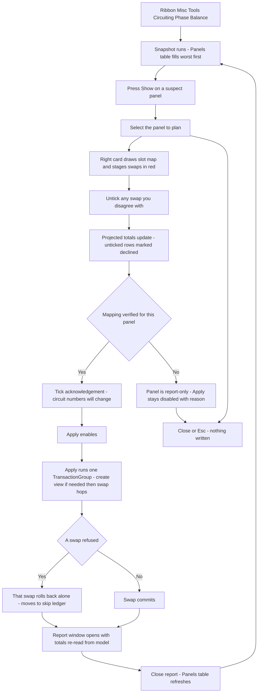

# Phase Balance — UI Mockup & Operation Diagrams

> Visual companion to handoff.md, which is authoritative. Mockups are ASCII wireframes; diagrams are Mermaid (rendered by GitHub).

## Window: Main Window

```
┌─ Phase Balance ──────────────────────────────────────────────────────────────────────────────────┐
│ Phase Balance                                                                                    │
│ Read from each panel's own totals. Projections assume the standard                               │
│ slot-to-phase convention and say so.                                                             │
│                                                                                                  │
├─ Panels ─────────────────────────────────────────────────────────────────────────────────────────┤
│ Panel   A         B         C         Imbalance                                                  │
│ ! LP-2  61.4 A    24.9 A    15.2 A    45%                                                 [Show] │
│ RP-1    38.0 A    --        --        single-phase                               (greyed) [Show] │
│ MDP     142 A     138 A     145 A     3%                                                  [Show] │
│ EP-3    not evaluable - phase parameters missing/blank                           (greyed) [Show] │
│                                                                                                  │
│ 38 panels - 6 above 20% imbalance, 4 not evaluable, 2 single-phase.                  [ Refresh ] │
├─ Rebalance LP-2 ─────────────────────────────────────────────────────────────────────────────────┤
│ Slot map (simplified list; real dialog draws a two-column strip):                                │
│ Slot  Phase   Circuit                                                                            │
│ 1     A       12 - Recept Rm 210                                                                 │
│ 3     A       12 - Recept Rm 210 (2-pole, joined with 1)                                         │
│ 7     B       7 - Lighting Rm 212                                                                │
│ 17    locked  15 - Fire Alarm                                                           (greyed) │
│                                                                                                  │
│ Before -> Projected:  A 61.4->52.1 A   B 24.9->34.2 A   C 15.2->15.2 A                           │
│ * [x] swap 7 with 12 - moves 1.2 kVA from A to B                                                 │
│ * [x] swap 3 with 9  - moves 0.8 kVA from A to B                                                 │
│   [ ] swap 5 with 11 - moves 0.4 kVA from C to B   (declined)                                    │
├──────────────────────────────────────────────────────────────────────────────────────────────────┤
│ LP-2: 3 swaps staged, projected imbalance 4% (standard slot convention). 2 slots locked - not    │
│ moved.                                                                                           │
│ [ ] Circuit numbers on this panel will change.                              [ Apply ]  [ Close ] │
└──────────────────────────────────────────────────────────────────────────────────────────────────┘
```

- Row marked ! is the worst-imbalance panel (tinted in the real dialog); rows marked * are the swaps currently staged red, pending Apply.
- Not-evaluable and single-phase panels (RP-1, EP-3) sit greyed in place with their reason and are never hidden from the list.
- Panels and Rebalance render as two side-by-side cards in the real window, stacked here for width; the slot map is drawn as a two-column visual strip with joined boxes for multi-pole spans.
- Apply stays disabled - reason in its tooltip - until the acknowledgement tick is checked.

## Window: Report Window

```
┌─ Phase Balance - Report ─────────────────────────────────────────────────────────────────────────┐
│ Phase Balance - Report                                                                           │
│ Read-only. Every number below is re-read from the committed model.                               │
│                                                                                                  │
├─ Swaps - LP-2 ───────────────────────────────────────────────────────────────────────────────────┤
│ Swap  Circuits (Panel / Number)     Result                                                       │
│ 1     LP-2 / 7  <->  LP-2 / 12      committed                                                    │
│ 2     LP-2 / 3  <->  LP-2 / 9       committed                                                    │
│ 3     LP-2 / 5  <->  LP-2 / 11      rolled back: template refused the move                       │
│                                                                                                  │
│ Per-phase totals, re-read:  A 41.2 A   B 39.8 A   C 40.5 A   Imbalance 6%                        │
├──────────────────────────────────────────────────────────────────────────────────────────────────┤
│ LP-2: 2 swaps committed, 1 rolled back. Re-read from the model: A 41.2 A, B 39.8 A, C 40.5 A -   │
│ imbalance 6%.                                                                                    │
│                                                                                        [ Close ] │
└──────────────────────────────────────────────────────────────────────────────────────────────────┘
```

- Result names the exact refusal reason for a rolled-back swap; nothing here is projected, every value is read back after commit.
- Closing this window returns to the Panels table, refreshed with the new imbalance percentages.

## User operation flow


