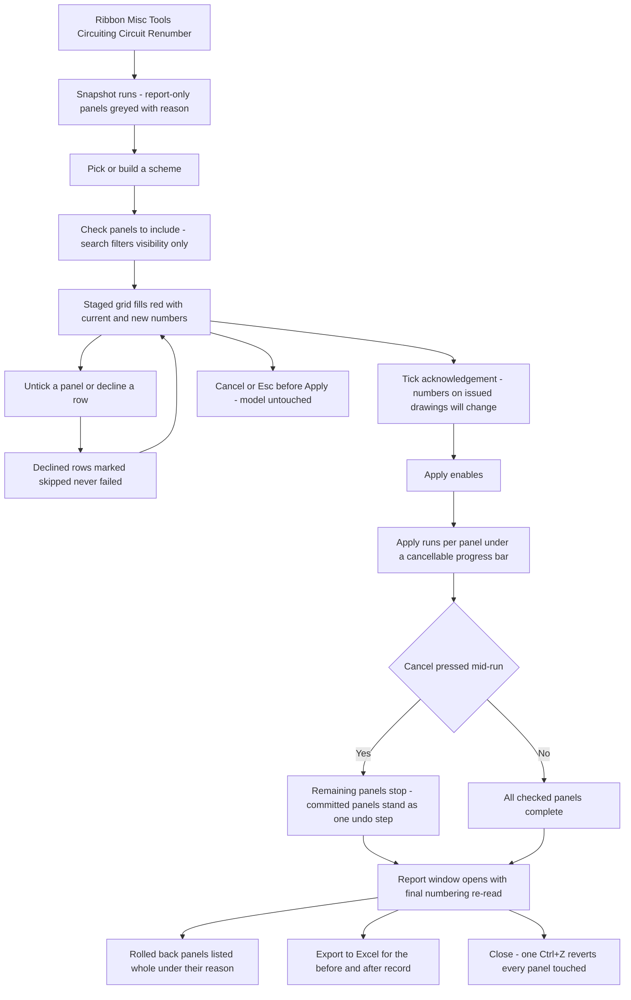

# Circuit Renumber — UI Mockup & Operation Diagrams

> Visual companion to handoff.md, which is authoritative. Mockups are ASCII wireframes; diagrams are Mermaid (rendered by GitHub).

## Window: Main Window

```
┌─ Circuit Renumber ───────────────────────────────────────────────────────────────────────────────┐
│ Circuit Renumber                                                                                 │
│ Plans every hop before one runs. Spaces are read for walk order; rooms in                        │
│ linked models are not visible here.                                                              │
│                                                                                                  │
├─ Scheme ─────────────────────────────────────────────────────────────────────────────────────────┤
│ Preset:      [ Office Standard v2         v]   [ Save ]   [ Delete ]                             │
│ Walk order:  [ by room number             v]                                                     │
│ Phase:       [ New Construction           v]                                                     │
│ [x] Odd/even sides        [x] Group by load classification                                       │
│ Spares:      [ gather at bottom           v]                                                     │
│                                                                                                  │
├─ Panels ─────────────────────────────────────────────────────────────────────────────────────────┤
│ [x] LP-2    12 circuits                                                                          │
│ [x] RP-1    report-only: template mapping unverified                                    (greyed) │
│ [ ] MDP     28 circuits                                                                          │
│ 12 panels - 3 checked, 9 unchecked.                                  [Select All]  [Select None] │
│ Search: [ LP__________________ ]                                                                 │
│                                                                                                  │
├─ Staged Plan ────────────────────────────────────────────────────────────────────────────────────┤
│ Panel   Ckt   Load Name             Current #  New #   Hops                                      │
│ * LP-2  7     Recept Rm 210         7          3       1                                         │
│ * LP-2  3     Lighting Rm 212       3          7       1                                         │
│   LP-2  15    Fire Alarm            15         --      slot locked                               │
│   RP-1  --    (report-only)         --         --      --                                        │
├──────────────────────────────────────────────────────────────────────────────────────────────────┤
│ 3 panels - 64 moves planned (9 hops through temp slots), 5 skipped.                              │
│ [ ] Circuit numbers on issued drawings will change.                        [ Apply ]  [ Cancel ] │
└──────────────────────────────────────────────────────────────────────────────────────────────────┘
```

- Scheme and Panels render as two side-by-side cards; stacked here for width.
- New # renders red for every *-marked row until Apply commits; a row's Hops count is how many temp-slot moves it takes to legally stage that circuit.
- RP-1 sits greyed with its reason and is never staged, regardless of its checkbox state.
- Apply stays disabled - reason in its tooltip - until the acknowledgement tick is checked; Search filters the Panels list without losing checked state.

## Window: Report Window

```
┌─ Circuit Renumber - Report ──────────────────────────────────────────────────────────────────────┐
│ Circuit Renumber - Report                                                                        │
│ Read-only. Final numbering re-read from the committed model.                                     │
│                                                                                                  │
├─ LP-2 - renumbered ──────────────────────────────────────────────────────────────────────────────┤
│ Ckt (Load Name / Old #)         Final #   Result                                                 │
│ Recept Rm 210 / 7               3         committed                                              │
│ Lighting Rm 212 / 3             7         committed                                              │
│ Fire Alarm / 15                 15        skipped: slot locked                                   │
├─ RP-1 - rolled back: template refused the move at slot 17 ───────────────────────────────────────┤
│ (entire panel rolled back - no circuits changed)                                                 │
├──────────────────────────────────────────────────────────────────────────────────────────────────┤
│ LP-2 renumbered - 24 circuits read back. RP-1 rolled back: template refused the move at slot 17. │
│ One undo step.                                                                                   │
│                                                                  [ Export to Excel ]   [ Close ] │
└──────────────────────────────────────────────────────────────────────────────────────────────────┘
```

- Rolled-back panels (RP-1) list whole under their refusal reason rather than showing numbers that never took effect.
- Ckt identity is load name plus old number, never ElementId, so the export stays meaningful outside Revit.
- Export to Excel writes this exact before/after table - the record the markup set and tag-checking pass work from.

## User operation flow


