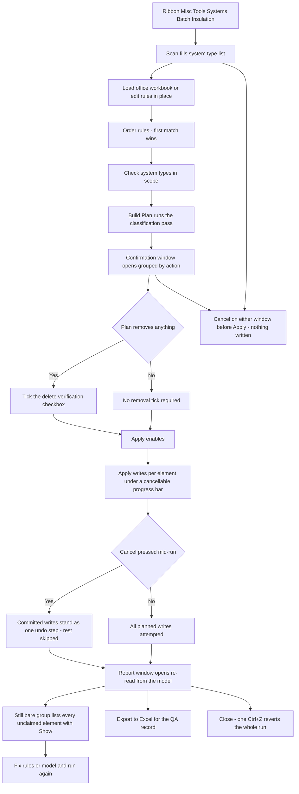

# Batch Insulation — UI Mockup & Operation Diagrams

> Visual companion to handoff.md, which is authoritative. Mockups are ASCII wireframes; diagrams are Mermaid (rendered by GitHub).

## Window: Main Window

```
┌─ Batch Insulation ───────────────────────────────────────────────────────────────────────────────┐
│ Batch Insulation                                                                                 │
│ First rule that matches wins. Elements no rule claims are counted, never touched.                │
│                                                                                                  │
├─ Rules ──────────────────────────────────────────────────────────────────────────────────────────┤
│ #   System Type         Size            Seg  Fit  Insulation Type   Thick  Action                │
│ *1  Supply Air Low      >=3" <6"        x    x    Duct Liner Wrap   1.5"   Apply                 │
│ *2  Hydronic HW Supply  >=2" <3"        x    -    Fiberglass 2#     1.0"   Apply                 │
│  3  Sanitary Vent       >=0" <24"       x    x    -                 -      Remove                │
│  4  Hydronic HW Supply  >=2" <3"        x    x    Fiberglass 2#     1.0"   disabled              │
│        -> insulation type not in document                                                        │
│ [ Up ]  [ Down ]                              [ Load Excel ]   [ Save Excel ]                    │
│ rule 4 is shadowed by rule 2 for pipes 2"-3"                                                     │
│                                                                                                  │
├─ Scope ──────────────────────────────────────────────────────────────────────────────────────────┤
│ [x] Supply Air - Low Pressure                                                                    │
│ [x] Hydronic HW Supply                                                                           │
│ [ ] Sanitary Vent                                                                                │
│ 14 system types - 8 checked, 6 unchecked.                            [Select All]  [Select None] │
│ Search: [ hydronic______________ ]                                                               │
├──────────────────────────────────────────────────────────────────────────────────────────────────┤
│ Scope: 8 of 14 system types. Rules: 6 rows, 1 disabled (insulation type not in document).        │
│                                                                   [ Build Plan... ]   [ Cancel ] │
└──────────────────────────────────────────────────────────────────────────────────────────────────┘
```

- Rows marked * are newly staged and render red until saved; row 4 disabled greys out with its reason instead of being deleted from the grid.
- Rules and Scope render as two side-by-side cards; stacked here for width.
- Row order is the matching contract - Up/Down changes which rule wins; the lint line warns about shadowed rules without blocking editing.
- Build Plan stays disabled, reason in its tooltip, until at least one rule and one system type are set.

## Window: Confirmation Window

```
┌─ Batch Insulation - Confirmation ────────────────────────────────────────────────────────────────┐
│ Batch Insulation - Confirmation                                                                  │
│ Complete dry run, grouped by action. Nothing is written until Apply.                             │
│                                                                                                  │
│ Add 212 | Replace 34 | Remove 8 | Keep 1,090 | No rule 77                                        │
│                                                                                                  │
├─ Add (212) ──────────────────────────────────────────────────────────────────────────────────────┤
│ Element       System Type         Size      Rule   Insulation                                    │
│ Duct 4201     Supply Air Low      14x8      1      Duct Liner Wrap 1.5"                          │
│ Pipe 3312     Hydronic HW Sup     2.5"      2      Fiberglass 1.0" -- may refuse                 │
├─ Remove (8) ─────────────────────────────────────────────────────────────────────────────────────┤
│ Pipe 887      Sanitary Vent       3"        3      remove existing                               │
├─ Skipped (12) ───────────────────────────────────────────────────────────────────────────────────┤
│ Duct 4412     --                  --        --     in a group                                    │
│ Pipe 205      --                  --        --     placeholder                                   │
│                                                                                                  │
│ [ ] I understand 8 insulations will be deleted.                                                  │
│ [ ] I understand stacked insulations will be replaced with one (2 elements).                     │
├──────────────────────────────────────────────────────────────────────────────────────────────────┤
│ 254 writes planned, 8 removes await the verification tick. 12 skipped - 9 in groups, 3           │
│ placeholders.                                                                                    │
│                                                                           [ Apply ]   [ Cancel ] │
└──────────────────────────────────────────────────────────────────────────────────────────────────┘
```

- Add/Replace/Remove/Keep/No rule render as collapsible expanders with counts in the header; Keep and No rule are collapsed by default and omitted here for space.
- Apply stays disabled until the delete-verification checkbox is ticked; a "may refuse" note flags fitting rows the API could still reject at write time.
- The write itself runs under a cancellable progress bar once Apply is pressed.

## Window: Report Window

```
┌─ Batch Insulation - Report ──────────────────────────────────────────────────────────────────────┐
│ Batch Insulation - Report                                                                        │
│ Read-only, re-read from the committed model.                                                     │
│                                                                                                  │
├─ Written (246) ──────────────────────────────────────────────────────────────────────────────────┤
│ Duct 4201     Duct Liner Wrap 1.5" added                                                         │
├─ Removed (8) ────────────────────────────────────────────────────────────────────────────────────┤
│ Pipe 887      insulation removed                                                                 │
├─ Refused (3) - rolled back ──────────────────────────────────────────────────────────────────────┤
│ Pipe fitting 887  rolled back: category refused insulation                                       │
├─ Skipped (12) ───────────────────────────────────────────────────────────────────────────────────┤
│ Duct 4412     skipped: in a group                                                                │
├─ Still bare - no rule matched (77) ──────────────────────────────────────────────────────────────┤
│ Duct 5108     14x6, Return Air                                                            [Show] │
│ Pipe 612      1", Domestic CW                                                             [Show] │
│       ...and 75 more                                                                             │
├──────────────────────────────────────────────────────────────────────────────────────────────────┤
│ 246 written, 8 removed, 3 refused (rolled back), 77 still bare - re-read from the model. One     │
│ undo step.                                                                                       │
│                                                                  [ Export to Excel ]   [ Close ] │
└──────────────────────────────────────────────────────────────────────────────────────────────────┘
```

- Still bare is the headline group; its Show buttons ride the bridge to select and zoom each unclaimed element so rules or the model can be fixed and the tool re-run.
- Refused rows name the API's exact rejection reason and were rolled back individually - nothing is left half-stripped.
- Expanders keep their open or closed state across rebuilds, matching the rest of the house report style.

## User operation flow


