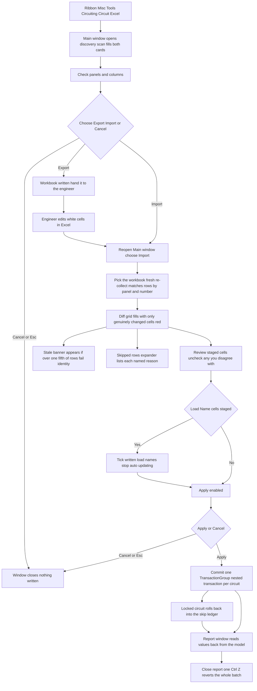

# Circuit Excel — UI Mockup & Operation Diagrams

> Visual companion to handoff.md, which is authoritative. Mockups are ASCII wireframes; diagrams are Mermaid (rendered by GitHub).

## Window: Main window

```
┌────────────────────────────────────────────────────────────────────────────────────────────────┐
│ Circuit Excel                                                                                  │
│ Willow Creek Hospital - Electrical.rvt                                                         │
├────────────────────────────────────────────────────────────────────────────────────────────────┤
│ ┌────────────────────────────────────────────┐  ┌────────────────────────────────────────────┐ │
│ │ Panels                                     │  │ Columns (export only)                      │ │
│ ├────────────────────────────────────────────┤  ├────────────────────────────────────────────┤ │
│ │ 12 panels -- 9 checked, 3 unchecked.       │  │ [x] Load Name                              │ │
│ │ [Select All]  [Select None]                │  │ [x] Rating                                 │ │
│ │ Search: [__________]                       │  │ [x] Frame                                  │ │
│ │ [x] LP-2                                   │  │ [ ] Comments                               │ │
│ │ [x] DP-1                                   │  │ [ ] Wire Size  (read-only here)            │ │
│ │ [x] RP-1                                   │  │ ... 29 more discovered                     │ │
│ │ [ ] EM-1  (all spare/space)                │  │                                            │ │
│ └────────────────────────────────────────────┘  └────────────────────────────────────────────┘ │
├────────────────────────────────────────────────────────────────────────────────────────────────┤
│ 34 columns discovered -- 3 read-only in this document (greyed). 9 panels will export.          │
│                                                    [ Export ]    [ Import... ]   [ Cancel ]    │
└────────────────────────────────────────────────────────────────────────────────────────────────┘
```

- **Export** and **Import…** both set `self.result` to a verb string and close the window; `script.py` then branches to the chosen flow — the same front door the Excel pushbutton drives its `ScheduleSelectionWindow` with.
- The Columns card applies to export only — Import re-runs the same discovery scan against the live document, so a workbook's columns are never assumed to still be writable.
- A read-only parameter (Wire Size here) stays visible and greyed, never hidden, with the reason in a tooltip.
- **Cancel**/Esc closes with nothing read beyond the initial discovery scan that filled these two cards.

## Window: Import diff window

```
┌────────────────────────────────────────────────────────────────────────────────────────────────┐
│ Circuit Excel -- Import Diff                                                                   │
│ LP-Circuits.xlsx re-matched against the live model.                                            │
├────────────────────────────────────────────────────────────────────────────────────────────────┤
│ This workbook looks stale: 9 of 41 rows failed identity -- circuits may have been renumbered.  │
│ Re-export recommended.                                                                         │
├────────────────────────────────────────────────────────────────────────────────────────────────┤
│ Search: [_________]                                                [ ] Hide Un-checked         │
│ [x] Panel  Ckt    Column      Model Value           Excel Value                                │
│ [x] LP-2   12     Load Name   RECEPT RM 210         *RECEPT -- OPEN OFFICE 210                 │
│ [x] LP-2   12     Rating      20                    *25                                        │
│ [x] RP-1   03     Load Name   Motor - Exhaust Fan   *EXHAUST FAN EF-3                          │
│ [ ] EM-1   1,3,5  Frame       100                   *150  (unchecked)                          │
├────────────────────────────────────────────────────────────────────────────────────────────────┤
│ ▾ Skipped rows (5)                                                                             │
│     LP-2 / 7 -- skipped: circuit not found (renumbered?)                                       │
│     EM-1 / 1,3,5 -- Rating -- skipped: value 'abc' unparseable                                 │
├────────────────────────────────────────────────────────────────────────────────────────────────┤
│ 61 cells to write across 41 circuits, 5 rows skipped. One undo step.                           │
│ [x] Written load names stop auto-updating                                                      │
│                                                             [ Apply ]    [ Cancel ]            │
└────────────────────────────────────────────────────────────────────────────────────────────────┘
```

- Every changed cell (marked `*`) renders red until Apply; an unchecked row's Excel Value cell greys out instead of staying red.
- Search matches circuit numbers as whole tokens, so "12" would not also match "112"; "Hide Un-checked" filters at rebuild time without losing check state.
- The stale-workbook banner shown here only appears once more than a fifth of rows fail identity; below that threshold the same failures are just named rows under "Skipped rows."
- The "Written load names stop auto-updating" tick appears only when Load Name cells are staged; **Apply** stays disabled — never hidden — until every required tick is set, with the reason in its tooltip.

## Window: Report window

```
┌────────────────────────────────────────────────────────────────────────────────────────────────┐
│ Circuit Excel -- Report                                                                        │
│ Read only. Values read back from the committed model.                                          │
├────────────────────────────────────────────────────────────────────────────────────────────────┤
│ Panel   Ckt      Column      Value                        Result                               │
│ LP-2    12       Load Name   RECEPT -- OPEN OFFICE 210     Written                             │
│ LP-2    12       Rating      25                            Written                             │
│ RP-1    03       Load Name   EXHAUST FAN EF-3              Rolled back - checked out mid-apply │
│ LP-2    7        --          --                            Skipped - circuit not found         │
├────────────────────────────────────────────────────────────────────────────────────────────────┤
│ 58 cells written, 5 rows skipped, 1 circuit rolled back -- read back from the model.           │
│                                                                             [ Close ]          │
└────────────────────────────────────────────────────────────────────────────────────────────────┘
```

- Values shown are read back from the committed model, not copied from the diff grid.
- Skips are grouped under their named bucket; a rolled-back row (a circuit locked mid-apply) is listed apart from a skip, never merged into the same count.
- Read-only WPF table, never stacked message boxes — the only affordance is Close; one Ctrl+Z in Revit reverts the whole batch.

## User operation flow


