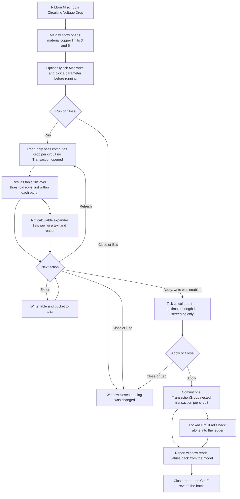

# Voltage Drop — UI Mockup & Operation Diagrams

> Visual companion to handoff.md, which is authoritative. Mockups are ASCII wireframes; diagrams are Mermaid (rendered by GitHub).

## Window: Main window

Before a run, material defaults to Copper and both panel-arithmetic cards sit side by side:

```
┌────────────────────────────────────────────────────────────────────────────────────────────────┐
│ Voltage Drop                                                                                   │
│ Lengths are Revit's most-remote-device estimate. Screening only.                               │
├────────────────────────────────────────────────────────────────────────────────────────────────┤
│ ┌────────────────────────────────────────────┐  ┌────────────────────────────────────────────┐ │
│ │ Settings                                   │  │ Panels                                     │ │
│ ├────────────────────────────────────────────┤  ├────────────────────────────────────────────┤ │
│ │ Conductor:  [ Copper            v]         │  │ 14 panels -- 14 checked, 0 unchecked.      │ │
│ │ Branch limit (%):   [ 3 ]                  │  │ [Select All]  [Select None]                │ │
│ │ Feeder limit (%):   [ 5 ]                  │  │ Search: [__________]                       │ │
│ │                                            │  │ [x] LP-2                                   │ │
│ │ [ ] Also write results to a                │  │ [x] DP-1                                   │ │
│ │     circuit parameter                      │  │ [x] RP-1                                   │ │
│ └────────────────────────────────────────────┘  └────────────────────────────────────────────┘ │
├────────────────────────────────────────────────────────────────────────────────────────────────┤
│ Ready. Nothing was changed.                                                                    │
│                                         [   Run   ]    [ Export ]   [  Close  ]                │
└────────────────────────────────────────────────────────────────────────────────────────────────┘
```

- **Export** stays disabled — never hidden — until a run has produced results; its tooltip reads "Run first."
- "Also write results to a circuit parameter" and the parameter ComboBox it reveals live on this Settings card and must be set **before** pressing Run, because the card is replaced by the results table once Run completes.
- A parameter entry read-only in this document greys in the picker, with the reason in a tooltip — never removed from the list.

After Run the body swaps to a results table grouped by panel — shown here with writing enabled, so the staged `-> PARAMETER` column and the Apply gate have appeared:

```
┌────────────────────────────────────────────────────────────────────────────────────────────────┐
│ Voltage Drop                                                                                   │
│ Lengths are Revit's most-remote-device estimate. Screening only.                               │
├────────────────────────────────────────────────────────────────────────────────────────────────┤
│ ▾ Panel LP-2  (18 circuits)                                                                    │
│   CKT  LOAD NAME          B/F     LENGTH  WIRE            AMPS   %VD    -> PARAMETER           │
│   12   RECEP RM 210       Branch  180 ft  3-#12           16A    3.8%   *3.8  <- over limit    │
│   14   HVAC RTU-3         Feeder  340 ft  2 sets 3-#3/0   140A   4.1%   *4.1  <- over limit    │
│   22   Corridor Lighting  Branch  90 ft   3-#12           8A     1.2%   *1.2                   │
│ ▸ Panel DP-1  (24 circuits)                                                                    │
│ ▸ Panel RP-1  (11 circuits)                                                                    │
│                                                                                                │
│ ▾ Not calculable (9)                                                                           │
│     LP-2 / 7   -- wire size 'AL XHHW special' not understood                                   │
│     RP-1 / 3   -- no length (device has no location)                                           │
├────────────────────────────────────────────────────────────────────────────────────────────────┤
│ Staged: 143 values to write (changed only). One undo step.                                     │
│ [x] Calculated from Revit's estimated circuit length -- a screening value, not a design calc.  │
│                                      [ Refresh ]   [ Export ]   [ Apply ]   [  Close  ]        │
└────────────────────────────────────────────────────────────────────────────────────────────────┘
```

- Over-threshold rows (marked here with "<- over limit") are tinted with the percent shown bold in the real dialog — plain ASCII cannot show that, so the arrow stands in for it.
- When "Also write" was left unticked, this same table appears without the `-> PARAMETER` column or the acknowledgement line, and the footer is just Refresh / Export / Close with no Apply.
- Expander open/closed state and Search survive a Refresh; Run relabels to Refresh after the first pass.
- Each row in "Not calculable" carries the raw wire-size text verbatim next to its reason, never a guessed number.

## Window: Report window

```
┌────────────────────────────────────────────────────────────────────────────────────────────────┐
│ Voltage Drop -- Report                                                                         │
│ Read only. Read back from the committed model.                                                 │
├────────────────────────────────────────────────────────────────────────────────────────────────┤
│ Panel   Ckt   %VD     Result                                                                   │
│ LP-2    12    3.8     Written                                                                  │
│ LP-2    14    4.1     Written                                                                  │
│ LP-2    22    1.2     Unchanged - value already current                                        │
│ RP-1    03    --      Rolled back - checked out mid-apply                                      │
├────────────────────────────────────────────────────────────────────────────────────────────────┤
│ 141 written, 2 rolled back, 45 unchanged -- read back from the model.                          │
│                                                                            [ Close ]           │
└────────────────────────────────────────────────────────────────────────────────────────────────┘
```

- Values are read back from the committed model, not carried over from the results table.
- Unchanged rows are epsilon-matched pre-existing values, kept apart from Written so the count is honest about what actually moved.
- Rolled-back rows (a circuit locked mid-apply) are listed separately from any skip.
- Read-only WPF table, never stacked message boxes — the only affordance is Close; one Ctrl+Z in Revit reverts the whole batch.

## User operation flow


