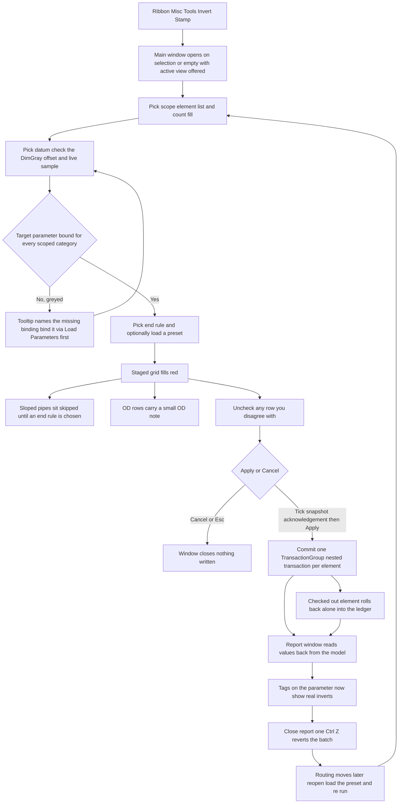

# Invert Stamp — UI Mockup & Operation Diagrams

> Visual companion to handoff.md, which is authoritative. Mockups are ASCII wireframes; diagrams are Mermaid (rendered by GitHub).

## Window: Main window

```
┌────────────────────────────────────────────────────────────────────────────────────────────────┐
│ Invert Stamp                                                                                   │
│ Pipes use inside diameter; fittings and fixtures are outside-diameter approximations, flagged. │
├────────────────────────────────────────────────────────────────────────────────────────────────┤
│ ┌──────────────────────────────┐  ┌──────────────────────────┐  ┌────────────────────────────┐ │
│ │ Scope                        │  │ Datum                    │  │ Target                     │ │
│ ├──────────────────────────────┤  ├──────────────────────────┤  ├────────────────────────────┤ │
│ │ Source: [Active view    v]   │  │ [ Survey Point     v]    │  │ [ Invert Elevation v]      │ │
│ │                              │  │ 312.50 ft below          │  │ Length param -- per        │ │
│ │ 124 elements -- 118          │  │ Internal Origin          │  │ project units              │ │
│ │ checked, 6 unchecked.        │  │                          │  │ End rule:                  │ │
│ │ [Select All] [Select None]   │  │ Live sample:             │  │ [ Lower end       v]       │ │
│ │ Search: [________]           │  │ at FD-1: 97.42 ft        │  │ Preset: [Sanitary v]       │ │
│ │ [x] Pipe P-12                │  │                          │  │ [ Save ]    [ Load ]       │ │
│ │ [x] Elbow (401227)           │  │                          │  └────────────────────────────┘ │
│ │ [ ] FD-1 Floor Drain         │  │                          │                                 │
│ └──────────────────────────────┘  └──────────────────────────┘                                 │
├────────────────────────────────────────────────────────────────────────────────────────────────┤
│ Element                    Connector      Old       New       Note                             │
│ Pipe P-12 (id 400114)      Low end        96.10     *95.85                                     │
│ FD-1 Floor Drain           Outlet         --        *97.42    OD                               │
│ Elbow (id 401227)          --             --        --        skipped - non-round connector    │
├────────────────────────────────────────────────────────────────────────────────────────────────┤
│ Will write 118 values (31 OD-approximate), skip 6 -- reasons listed. One undo step.            │
│ [x] Stamped inverts are snapshots -- they do not update when the routing moves.                │
│                                                              [ Apply ]   [ Cancel ]            │
└────────────────────────────────────────────────────────────────────────────────────────────────┘
```

- The Datum card's DimGray offset line and live sample update immediately when the ComboBox changes, so a flipped basis — clipped vs unclipped base point — is caught by eye before anything is written.
- A Target parameter not bound to every scoped category greys in the ComboBox with the missing category named in a tooltip ("not bound to Pipe Fittings"), rather than disappearing from the list.
- The small "OD" note on the FD-1 row is the outside-diameter-approximation flag; it stays visible next to the value through grid and report, never hidden or merged with the exact pipe rows.
- Sloped pipes whose two ends differ beyond tolerance sit skipped until an end rule is picked; choosing "Both ends" reveals a second parameter ComboBox on the Target card for the paired write.

## Window: Report window

```
┌────────────────────────────────────────────────────────────────────────────────────────────────┐
│ Invert Stamp -- Report                                                                         │
│ Read only. Read back from the committed model.                                                 │
├────────────────────────────────────────────────────────────────────────────────────────────────┤
│ Element                    Parameter          Value      Result                                │
│ Pipe P-12 (id 400114)      Invert Elevation   95.85      Written                               │
│ FD-1 Floor Drain           Invert Elevation   97.42      Written                               │
│ Elbow (id 401227)          --                 --         Skipped - non-round connector         │
│ Pipe P-14 (id 400221)      Invert Elevation   --         Rolled back - owned by another user   │
├────────────────────────────────────────────────────────────────────────────────────────────────┤
│ 116 written, 6 skipped, 2 rolled back -- read back from the model.                             │
│                                                                            [ Close ]           │
└────────────────────────────────────────────────────────────────────────────────────────────────┘
```

- Every row is read back from the committed model, never copied from the staged plan.
- Skips are grouped under their named bucket (non-round connector, sloped with no end rule chosen, parameter not bound, and so on); rollbacks are listed apart from skips.
- Read-only WPF table, never stacked message boxes — the only affordance is Close; one Ctrl+Z in Revit reverts the whole batch.

## User operation flow


