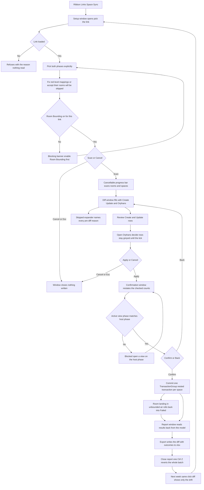

# Space Sync — UI Mockup & Operation Diagrams

> Visual companion to handoff.md, which is authoritative. Mockups are ASCII wireframes; diagrams are Mermaid (rendered by GitHub).

## Window: Setup window

```
┌────────────────────────────────────────────────────────────────────────────────────────────────┐
│ Space Sync                                                                                     │
│ Matching is by location; the link's Room parameter is not trusted.                             │
├────────────────────────────────────────────────────────────────────────────────────────────────┤
│ Link:  [ ARCH-Tower.rvt                                                             v]         │
│                                                                                                │
│ Rooms in link, phase                       Spaces here, phase                                  │
│ [ 2 - New Construction    v]               [ 2 - New Construction    v]                        │
├────────────────────────────────────────────────────────────────────────────────────────────────┤
│ ┌────────────────────────────────────────────────────────────────────────────────────────────┐ │
│ │ Level mapping -- 8 of 9 link levels mapped.                                                │ │
│ ├────────────────────────────────────────────────────────────────────────────────────────────┤ │
│ │ Link level          Host level                                                             │ │
│ │ Level 1        ->   Level 1                                                                │ │
│ │ Level 2        ->   Level 2                                                                │ │
│ │ L-B1           ->   (unmapped)   [ pick a host level                        v]             │ │
│ └────────────────────────────────────────────────────────────────────────────────────────────┘ │
├────────────────────────────────────────────────────────────────────────────────────────────────┤
│ L-B1 has no host level match -- map it, or its 14 rooms will be skipped.                       │
│                                                                   [   Scan   ]   [ Cancel ]    │
└────────────────────────────────────────────────────────────────────────────────────────────────┘
```

- The two phase ComboBoxes pre-pair only on an exact name match between the two documents; anything else leaves both blank rather than guessing a pairing.
- When the link type's Room Bounding is off, the footer's **Scan** button is replaced by a red blocking banner naming the fix ("enable it in the link type before spaces can form") — not shown above, since the two conditions don't occur together.
- Unmapped level rows render red with a manual override ComboBox, as L-B1 does here; mapped rows stay in plain text.
- An unloaded link refuses immediately in the status line, before the phase or level cards even render.

## Window: Diff window

```
┌────────────────────────────────────────────────────────────────────────────────────────────────┐
│ Space Sync -- Diff                                                                             │
│ 64 creates, 12 updates, 3 orphans, 9 skipped. Nothing written.                                 │
├────────────────────────────────────────────────────────────────────────────────────────────────┤
│ Search: [__________]                                                 [ ] Hide Un-checked       │
│ ▾ Create (64)                                                                                  │
│     [x] Room 214 -- OFFICE -- Level 2                                                          │
│     [x] Room 215 -- CORRIDOR -- Level 2                                                        │
│     [ ] Room 220 -- MECH -- Level 2                                                            │
│ ▾ Update (12)                                                                                  │
│     [x] Space 214: 'OFFICE' -> 'OPEN OFFICE', 214 -> 214A                                      │
│     [x] Space 301: 'CONFERENCE' -> 'CONFERENCE A', 301 -> 301                                  │
│ ▾ Orphans (3)                                                                                  │
│     [ ] Space 118 -- no matching room  (greyed until acknowledged below)                       │
│     [ ] Space 240 -- no matching room  (greyed until acknowledged below)                       │
│ ▸ Skipped (9)                                                                                  │
├────────────────────────────────────────────────────────────────────────────────────────────────┤
│ 64 creates, 12 updates, 3 orphans, 9 skipped. Nothing written.                                 │
│ [ ] Delete 3 orphan spaces -- engineering data on them (airflow, loads) is lost                │
│                                                                    [ Apply ]   [ Cancel ]      │
└────────────────────────────────────────────────────────────────────────────────────────────────┘
```

- Create and Update rows render red until Apply; Orphans stay greyed and forcibly unchecked until the footer's acknowledgement tick is set, then become individually checkable.
- "Hide Un-checked" filters at rebuild time; Search flips row visibility only, so a check survives a search.
- The "Skipped (9)" expander names every pre-diff reason (unplaced room, zero-area, unmapped level, duplicate room number); those rows carry no checkbox — they were never candidates for the diff.
- **Apply** stays disabled — never hidden — with the unmet condition named in its tooltip whenever one applies.

## Window: Confirmation window

```
┌──────────────────────────────────────────────────────────────────────────┐
│ Space Sync -- Confirm                                                    │
├──────────────────────────────────────────────────────────────────────────┤
│                                                                          │
│ Create 64 spaces, update 12, delete 2 orphans -- one undo step.          │
│                                                                          │
│ Active view phase: 2 - New Construction -- matches the host phase.       │
│                                                                          │
├──────────────────────────────────────────────────────────────────────────┤
│                                               [ Apply ]   [ Back ]       │
└──────────────────────────────────────────────────────────────────────────┘
```

- This window only restates the checked counts — it has no checkboxes of its own; **Back** returns to the Diff window with every selection intact.
- A phase mismatch between the active view and the chosen host phase blocks here with the fix named ("open a view on phase New Construction") in place of the match line, and **Apply** is withheld until it is resolved.
- The delete count reflects only the Orphans actually checked on the Diff window (2 of 3 here), not the full Orphans total.

## Window: Report window

```
┌────────────────────────────────────────────────────────────────────────────────────────────────┐
│ Space Sync -- Report                                                                           │
│ Read only. Read back from the committed model.                                                 │
├────────────────────────────────────────────────────────────────────────────────────────────────┤
│ Room / Space              Level      Result                                                    │
│ Room 214 OFFICE           Level 2    Created -- Space 214                                      │
│ Space 214                 Level 2    Updated -- name and number                                │
│ Space 118                 Level 1    Deleted -- orphan, acknowledged                            │
│ Room 117                  Level 1    Skipped - zero-area (not enclosed or redundant)           │
│ Room 552                  Level 3    Failed - point landed in unbounded air, rolled back       │
├────────────────────────────────────────────────────────────────────────────────────────────────┤
│ 64 created, 12 updated, 2 deleted, 9 skipped, 1 failed -- read back from the model.            │
│                                                              [ Export ]   [ Close ]            │
└────────────────────────────────────────────────────────────────────────────────────────────────┘
```

- Every row is read back from the committed model, never copied from the diff — a Created row shows the space number Revit actually assigned.
- Failed rows are the zero-area post-create rollbacks, named with their room so the failure is diagnosable, and listed apart from ordinary skips.
- **Export** writes the whole diff-with-outcomes to .xlsx as a one-way coordination log, not a round-trip workbook.

## User operation flow


