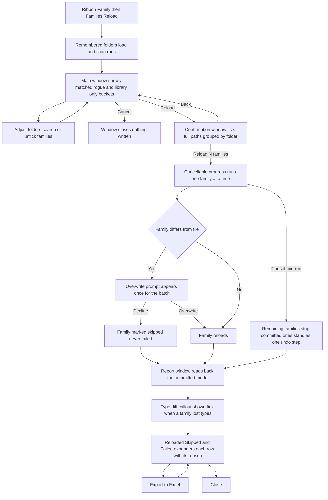

# Families Reload — UI Mockup & Operation Diagrams

> Visual companion to handoff.md, which is authoritative. Mockups are ASCII wireframes; diagrams are Mermaid (rendered by GitHub).

## Window: Main window

```
┌────────────────────────────────────────────────────────────────────────────────────────────┐
│ Families Reload                                                                            │
│ Reloads loaded families from the library folders, matched by name.                         │
├────────────────────────────────────┬───────────────────────────────────────────────────────┤
│ Library folders                    │ Matched families                                      │
│                                    │ 31 matched — 29 selected, 2 unchecked.                │
│ \\office\lib\Electrical            │                 [ Select All ]   [ Select None ]      │
│ \\office\lib\Doors-Casework        │ Search: [                    ]                        │
│                                    │                                                       │
│ [ Add Folder... ]   [ Remove ]     │ Name          Category      Saved in  File date       │
│                                    │ [x] Duplex Receptacle  Elec Fixt.  2024     Aug 20    │
│ 214 .rfa files scanned,            │ [x] Door-Single-36x84  Doors       2024     Aug 12    │
│ 3 backups ignored.                 │ [ ] Door-Double-72x84  2027 - newer session  (grey)   │
│                                    │ [ ] Casework-Base-Cab  ambiguous - 2 files  (grey)    │
│                                    │                                                       │
│                                    │ Revit records no load date — these columns            │
│                                    │ describe the file, not which side is newer.           │
├────────────────────────────────────┴───────────────────────────────────────────────────────┤
│ 31 matched, 4 rogue (listed), 2 ambiguous — skipped, 96 library-only ignored.              │
│                                  [ Reload... ]   [ Export to Excel ]   [ Cancel ]          │
└────────────────────────────────────────────────────────────────────────────────────────────┘
```

- Ambiguous rows (two same-named files in different subfolders) grey out with both full paths in the tooltip; too-new rows grey with the parsed file year versus the session's Revit version.
- Search filters the matched list by name substring only; there is no fuzzy or renamed-file matching anywhere in this tool.
- **Reload...** stays disabled — never hidden — with "Nothing is checked" in its tooltip until at least one matched row is ticked.
- The folder list and the scan summary line persist across sessions through the tool's own pyRevit config section.

## Window: Confirmation window

```
┌────────────────────────────────────────────────────────────────────────────────────────────┐
│ Confirm Reload                                                                             │
│ 29 families will reload from 2 folders.                                                    │
├────────────────────────────────────────────────────────────────────────────────────────────┤
│ \\office\lib\Electrical                                                                    │
│   Reload Duplex Receptacle ← \\office\lib\Electrical\Duplex Receptacle.rfa                 │
│   Reload Panelboard-Surface ← \\office\lib\Electrical\Panelboard-Surface.rfa               │
│ \\office\lib\Doors-Casework                                                                │
│   Reload Door-Single-36x84 ← \\office\lib\Doors-Casework\Door-Single-36x84.rfa             │
│                                                                                            │
│ Families that differ from the file will ask Overwrite / Overwrite with                     │
│ parameter values / Cancel — Cancel skips that family.                                      │
├────────────────────────────────────────────────────────────────────────────────────────────┤
│ 29 families will reload from 2 folders. One undo step.                                     │
│                                    [ Reload 29 families ]      [ Back ]                    │
└────────────────────────────────────────────────────────────────────────────────────────────┘
```

- No acknowledgement checkbox on this window — the run is one undo step and nothing here is irreversible; the per-family native Overwrite prompt is the real consent surface, kept deliberately native-shaped.
- Rows are grouped by source folder so a reviewer can sanity-check which office library each path came from before committing.
- **Cancel** on the main window or **Back** here writes nothing; this dry run is a complete deliverable on its own.

## Window: Report window

```
┌────────────────────────────────────────────────────────────────────────────────────────────┐
│ Families Reload — Report                                                                   │
│ Read back from the committed model.                                                        │
├────────────────────────────────────────────────────────────────────────────────────────────┤
│ 1 family lost types: Door-Double — 2 types gone; placed instances re-mapped.               │
├────────────────────────────────────────────────────────────────────────────────────────────┤
│ ▾ Reloaded (27)                                                                            │
│     Duplex Receptacle              — Electrical                                            │
│     Door-Single-36x84              — Doors                                                 │
│ ▾ Skipped (1)                                                                              │
│     Panelboard-Surface — Skipped: declined at the overwrite prompt                         │
│ ▾ Failed (1)                                                                               │
│     Casework-Base-Cab — Failed, rolled back: owned by user jsmith                          │
├────────────────────────────────────────────────────────────────────────────────────────────┤
│ 27 reloaded, 1 skipped, 1 failed (rolled back). Type counts re-read from the model.        │
│                                            [ Export to Excel ]      [ Close ]              │
└────────────────────────────────────────────────────────────────────────────────────────────┘
```

- The type-diff callout only appears when it has content; a family whose type list **shrank** is the loud top-of-window callout, because that reload silently re-maps placed instances.
- A workshared failure row carries the checkout owner from `GetWorksharingTooltipInfo` verbatim, never a generic error string.
- Expander open/closed state survives Export and any rebuild; nothing here recollapses on its own.
- Counters are read back from the committed model, so a rolled-back family never appears counted as reloaded.

## User operation flow


