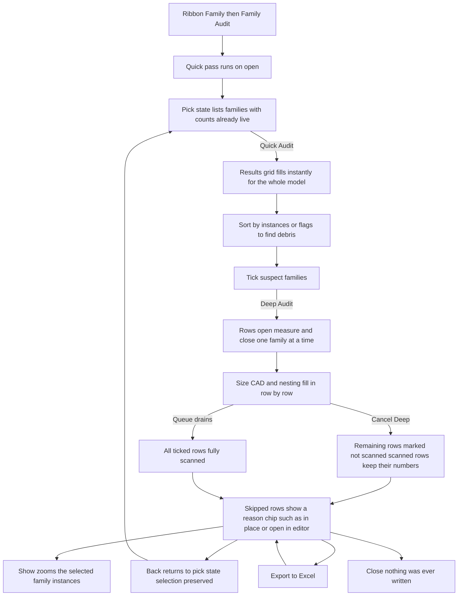
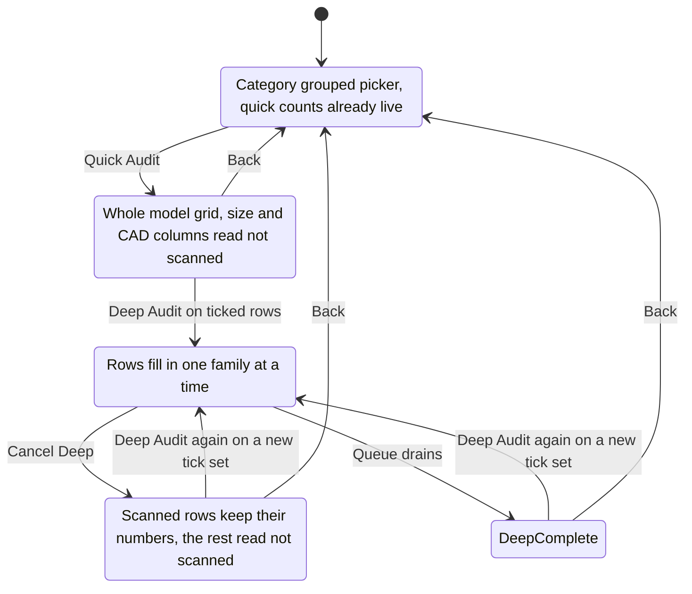

# Family Audit — UI Mockup & Operation Diagrams

> Visual companion to handoff.md, which is authoritative. Mockups are ASCII wireframes; diagrams are Mermaid (rendered by GitHub).

## Window: Main window (pick state)

```
┌────────────────────────────────────────────────────────────────────────────────────────────┐
│ Family Audit                                                                               │
│ What every loaded family weighs, carries, and hides.                                       │
├────────────────────────────────────────────────────────────────────────────────────────────┤
│ 38 selected, 362 unchecked.                    [ Select All ]   [ Select None ]            │
│ Search: [                    ]                                                             │
├────────────────────────────────────────────────────────────────────────────────────────────┤
│ ▾ Doors                                                                                    │
│    ▾ Single-Flush                                                                          │
│       [x] Door-36x84                                                                       │
│       [x] Door-32x84                                                                       │
│ ▾ Electrical Fixtures                                                                      │
│    [x] Duplex Receptacle                                                                   │
│    [ ] Panelboard-Surface                                                                  │
│ ▾ Casework                                                                                 │
│    [ ] Casework-Base-Old                                                                   │
├────────────────────────────────────────────────────────────────────────────────────────────┤
│ 400 loadable families, 6 in-place (listed).                                                │
│                       [ Quick Audit ]   [ Deep Audit ]        [ Cancel ]                   │
└────────────────────────────────────────────────────────────────────────────────────────────┘
```

- This is the shared family-selection wizard's category-grouped picker (its third consumer), so the star row and its MinHeight, Search, and Select All/None behave exactly as they do in Families Transfer and Families Downgrade.
- The window is modeless (`ShowInTaskbar` off) so the model stays interactive and **Show**, later, can zoom while this window stays open.
- **Deep Audit** stays disabled, tooltip "opens each ticked family behind this window — seconds per family", until at least one row is ticked.
- In-place families are listed and counted but are never selectable here — `EditFamily` has nothing to open on them.

## Window: Main window (results state)

```
┌────────────────────────────────────────────────────────────────────────────────────────────┐
│ Family Audit — Results                                                                     │
│ What every loaded family weighs, carries, and hides.                                       │
├────────────────────────────────────────────────────────────────────────────────────────────┤
│ Family              Category            Types Inst Nest Size    CAD Depth Flags            │
│ Chair-Executive     Furniture             3   142   0  2.4 MB   0    1   name-suspect      │
│ Duplex Receptacle   Electrical Fixtures   1   884   0    —     —    —  not scanned         │
│ Casework-Base-Old   Casework              2     0   6  8.1 MB   3    2   name-suspect,     │
│                                                                        0 instances         │
│ Column-Lobby-01     Structural Columns    1     4   0     —     —    —  in-place           │
├────────────────────────────────────────────────────────────────────────────────────────────┤
│ Opening 12 of 38: Chair-Executive...                          [ Cancel Deep ]              │
├────────────────────────────────────────────────────────────────────────────────────────────┤
│ 38 audited, 3 skipped (listed), 362 not scanned.                                           │
│ [ Show ]  [ Deep Audit ]  [ Export to Excel ]         [ Back ]      [ Close ]              │
└────────────────────────────────────────────────────────────────────────────────────────────┘
```

- The grid is sortable; Quick-pass columns (Category, Types, Inst., Nested inst.) fill instantly for the whole model, while Size, CAD Imports, and Nested (depth) read "—" until a row is deep-scanned.
- Flags render as short chips with the full reason in the tooltip; name-suspect is labelled a heuristic and never triggers anything automatically — a project whose real convention ends in digits will see false positives.
- Nested-instance counts (`SuperComponent` set) sit in their own column and are never blurred with user-placed instances, because that split is exactly what the purge decision downstream reads.
- **Show** disables with a reason in its tooltip for zero-instance rows rather than doing nothing silently; **Back** returns to the pick state with the tick set preserved.

## User operation flow



## States and modes

*Family Audit is read-only and never writes to the model, but it genuinely has a running session: the deep pass drains one ticked family at a time and can be cancelled mid-flight without losing what already scanned.*


