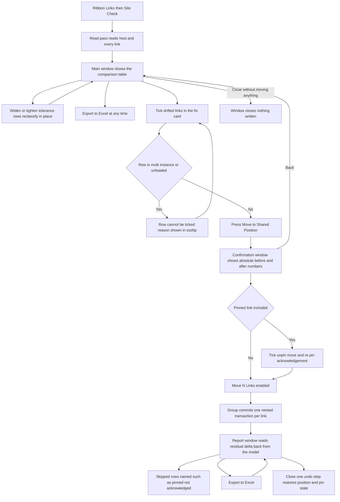

# Site Check — UI Mockup & Operation Diagrams

> Visual companion to handoff.md, which is authoritative. Mockups are ASCII wireframes; diagrams are Mermaid (rendered by GitHub).

## Window: Main window

```
┌────────────────────────────────────────────────────────────────────────────────────────────┐
│ Site Check                                                                                 │
│ Compares shared coordinates across the host and every link.                                │
├────────────────────────────────────────────────────────────────────────────────────────────┤
│ Comparison                    Flag beyond [ 1 ] mm  /  [ 0.01 ]°                           │
├────────────────────────────────────────────────────────────────────────────────────────────┤
│ Link          Shared Site   Δ Position  Δ Rotation  Δ Elevation  Flags                     │
│ ARCH-Central  Central-01    12.0 mm     +0.00°      0.0 mm     ! origin-to-origin          │
│ MEP-Central   Central-01     3.0 mm     +0.02°      1.5 mm     ! survey pts differ         │
│ STRUC-Podium  Central-01     0.2 mm      0.00°      0.0 mm     ✓ in tolerance              │
│ SITE-Survey   —              unloaded — coordinates unreadable        (grey)               │
├────────────────────────────────────────────────────────────────────────────────────────────┤
│ Fix — only flagged, fixable links                                                          │
│ [x] ARCH-Central: E 1032.500→1032.500, N 220.100→208.100 m, rot +0.00° — Δ 12.0 mm         │
│ [ ] MEP-Central: pinned — greyed until unpin acknowledged next step   (grey)               │
├────────────────────────────────────────────────────────────────────────────────────────────┤
│ 2 links off shared position, 1 unloaded — skipped. Nothing moved.                          │
│                  [ Move to Shared Position... ]  [ Export to Excel ]  [ Close ]            │
└────────────────────────────────────────────────────────────────────────────────────────────┘
```

- The tolerance controls re-classify rows in place on change without re-reading the model; everything below tolerance is a green row so hairline float noise never floods the report.
- A link placed more than once gets every instance compared and reported, but its auto-fix greys out with "position by design cannot be told from drift" — only a human knows which instance is the building and which is the copy.
- Geolocation (latitude/longitude) differences show as an informational flag only; no fix is offered for them.
- Unloaded and closed-workset links are named skips — "unloaded — coordinates unreadable" — never guessed at.

## Window: Confirmation window

```
┌────────────────────────────────────────────────────────────────────────────────────────────┐
│ Confirm Move                                                                               │
│ 2 links will move; 1 pinned link included.                                                 │
├────────────────────────────────────────────────────────────────────────────────────────────┤
│ ARCH-Central                                                                               │
│    E        1032.500 m → 1032.500 m       Rotation   +0.10° → +0.00°                       │
│    N         220.100 m →  208.100 m       Elevation  100.000 m → 100.000 m                 │
│ MEP-Central (pinned)                                                                       │
│    E          884.200 m → 884.203 m       Rotation   +0.00° → +0.00°                       │
│    N          412.800 m → 412.803 m       Elevation  102.400 m → 102.400 m                 │
│                                                                                            │
│ Revit may raise Coordination Monitor warnings after the move.                              │
│ [ ] Unpin pinned links, move them, and re-pin                                              │
├────────────────────────────────────────────────────────────────────────────────────────────┤
│ 2 links will move; 1 pinned link included.                                                 │
│                                       [ Move 2 Links ]         [ Back ]                    │
└────────────────────────────────────────────────────────────────────────────────────────────┘
```

- Numbers are absolute before/after values, not just deltas — this is precisely the tool where a wrong fix causes the disaster it exists to prevent, so the dry-run must show numbers a human can check against the survey.
- The Coordination Monitor line is informational, stating what Revit itself may raise after the move; it gates nothing by itself.
- **Move 2 Links** stays disabled while any checked pinned row lacks the unpin acknowledgement tick.

## Window: Report window

```
┌────────────────────────────────────────────────────────────────────────────────────────────┐
│ Site Check — Report                                                                        │
│ Read back from the committed model.                                                        │
├────────────────────────────────────────────────────────────────────────────────────────────┤
│ ▾ Moved (2)                                                                                │
│     ARCH-Central — residual 0.0 mm / 0.00°                                                 │
│     MEP-Central  — residual 0.0 mm / 0.00° (unpinned, moved, re-pinned)                    │
│ ▾ Skipped (1)                                                                              │
│     SITE-Survey — Skipped: unloaded, coordinates unreadable                                │
│ ▾ Failed (0)                                                                               │
├────────────────────────────────────────────────────────────────────────────────────────────┤
│ 2 moved (residual 0.0 mm), 0 failed. One undo step.                                        │
│                                            [ Export to Excel ]    [ Close ]                │
└────────────────────────────────────────────────────────────────────────────────────────────┘
```

- The residual delta is re-read from `GetTotalTransform` after commit, not assumed to be zero; a nonzero residual is printed, never rounded away.
- A skipped pinned link reads "pinned, unpin not acknowledged" — distinct wording from a failed move, which would carry Revit's own message.
- One Ctrl+Z restores both position and pin state, because unpin, move, and re-pin run inside one nested transaction per link.

## User operation flow


