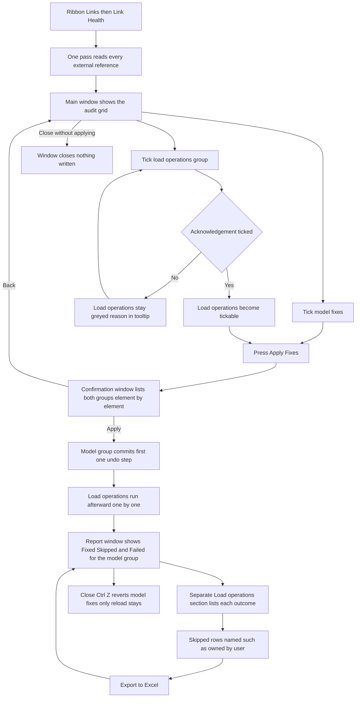

# Link Health — UI Mockup & Operation Diagrams

> Visual companion to handoff.md, which is authoritative. Mockups are ASCII wireframes; diagrams are Mermaid (rendered by GitHub).

## Window: Main window

```
┌────────────────────────────────────────────────────────────────────────────────────────────┐
│ Link Health                                                                                │
│ Everything Manage Links does not say.                                                      │
├────────────────────────────────────────────────────────────────────────────────────────────┤
│ Name           Status     Path  Attach   Pinned  Workset      Inst  Flags                  │
│ ARCH-Central   Loaded     UNC   Overlay  Yes     Z-Links        1   ✓ healthy              │
│ MEP-Central    Loaded     Abs   Attach   No      Interiors      2   ! unpinned; shared     │
│                                                                    workset                 │
│ STRUC-Podium   Loaded     UNC   Overlay  Yes     Z-Links        2   ! 2 instances, same    │
│                                                                    position                │
│ Consult-HVAC   Not Found   —     —        —       —              0   ! not found           │
│ Detail-CAD.dwg Loaded     UNC   (import)  —      Z-Links        1   ! import, not a link   │
├────────────────────────────────────────────────────────────────────────────────────────────┤
│ One undo step                                                                              │
│ [x] Pin 3 unpinned instances                                                               │
│ [x] Move 2 links to workset:  [ Z-Links  v ]                                               │
│ [ ] Delete 1 exact-duplicate instance — keeping the pinned one                             │
│ [ ] Delete 1 never-placed link type                                                        │
│ Load operations (not undoable)                        (greyed until acknowledged)          │
│ [ ] I understand: unload/reload happens outside the undo step                              │
│ [ ] Reload 1 out-of-date link (MEP-Central)                            (grey)              │
│ [ ] Unload 1 link (Consult-HVAC — Not Found)                           (grey)              │
├────────────────────────────────────────────────────────────────────────────────────────────┤
│ 6 findings, 2 fixes checked. Nothing written.                                              │
│                       [ Apply Fixes... ]   [ Export to Excel ]    [ Close ]                │
└────────────────────────────────────────────────────────────────────────────────────────────┘
```

- The two fix groups are visually separate on purpose: "One undo step" commits through one assimilated TransactionGroup, while "Load operations" cannot join a transaction at all and run afterward — blurring the two would break the house one-undo promise.
- The load-operations group stays greyed until its own acknowledgement checkbox is ticked; ticking a model fix never requires it, so model-only fixes can be applied without ever seeing that tick.
- Near-duplicate instances (transforms differ by a stated distance, not exact matches) are a flag for a human and are never offered for deletion — only exact duplicates ever are.
- "Loaded, never placed" deletion ships default-unticked even when the audit finds one; every unavailable fix greys out with its reason in a tooltip rather than vanishing.

## Window: Confirmation window

```
┌────────────────────────────────────────────────────────────────────────────────────────────┐
│ Confirm Fixes                                                                              │
│ 4 model fixes in one undo step; 1 load operation after it.                                 │
├────────────────────────────────────────────────────────────────────────────────────────────┤
│ One undo step                                                                              │
│   Pin ARCH-Central instance 402711                                                         │
│   Pin MEP-Central instance 402833                                                          │
│   Move MEP-Central to workset Z-Links                                                      │
│   Delete duplicate STRUC-Podium instance 402955 — keeping 402711: pinned                   │
├────────────────────────────────────────────────────────────────────────────────────────────┤
│ Load operations — run after the undo step, cannot be rolled back with it                   │
│   Reload MEP-Central                                                                       │
│ [ ] I understand unload/reload happens outside the undo step                               │
├────────────────────────────────────────────────────────────────────────────────────────────┤
│ 4 model fixes in one undo step; 1 load operation after it.                                 │
│                                              [ Apply ]         [ Back ]                    │
└────────────────────────────────────────────────────────────────────────────────────────────┘
```

- Each model fix lists its target element and reason (the duplicate-deletion tiebreak rule is stated inline: pinned first, else lowest ElementId); each load op repeats the "cannot be rolled back with it" warning right on its row.
- The two groups keep their own headers here too, so the split that matters at commit time is never ambiguous on the page a user actually reads before clicking Apply.

## Window: Report window

```
┌────────────────────────────────────────────────────────────────────────────────────────────┐
│ Link Health — Report                                                                       │
│ Read back from the committed model.                                                        │
├────────────────────────────────────────────────────────────────────────────────────────────┤
│ ▾ Fixed (4)                                                                                │
│     Pin ARCH-Central instance 402711                                                       │
│     Move MEP-Central to workset Z-Links                                                    │
│     Delete duplicate STRUC-Podium instance 402955                                          │
│ ▾ Skipped (1)                                                                              │
│     Pin MEP-Central instance 402833 — Skipped: owned by user jsmith                        │
│ ▾ Failed (0)                                                                               │
├────────────────────────────────────────────────────────────────────────────────────────────┤
│ Load operations                                                                            │
│     MEP-Central — reloaded, outside the undo step                                          │
├────────────────────────────────────────────────────────────────────────────────────────────┤
│ 4 fixed, 1 skipped, 0 failed. 1 link reloaded (outside the undo step).                     │
│ Statuses re-read from the model.                                                           │
│                                            [ Export to Excel ]    [ Close ]                │
└────────────────────────────────────────────────────────────────────────────────────────────┘
```

- Load operations get their own section below the model group's Fixed/Skipped/Failed expanders, clearly outside the "one undo step" those expanders describe.
- A checkout refusal names the owner from `GetWorksharingTooltipInfo` rather than a generic failure message.
- One Ctrl+Z reverts every model fix; the footer says plainly that the completed reload does not revert with it.

## User operation flow


