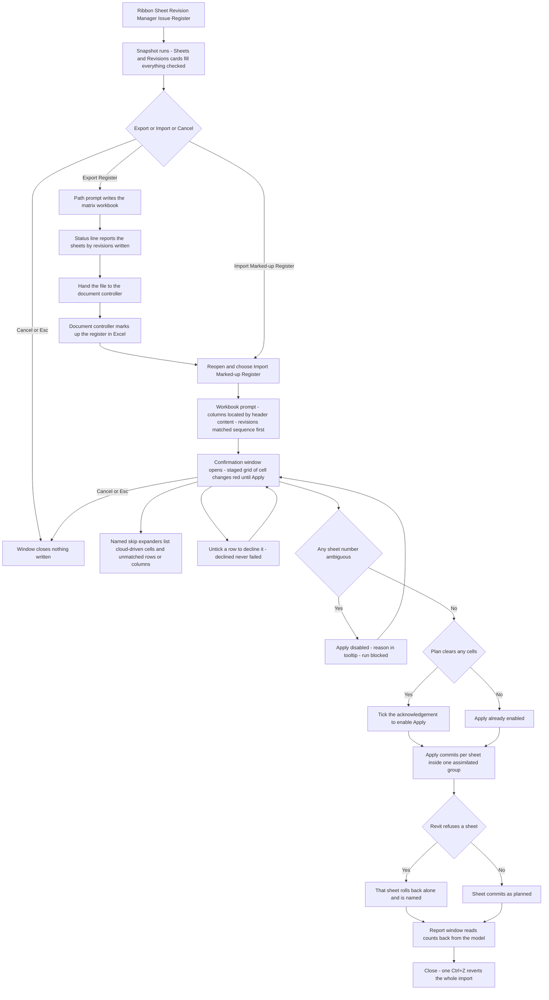

# Issue Register — UI Mockup & Operation Diagrams

> Visual companion to handoff.md, which is authoritative. Mockups are ASCII wireframes; diagrams are Mermaid (rendered by GitHub).

## Window: Main window

```
┌────────────────────────────────────────────────────────────────────────────────────────────────┐
│ Issue Register                                                                                  │
│ Export the sheets-by-revisions matrix; import it back after markup. C cells come from clouds    │
│ and only a cloud can clear them.                                                                │
├────────────────────────────────────────────────────────────────────────────────────────────────┤
│ ┌─ Sheets ───────────────────────────────────┐  ┌─ Revisions ────────────────────────────────┐ │
│ │ 143 sheets -- 143 checked, 0 unchecked.    │  │ [x] Include issued revisions               │ │
│ │              [Select All]  [Select None]   │  │ [x] Seq 14 - 2026-08-22 - For Review       │ │
│ │ Search: [__________]                       │  │ [x] Seq 13 - 2026-08-15 - Issued for       │ │
│ │ [x] A-101                                  │  │       Construction                          │ │
│ │ [x] A-102                                  │  │ [x] Seq 12 - 2026-08-01 - Issued for        │ │
│ │ [x] E-501                                  │  │       Permit                                │ │
│ │ ... 140 more                               │  │ ... 9 more                                  │ │
│ └─────────────────────────────────────────────┘  └────────────────────────────────────────────┘ │
├────────────────────────────────────────────────────────────────────────────────────────────────┤
│ Wrote 143 sheets × 12 revisions to Issue Register 2026-08-25.xlsx.                              │
│              [ Export Register... ]   [ Import Marked-up Register... ]      [ Cancel ]          │
└────────────────────────────────────────────────────────────────────────────────────────────────┘
```

- The Revisions card's "Include issued revisions" checkbox is on by default — issued revisions are usually the whole point of the register.
- Search filters the Sheets list by substring on the sheet number without losing existing checks.
- **Export Register…** is `IsDefault`; **Import Marked-up Register…** and **Cancel** (`IsCancel`) sit beside it — the window never writes to the model itself, export only reads.
- The status line only ever reports what was just written or imported; before either action it is blank.

## Window: Confirmation window (import)

```
┌────────────────────────────────────────────────────────────────────────────────────────────────┐
│ Issue Register — Confirm Import: Issue Register 2026-08-25 - marked up.xlsx                     │
├────────────────────────────────────────────────────────────────────────────────────────────────┤
│ Sheet     Revision                Was    Becomes                                                │
│ *A-204    Seq 14 / 2026-08-22     --     A (add)                                                 │
│ *A-204    Seq 12 / 2026-08-01     A      -- (clear)                                              │
│ *E-501    Seq 14 / 2026-08-22     --     A (add)                                                 │
│  A-101    Seq 13 / 2026-08-15     A      A (no change)                                           │
├────────────────────────────────────────────────────────────────────────────────────────────────┤
│ ▾ Cloud-driven attempts (3) — comes from a cloud; remove the cloud                               │
│      A-105 / Seq 12 — tried to clear a C cell                                                    │
│ ▾ Rows unmatched (2)                                                                              │
│      Row "A-999" — unknown sheet number                                                          │
│      Column "Rev 99" — unmatched revision                                                        │
├────────────────────────────────────────────────────────────────────────────────────────────────┤
│ 61 cells to add, 9 to clear, 3 skipped (cloud-driven), 2 rows unmatched.                         │
│ [x] Revisions will be removed from 9 sheets.                     [ Apply ]     [ Cancel ]        │
└────────────────────────────────────────────────────────────────────────────────────────────────┘
```

- Rows marked `*` are staged changes and render red until Apply commits; the "no change" row (A-101) renders grey and is never a write.
- The named-skip expanders quote the offending row or column header verbatim, per the fail-closed identity rule — never a guess at what row or column was meant.
- While any sheet number in the model is ambiguous, **Apply** is disabled — never hidden — with the reason in its tooltip; that state isn't pictured here since nothing is ambiguous in this example.
- The acknowledgement tick only appears because this plan contains clears; it sits left of the buttons and gates Apply until checked.

## Window: Report window

```
┌────────────────────────────────────────────────────────────────────────────────────────────────┐
│ Issue Register — Report                                                                         │
│ Read-only. Read back from the committed model.                                                  │
├────────────────────────────────────────────────────────────────────────────────────────────────┤
│ Sheet    Revision              Result                                                           │
│ A-204    Seq 14 / 2026-08-22   added                                                             │
│ A-204    Seq 12 / 2026-08-01   cleared                                                           │
│ E-501    Seq 14 / 2026-08-22   added                                                             │
│ A-105    Seq 12 / 2026-08-01   skipped: comes from a cloud; remove the cloud                     │
│ A-999    --                    skipped: unknown sheet number                                     │
├────────────────────────────────────────────────────────────────────────────────────────────────┤
│ 61 added, 9 cleared — read back from the model. 3 cloud-driven cells unchanged.                 │
│ One undo step.                                                                     [ Close ]     │
└────────────────────────────────────────────────────────────────────────────────────────────────┘
```

- Every count here is re-read from the committed model after Apply, never carried forward from the staged grid.
- A sheet Revit refused would list whole under a Failed result with Revit's reason verbatim — none refused in this example run.
- Read-only WPF table; **Close** is the only affordance — one Ctrl+Z in Revit reverts the whole import.

## User operation flow


