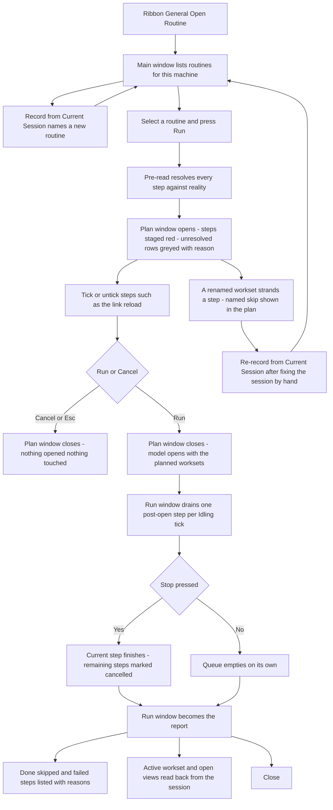
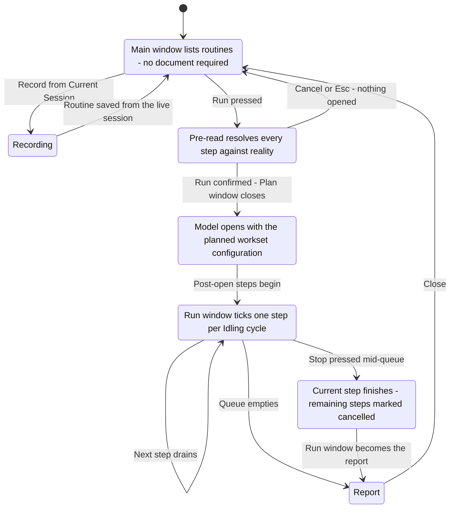

# Open Routine — UI Mockup & Operation Diagrams

> Visual companion to handoff.md, which is authoritative. Mockups are ASCII wireframes; diagrams are Mermaid (rendered by GitHub).

## Window: Main window

```
┌────────────────────────────────────────────────────────────────────────────────────────────────┐
│ Open Routine                                                                                    │
│ Record a model's opening ritual once; replay it on demand.                                      │
├─ Routines ─────────────────────────────────────────────────────────┬─────────────────────────────┤
│ Search: [                                    ]                     │ [ Record from Current      │
│                                                                     │   Session ]      (greyed - │
│  Name                     Model                  Steps  Last run   │   no document open)         │
│ >L2 Electrical — morning  ACME-Tower-E.rvt       14     Aug 22     ├─────────────────────────────┤
│  L3 Mechanical - morning  ACME-Tower-M.rvt       9      Aug 20     │ [ Run ]         (IsDefault) │
│  Coordination model open  ACME-Tower-Coord.rvt   6      Aug 15     │ [ Edit ]                    │
│  Site survey open         ACME-Tower-Site.rvt    4      Jul 30     │ [ Delete ]                  │
│                                                                     ├─────────────────────────────┤
│                                                                     │ [ Export... ]               │
│                                                                     │ [ Import... ]               │
├─────────────────────────────────────────────────────────────────────────────────────────────────┤
│ 4 routines. 'L2 Electrical — morning' last ran Aug 22.                              [ Close ]    │
└────────────────────────────────────────────────────────────────────────────────────────────────┘
```

- The Routines list is single-select (`>` marks the highlighted row), not a checkbox list — **Run**, **Edit**, **Delete**, and **Record from Current Session** all act on whichever row is highlighted.
- **Record from Current Session** greys out with "No document is open" in its tooltip whenever this window is opened with no active document — the button never disappears.
- **Export…** / **Import…** hand a routine off as JSON in the My Ribbon manner, set apart from the per-routine actions by the divider.
- **Close** (`IsCancel`) is the only button here that isn't gated — this window never touches a document by itself.

## Window: Plan window

```
┌─ Open Routine — Plan: L2 Electrical — morning ────────────────────────────────────────────────┐
│ 14 steps resolved against the live model before anything runs.                                │
├─ Opening ───────────────────────────────────────────────────────────────────────────────────────┤
│ *[x] Open workset AR-Shell                                                                       │
│ *[x] Open workset E-Power                                                                        │
│ *[x] Open workset E-Lighting                                                                     │
│  [ ] Open workset AR-Interior     — skipped: not found, renamed since recording      (greyed)   │
│  ... 6 of 14 worksets                                                                            │
├─ After open ──────────────────────────────────────────────────────────────────────────────────┤
│ *[x] Set active workset: E-Power                                                                 │
│  [ ] Reload link ST-Central.rvt         Link reloads cannot be undone.                           │
│ *[x] Open view: E1-02 Level 2 Power                                                              │
│ *[x] Open view: 3D Coordination                                                                  │
│ *[x] Close other open views                                                                      │
├──────────────────────────────────────────────────────────────────────────────────────────────┤
│ 14 steps — 11 resolved, 2 skipped (workset renamed), 1 unchecked.                               │
│                                                                        [ Run ]     [ Cancel ]    │
└──────────────────────────────────────────────────────────────────────────────────────────────┘
```

- Rows marked `*` are staged and render red until Run is confirmed; the unresolvable workset row greys out with its reason in a tooltip instead.
- The link reload step is unchecked by default with its "cannot be undone" note printed beside it, never only in a tooltip — the one step here that changes the document.
- Unresolvable rows are named, never silently dropped: this plan shows "workset renamed" as the reason a step cannot run.
- **Run** (`IsDefault`) closes this window and opens the document before any post-open step fires; **Cancel** (`IsCancel`) opens nothing and touches nothing.

## Window: Run window

```
┌─ Open Routine — Run: L2 Electrical — morning ───────────────────────────────── (modeless) ────┐
│ Reloading link ST-Central (2 of 3)…                                                            │
├─────────────────────────────────────────────────────────────────────────────────────────────┤
│ done       Open workset AR-Shell                                                               │
│ done       Open workset E-Power                                                                │
│ done       Set active workset: E-Power                                                         │
│ running    Reload link ST-Central.rvt                                                          │
│ pending    Open view: E1-02 Level 2 Power                                                       │
│ pending    Close other open views                                                               │
├─────────────────────────────────────────────────────────────────────────────────────────────┤
│                                                                                    [ Stop ]     │
└─────────────────────────────────────────────────────────────────────────────────────────────┘
```

- Modeless and small: it opens once the document is up (immediately, if the model was already open) and stays while the Idling queue drains one step per tick, never in a tight loop.
- When the queue empties, the step list becomes a read-only done/skipped/failed table and **Stop** relabels to **Close**: "12 done, 2 skipped (workset renamed; last view kept open), 0 failed. Active workset read back: E-Power."
- **Stop** finishes the currently running step, marks everything still pending as cancelled, and still opens the report — a half-run ritual always ends in a readable report.
- For an already-open target model, the Opening steps above show as done or not-applicable immediately, and only the After-open steps actually drain.

## User operation flow



## States and modes


