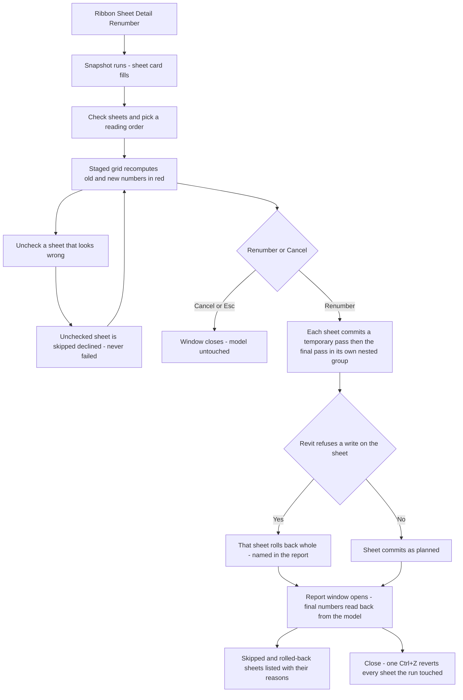

# Detail Renumber — UI Mockup & Operation Diagrams

> Visual companion to handoff.md, which is authoritative. Mockups are ASCII wireframes; diagrams are Mermaid (rendered by GitHub).

## Window: Main window

```
┌────────────────────────────────────────────────────────────────────────────────────────────────┐
│ Detail Renumber                                                                                 │
│ Renumber viewports by their position on the sheet. The whole sheet renumbers together.          │
├─ Sheets ─────────────────────────────────────────┬─ Reading order: [Left-to-right / top-down v]─┤
│ 38 sheets — 12 checked, 26 unchecked.             │ Sheet   View                Old   New        │
│                      [Select All]  [Select None]  │ *A-201  Plan Detail 1       7     1           │
│ Search: [                    ]                    │ *A-201  Wall Section        2     2           │
│ [x] A-201 - Details                               │ *A-201  Head Detail         9     3           │
│ [x] A-202 - Details                               │  A-201  Sill Detail         4     4 (already  │
│ [x] E-501 - Power Details                         │                                    correct)   │
│ [ ] M-601 - Mech Details                          │ *E-502  Jamb Detail         5     1           │
│ ... 34 more                                       │  E-501  --                  3     -- (unwrit- │
│                                                    │                                    able)      │
├────────────────────────────────────────────────────┴──────────────────────────────────────────┤
│ 12 sheets — 87 to renumber, 5 already correct, 1 sheet without a title block (positions taken   │
│ from sheet origin). One undo step.                                                               │
│ E-501 not staged: detail 3 is held by an unwritable viewport.                                    │
│                                                                    [ Renumber ]     [ Cancel ]    │
└────────────────────────────────────────────────────────────────────────────────────────────────┘
```

- Rows marked `*` are staged and render red until **Renumber** commits; the E-501 row has no New value and greys out, naming its bucket instead of a number.
- The "already correct" row (A-201 Sill Detail) renders grey too, never red — nothing to write there.
- Search filters the Sheets list only; the staged grid on the right recomputes whenever the checked sheets or the Reading order combo changes.
- **Renumber** (`IsDefault`) stays disabled, with the reason in its tooltip, until at least one sheet is checked.

## Window: Report window

```
┌────────────────────────────────────────────────────────────────────────────────────────────────┐
│ Detail Renumber — Report                                                                        │
│ Read-only. Final numbers re-read from the committed model.                                      │
├─ A-201 - renumbered ───────────────────────────────────────────────────────────────────────────┤
│ View                     Final #    Result                                                      │
│ Plan Detail 1            1          committed                                                    │
│ Wall Section             2          committed                                                    │
│ Head Detail              3          committed                                                    │
│ Sill Detail              4          skipped: already correct                                     │
├─ E-501 - rolled back: Revit refused the write at detail 4 ─────────────────────────────────────┤
│ (entire sheet rolled back — no viewports changed)                                                │
├────────────────────────────────────────────────────────────────────────────────────────────────┤
│ 11 sheets renumbered — 87 viewports read back. E-501 rolled back: Revit refused the write at     │
│ detail 4. One undo step.                                                                          │
│                                                                                    [ Close ]      │
└────────────────────────────────────────────────────────────────────────────────────────────────┘
```

- Grouped per sheet exactly like the staged grid it replaces; a rolled-back sheet (E-501) lists whole under its refusal reason instead of showing numbers that never took effect.
- Final # is read back from the committed model, never copied forward from the plan.
- Read-only WPF table — **Close** is the only affordance; one Ctrl+Z in Revit reverts every sheet the run touched.

## User operation flow


