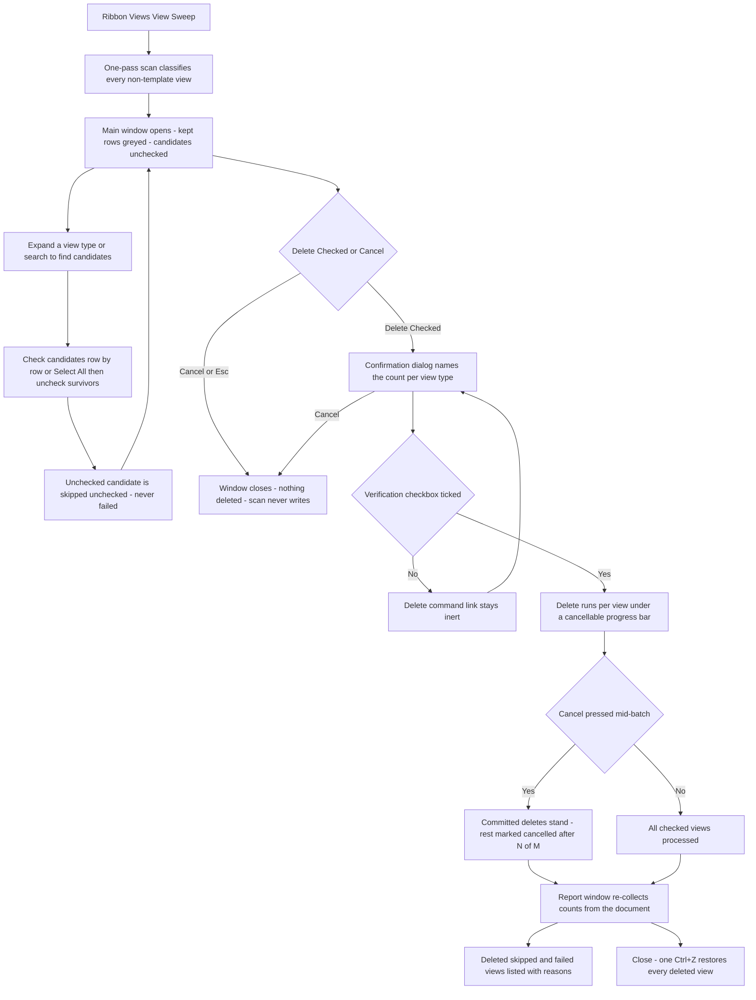

# View Sweep — UI Mockup & Operation Diagrams

> Visual companion to handoff.md, which is authoritative. Mockups are ASCII wireframes; diagrams are Mermaid (rendered by GitHub).

## Window: Main window

```
┌────────────────────────────────────────────────────────────────────────────────────────────────┐
│ View Sweep                                                                                      │
│ Finds views no sheet or view depends on. Kept views stay visible with their reason.             │
├────────────────────────────────────────────────────────────────────────────────────────────────┤
│ 214 candidates, 38 checked.                [Select All] [Select None]    [ ] Hide kept views    │
│ Search: [                              ]                                                         │
├────────────────────────────────────────────────────────────────────────────────────────────────┤
│ Name                            Creator      Last Changed By                                    │
│ ▾ Floor Plans (14)                                                                                │
│    [x] Copy of Level 2 - RL     jsmith       jsmith                                              │
│    [x] Working Plan - temp      aleung       jsmith                                              │
│    [ ] Level 2 - Electrical     --           --        kept: placed on sheet E-101    (greyed)  │
│ ▾ Sections (61)                                                                                   │
│    [ ] Section A-A              --           --        kept: references unverifiable  (greyed)  │
│                                                          on this version                          │
│ ▾ 3D Views (39)                                                                                   │
│    [x] 3D Coordination check    aleung       aleung                                              │
│    [ ] {3D}                     --           --        kept: starting view            (greyed)  │
├────────────────────────────────────────────────────────────────────────────────────────────────┤
│ 486 views scanned — 272 kept with reasons, 214 candidates. Nothing has been deleted yet.         │
│ References unverifiable on this version — 61 sections kept closed.                               │
│                                                              [ Delete Checked... ]  [ Cancel ]    │
└────────────────────────────────────────────────────────────────────────────────────────────────┘
```

- Creator and Last Changed By resolve for candidate rows only, never for the kept majority — kept rows show `--` there and carry their full reason in a tooltip instead of the truncated inline text shown here.
- Kept rows sit greyed in place with their checkbox disabled; they are never hidden, because trust in a delete tool comes from seeing what it refused to touch and why.
- "Hide kept views" filters at rebuild time without changing any bucket; Search flips visibility only, so existing checks on candidates survive it.
- **Delete Checked…** (`IsDefault`) stays disabled, reason in its tooltip, until at least one candidate is checked; the two attribution columns are hidden entirely (not shown empty) in a non-workshared document.

## Window: Confirmation dialog

```
┌─ View Sweep ─────────────────────────────────────────────────────────────┐
│ Delete 38 views?                                                         │
│ 14 Floor Plans, 3 Sections, 21 3D Views.                                 │
│                                                                           │
│ [ ] Everything drawn only in these views is deleted with them.          │
│                                                                           │
│   ┌───────────────────────────────────────────────────────────────────┐ │
│   │ Delete 38 views (one undo step)                                   │ │
│   └───────────────────────────────────────────────────────────────────┘ │
│   ┌───────────────────────────────────────────────────────────────────┐ │
│   │ Cancel                                                            │ │
│   └───────────────────────────────────────────────────────────────────┘ │
└───────────────────────────────────────────────────────────────────────────┘
```

- Native TaskDialog command-link mimicry, in the Review-Warnings-register shape — not a WPF window like the Main window.
- The "Delete 38 views" command link stays inert until the verification checkbox above it is ticked.
- Per-view-type counts (14 Floor Plans, 3 Sections, 21 3D Views) sum to the 38 named in the title; **Cancel** here writes nothing.

## Window: Report window

```
┌────────────────────────────────────────────────────────────────────────────────────────────────┐
│ View Sweep — Report                                                                              │
│ Read-only. Re-collected from the document.                                                       │
├────────────────────────────────────────────────────────────────────────────────────────────────┤
│ Name                          Result                                                             │
│ Copy of Level 2 - RL          deleted                                                             │
│ Working Plan - temp           deleted                                                             │
│ 3D Coordination check         deleted                                                             │
│ Elevation - West (old)        failed: Revit refused the delete (last elevation of its type)      │
│ Working 3D - RL               skipped: owned by jsmith                                            │
├────────────────────────────────────────────────────────────────────────────────────────────────┤
│ 37 deleted, 1 failed (Revit: last elevation of its type), 176 candidates remain — re-counted     │
│ from the model. One undo step.                                                                    │
│                                                                                     [ Close ]      │
└────────────────────────────────────────────────────────────────────────────────────────────────┘
```

- Deleted / Skipped / Failed sit in one flat re-collected table; Failed carries Revit's refusal message verbatim, never paraphrased.
- The remaining-candidate count is re-counted from the model after the batch, not carried forward from the plan.
- Read-only WPF table, **Close** only; one Ctrl+Z in Revit restores every deleted view.

## User operation flow


