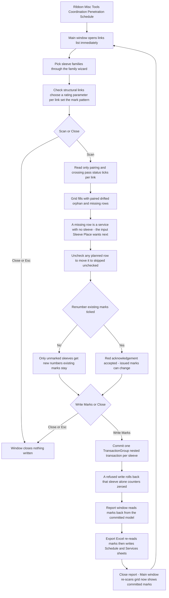

# Penetration Schedule — UI Mockup & Operation Diagrams

> Visual companion to handoff.md, which is authoritative. Mockups are ASCII wireframes; diagrams are Mermaid (rendered by GitHub).

## Window: Main window

```
┌──────────────────────────────────────────────────────────────────────────────────────────────┐
│ Penetration Schedule                                                                          │
│ Links are read, never written. Nested links cannot be reached.                                │
├──────────────────────────────────────────────────────────────────────────────────────────────┤
│ ┌──────────────────────────────────────────┐  ┌────────────────────────────────────────────┐ │
│ │ Sleeves & structure                      │  │ Numbering & rating                         │ │
│ ├──────────────────────────────────────────┤  ├────────────────────────────────────────────┤ │
│ │ Sleeve families: [ Pick families... ]    │  │ Pattern: [ P-{level}-{nnn}          ]      │ │
│ │ Sleeve-Round, Sleeve-Rect                │  │ Example: P-L2-001                          │ │
│ │                                          │  │                                            │ │
│ │ 2 of 3 links selected.                   │  │ [ ] Renumber existing marks                │ │
│ │ [Select All]  [Select None]              │  │ *Marks already issued to the structural    │ │
│ │ Search: [__________]                     │  │  engineer will change.                     │ │
│ │                                          │  │                                            │ │
│ │ [x] EB-Structure.rvt                     │  │ Rating parameter per checked link:         │ │
│ │ [x] EB-Structure-Roof.rvt                │  │ EB-Structure.rvt      [ Fire_Rating   v]   │ │
│ │ [ ] EB-Structure-Annex.rvt   (unloaded)  │  │ EB-Structure-Roof.rvt [ no source     v]   │ │
│ └──────────────────────────────────────────┘  └────────────────────────────────────────────┘ │
├──────────────────────────────────────────────────────────────────────────────────────────────┤
│ [x] Mark            Lvl Host (Rate)     Service          Size      Offset       Status        │
│ [x] 205->P-L2-001*  L2  W1 CMU200 2HR   PIPE CHW-S 3in   RND 4in   A+1.2 3+0.8  Paired  [Show] │
│ [x] new->P-L2-002*  L2  W1 CMU200 2HR   DUCT SA 24x12    RCT 27x15 B+0.4 3+1.1  Paired  [Show] │
│ [x] 118 (kept)      L3  W2 CMU150 1HR   COND EMT 2in     RND 3in   --           Drifted 35mm   │
│ [x] 214 (kept)      L2  --              --               --        --          Orphan  [Show] │
│ [x] --              L3  W4 corewall --  SAN 100          --        --          Missing sleeve  │
├──────────────────────────────────────────────────────────────────────────────────────────────┤
│ 214 penetrations: 195 paired, 9 drifted, 6 orphans -- 4 services missing sleeves.              │
│ Marks staged: 187 new, 27 kept. Nothing is written until Write Marks.                          │
│                                    [ Scan ]  [ Write Marks ]  [ Export Excel ]  [ Close ]      │
└──────────────────────────────────────────────────────────────────────────────────────────────┘
```

- `205->P-L2-001*` and `new->P-L2-002*` render solid red until **Write Marks**; `118` and `214` are
  existing marks kept as-is (plain text, not red) because "Renumber existing marks" is unticked.
- Drifted, orphan, and missing rows grey out with their reason in place of a Size/Offset value
  (`--`); the missing row has no Mark at all — it is a service, not a sleeve, and its Show button
  zooms to the service instead of a sleeve. Every planned row stays individually uncheckable.
- `EB-Structure-Roof.rvt` shows "no source" in its rating ComboBox until a parameter is chosen;
  until then its Rating column reads "no rating source chosen for link X", never a blank.
- **Write Marks** and **Export Excel** stay disabled — never hidden — with the unmet condition
  named in their tooltip until a scan exists.

## Window: Report window

```
┌────────────────────────────────────────────────────────────────────────────────────────────┐
│ Penetration Schedule - Report                                                              │
│ Read only. Read back from the committed model, not from the plan.                          │
├────────────────────────────────────────────────────────────────────────────────────────────┤
│ Sleeve / Service                Level  Mark           Result                               │
│ PIPE CHW-S 3in (id 512907)      L2     P-L2-001       Written                              │
│ DUCT SA 24x12 (id 512944)       L2     P-L2-002       Written                              │
│ COND EMT 2in (id 512980)        L3     118            Kept                                 │
│ SAN 100 (service, no sleeve)    L2     --             Skipped - missing sleeve             │
│ PIPE HW-R 2in (id 513002)       L1     --             Rolled back - write refused          │
├────────────────────────────────────────────────────────────────────────────────────────────┤
│ 187 marks written, 27 kept, 2 rolled back -- read back from the model. One undo step.       │
│ Still open: 9 drifted, 6 orphans, 4 services missing sleeves.                               │
│                                                                          [ Export Excel ]   │
│                                                                          [ Close ]          │
└────────────────────────────────────────────────────────────────────────────────────────────┘
```

- Every Mark cell is read back from the committed model — a Written row shows the mark Revit
  actually stored, never the one that was staged.
- Rolled-back rows are listed apart from ordinary skips, and their counters are zeroed so the
  report never claims a mark that is gone.
- Closing this window re-scans the Main window, so its grid now shows the committed marks in
  black instead of red.

## User operation flow


