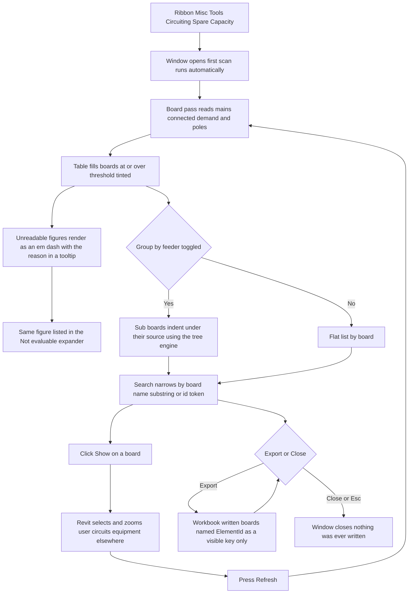

# Spare Capacity — UI Mockup & Operation Diagrams

> Visual companion to handoff.md, which is authoritative. Mockups are ASCII wireframes; diagrams are Mermaid (rendered by GitHub).

## Window: Main window

```
┌──────────────────────────────────────────────────────────────────────────────────────────────┐
│ Spare Capacity                                                                                │
│ Read-only. Demand is shown as the model computed it.                                          │
├──────────────────────────────────────────────────────────────────────────────────────────────┤
│ Threshold (%): [ 80 ]     [ ] Group by feeder      Search: [__________]                       │
├──────────────────────────────────────────────────────────────────────────────────────────────┤
│ Panel    Fed From   Mains    Connected   Demand    % Used   Open Poles                        │
│ ! LP-2   MDP        225 A    312 A       189 A     84%      6                        [Show]   │
│   RP-1   MDP        100 A     58 A        22 A     22%     18                        [Show]   │
│   DP-1   MDP        400 A    248 A        --        --      --                       [Show]   │
│   MSB    Utility     --      1,180 A     902 A     --       --                       [Show]   │
│                                                                                                │
│ > Not evaluable (3)                                                                           │
│     DP-1 -- max breakers not set on the family -- open poles not computed                     │
│     DP-1 -- no demand current on this release -- % of main not computed                       │
│     MSB  -- mains rating not set on the family -- % of main not computed                      │
├──────────────────────────────────────────────────────────────────────────────────────────────┤
│ 42 boards read -- 5 at or over 80% demand, 3 figures not evaluable. Nothing was changed.       │
│                                              [ Refresh ]     [ Export ]       [ Close ]        │
└──────────────────────────────────────────────────────────────────────────────────────────────┘
```

- The `!` marker on `LP-2` stands in for the live threshold tint (84% is at or over the 80%
  Threshold box); `RP-1` at 22% renders unhighlighted, and the tint recomputes the moment the
  Threshold value changes — no re-scan needed.
- `DP-1`'s and `MSB`'s unreadable cells render as an em-dash whose tooltip carries the raw text
  and reason (e.g. "max breakers not set on the family"); each is also echoed as its own line in
  the "Not evaluable" expander, grouped per figure, never averaged in as a zero.
- "Group by feeder" (unchecked here) re-nests the table under the tree engine Circuit Schedule
  already uses, so a sub-board like `RP-1` would indent under the panel that feeds it; expander
  state survives Refresh.
- **Export** stays disabled with the tooltip "Nothing to export yet." until the first scan
  completes; there is no confirmation window and no report window, because the tool never writes.

## User operation flow


