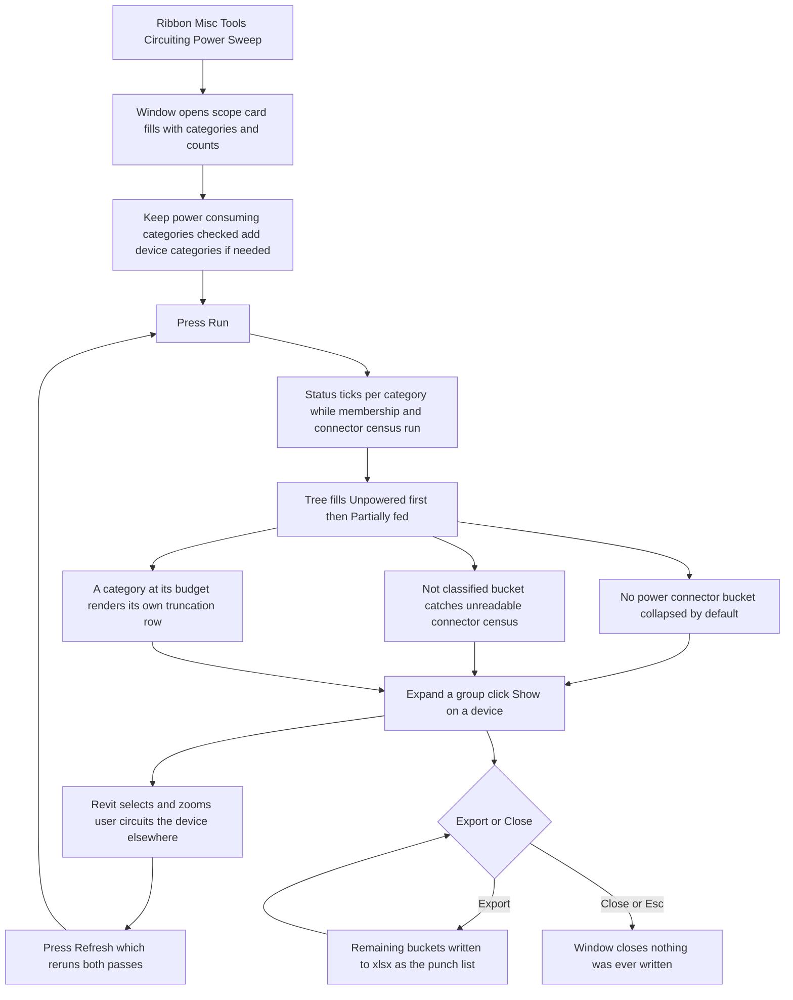

# Power Sweep — UI Mockup & Operation Diagrams

> Visual companion to handoff.md, which is authoritative. Mockups are ASCII wireframes; diagrams are Mermaid (rendered by GitHub).

## Window: Main window

Before Run, the scope card fills with categories and live instance counts:

```
┌──────────────────────────────────────────────────────────────────────────────────────────────┐
│ Power Sweep                                                                                   │
│ Read-only. Power connectors only -- closed worksets are not read.                             │
├──────────────────────────────────────────────────────────────────────────────────────────────┤
│ Scope                                                                                         │
│ 4 of 11 categories selected.                            [ Select All ]   [ Select None ]      │
│ [x] Electrical Fixtures -- 1,204      [x] Lighting Fixtures -- 1,950                          │
│ [x] Electrical Equipment -- 62        [x] Mechanical Equipment -- 118                          │
│ [ ] Data Devices -- 340   (usually no power connector -- counted separately when checked)      │
│ [ ] Fire Alarm Devices -- 0   (none in this model)                                             │
├──────────────────────────────────────────────────────────────────────────────────────────────┤
│ Ready. Nothing was changed.                              [  Run  ]   [ Export ]   [ Close ]   │
└──────────────────────────────────────────────────────────────────────────────────────────────┘
```

After Run, the body swaps to a summary strip over the results tree:

```
┌──────────────────────────────────────────────────────────────────────────────────────────────┐
│ Power Sweep                                                                                   │
│ Read-only. Power connectors only -- closed worksets are not read.                             │
├──────────────────────────────────────────────────────────────────────────────────────────────┤
│ 1,204 devices scanned -- 37 unpowered, 3 partially fed, 12 with no power connector.            │
│ Search: [__________]                                                                          │
│                                                                                                │
│ v Unpowered (37)                                                                              │
│    v L3                                                                                       │
│       v Electrical Fixtures                                                                  │
│          Recept-Duplex -- id 415118 -- L3                                            [Show]   │
│          Recept-Duplex -- id 415119 -- L3                                            [Show]   │
│ v Partially fed (3)                                                                           │
│    ATS-1 -- 2 power connectors, 1 circuit -- emergency side open                     [Show]   │
│ > No power connector (12)                                                                     │
│ > Not classified (0)                                                                          │
├──────────────────────────────────────────────────────────────────────────────────────────────┤
│ 1,204 devices scanned -- 37 unpowered, 3 partially fed, 12 with no power connector.            │
│ Nothing was changed.                       [ Refresh ]     [ Export ]      [ Close ]          │
└──────────────────────────────────────────────────────────────────────────────────────────────┘
```

- Zero-instance categories (`Fire Alarm Devices` here) grey out with the tooltip "none in this
  model"; device categories ship unchecked with the tooltip "usually no power connector — counted
  separately when checked" — neither is ever hidden from the Scope list.
- `v` and `>` mark expanded and collapsed groups: "No power connector" and "Not classified" start
  collapsed by default, since a large connectorless bucket in a mechanical-heavy model is
  information, not alarm.
- Every leaf device row carries a **Show** button (select and zoom via ExternalEventBridge); the
  element id is a linkified click target too.
- **Run** relabels to **Refresh** after the first pass; a category that hits its per-category
  budget renders its own truncation row instead, e.g. "Electrical Fixtures truncated at 20,000 —
  narrow the scope and re-run."

## User operation flow


