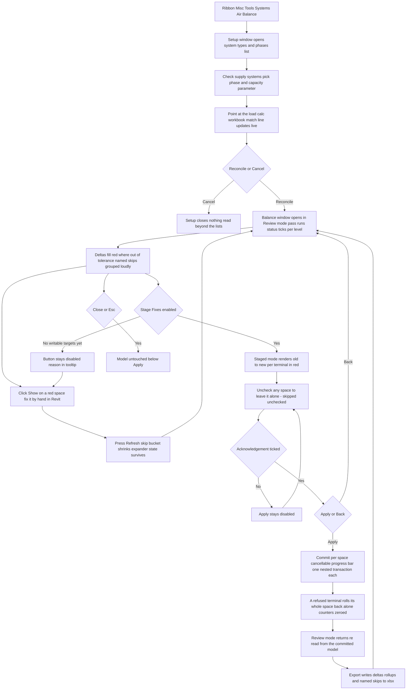
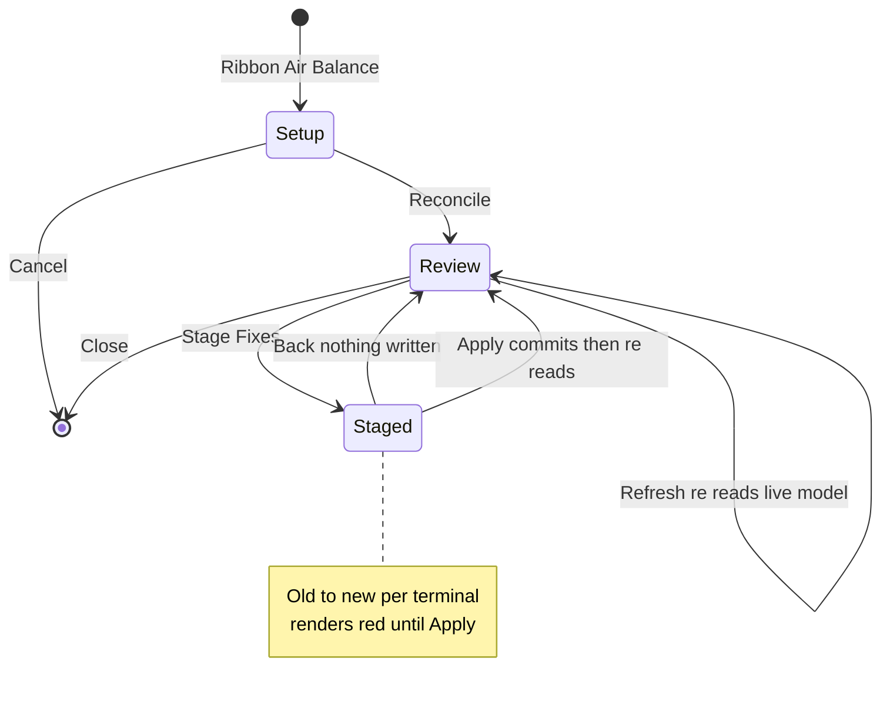

# Air Balance — UI Mockup & Operation Diagrams

> Visual companion to handoff.md, which is authoritative. Mockups are ASCII wireframes; diagrams are Mermaid (rendered by GitHub).

## Window: Setup window

```
┌──────────────────────────────────────────────────────────────────────────────────────────────┐
│ Air Balance                                                                                   │
│ Requires Spaces in this model -- rooms in a linked model are not read.                        │
├──────────────────────────────────────────────────────────────────────────────────────────────┤
│ ┌──────────────────────────────────────────┐  ┌────────────────────────────────────────────┐ │
│ │ Scope                                    │  │ Source of truth                            │ │
│ ├──────────────────────────────────────────┤  ├────────────────────────────────────────────┤ │
│ │ 4 of 9 system types selected.            │  │ ( ) Model only (Specified Airflow)         │ │
│ │ [Select All]  [Select None]              │  │ (*) Workbook...  [ LoadCalc-2026.xlsx ]    │ │
│ │ Search: [__________]                     │  │ Units: [ CFM   v]                          │ │
│ │                                          │  │                                            │ │
│ │ [x] Supply Air - AHU-1                   │  │ *63 rows -- 58 matched, 3 unmatched,       │ │
│ │ [x] Supply Air - AHU-2                   │  │ *2 duplicates (refused).                   │ │
│ │ [ ] Return Air - AHU-1                   │  │                                            │ │
│ │ [ ] Exhaust - Toilet Exhaust              │  │ Tolerance: [+/-10 CFM] [+5 %]              │ │
│ │                                          │  │ Rounding step: [ 5 CFM ]                   │ │
│ │ Phase:    [ 2 - New Construction    v]   │  │                                            │ │
│ │ Capacity: [ Rated Airflow          v]   │  │                                            │ │
│ └──────────────────────────────────────────┘  └────────────────────────────────────────────┘ │
├──────────────────────────────────────────────────────────────────────────────────────────────┤
│ Ready to reconcile against the workbook.                                                      │
│                                                          [ Reconcile ]        [ Cancel ]       │
└──────────────────────────────────────────────────────────────────────────────────────────────┘
```

- The starred match line renders red — 3 unmatched and 2 duplicate rows are refused outright
  rather than guessed; matching is exact-number-then-exact-name only, so "101" never matches
  "101A".
- Choosing "Model only" hides the file picker, units, and match line entirely — there is nothing
  external to match against, so Specified Airflow becomes the source of truth directly.
- **Reconcile** stays disabled until at least one system type is checked and, in Workbook mode, a
  file has been picked; **Cancel** here closes with nothing read beyond the lists.

## Window: Balance window

*Review mode* opens as soon as Reconcile runs, and is what Refresh always returns to:

```
┌──────────────────────────────────────────────────────────────────────────────────────────────┐
│ Air Balance - Balance                                              Review mode                │
│ 112 spaces read. Nothing has been written.                                                    │
├──────────────────────────────────────────────────────────────────────────────────────────────┤
│ Space            Design (Workbook)  Specified   Terminal sum   Delta                          │
│ v 214 Office     450 CFM            420 CFM     388 CFM        !62 over tol.          [Show]  │
│      VAV-214-1 (Supply)                         220 CFM                               [Show]  │
│      VAV-214-2 (Supply)                         168 CFM                               [Show]  │
│ > 215 Corridor   200 CFM            200 CFM     196 CFM         4 within tol.         [Show]  │
│ > 301 Conf Rm    600 CFM            600 CFM     600 CFM         0 within tol.         [Show]  │
│                                                                                                │
│ v Systems                                                                                     │
│    Supply Air-AHU-1  capacity 12,000 CFM  terminal sum 11,420 CFM  580 within tol             │
│    Supply Air-AHU-2  capacity  8,000 CFM  terminal sum  8,640 CFM  !640 over cap      [Show]  │
│                                                                                                │
│ v Named skips                                                                                 │
│    No space at phase New Construction -- 41 terminals (L3: 28, L4: 13)                        │
│    Space 214 workbook row -- duplicate number, not matched                                    │
├──────────────────────────────────────────────────────────────────────────────────────────────┤
│ 112 spaces read -- 84 within tolerance, 19 out, 9 skipped (named). 3 of 7 systems exceed       │
│ equipment capacity.                                                                           │
│                    [ Stage Fixes ]   [ Export ]   [ Refresh ]                    [ Close ]    │
└──────────────────────────────────────────────────────────────────────────────────────────────┘
```

- `!` marks a Delta or system rollup beyond tolerance, which renders red in the real window; Show
  zooms to the space or terminal so the fix happens by hand elsewhere in Revit, then Refresh
  re-reads the live model and the row either clears or moves.
- Each space row expands to its own writable terminals (`VAV-214-1`, `VAV-214-2`); "Named skips"
  groups its reasons loudly by count rather than listing all 41 terminals one by one.
- **Stage Fixes** stays disabled — never hidden — with the unmet condition in its tooltip until
  the chosen source of truth yields at least one writable target.

Pressing **Stage Fixes** flips the matched spaces into *Staged mode*, the confirmation stage:

```
┌──────────────────────────────────────────────────────────────────────────────────────────────┐
│ Air Balance - Balance                                              Staged mode                │
│ 61 spaces staged. Nothing is written until Apply.                                             │
├──────────────────────────────────────────────────────────────────────────────────────────────┤
│ [x] Space 214 Office                                                                          │
│        VAV-214-1 (Supply)   220 CFM -> *235 CFM                                               │
│        VAV-214-2 (Supply)   168 CFM -> *215 CFM                                               │
│ [x] Space 215 Corridor                                                                        │
│        VAV-215-1 (Supply)   196 CFM -> *200 CFM                                               │
│ [ ] Space 301 Conf Rm   (unchecked -- engineer asked to leave this room alone)                │
│                                                                                                │
├──────────────────────────────────────────────────────────────────────────────────────────────┤
│ 61 spaces staged -- 312 terminal writes planned, 9 spaces skipped (named).                     │
│ [ ] Terminal airflows will be overwritten.               [ Apply ]              [ Back ]      │
└──────────────────────────────────────────────────────────────────────────────────────────────┘
```

- Every terminal's old-to-new pair renders red until **Apply**; unchecking a space (`301` here)
  moves it to "skipped — unchecked", never failed, and it returns to Review mode's out-of-tolerance
  list rather than disappearing.
- **Apply** stays disabled until "Terminal airflows will be overwritten." is ticked; **Back**
  returns to Review mode with nothing written and every earlier selection intact.
- There is no separate Report window: Apply commits per space under a cancellable progress bar,
  one nested transaction each, then Review mode returns re-read from the committed model, e.g.
  "Balanced 61 spaces — read back: 58 within tolerance, 3 still out (listed). One undo step."

## User operation flow



## States and modes

*The Balance window is one long-lived surface with two named modes, plus the modal Setup window
that feeds it — Review answers what is out of balance, Staged is the confirmation gate before
any write.*


