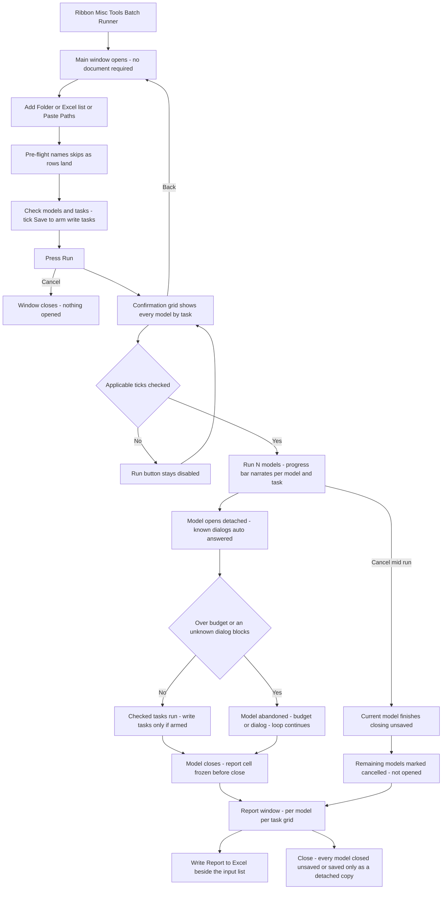
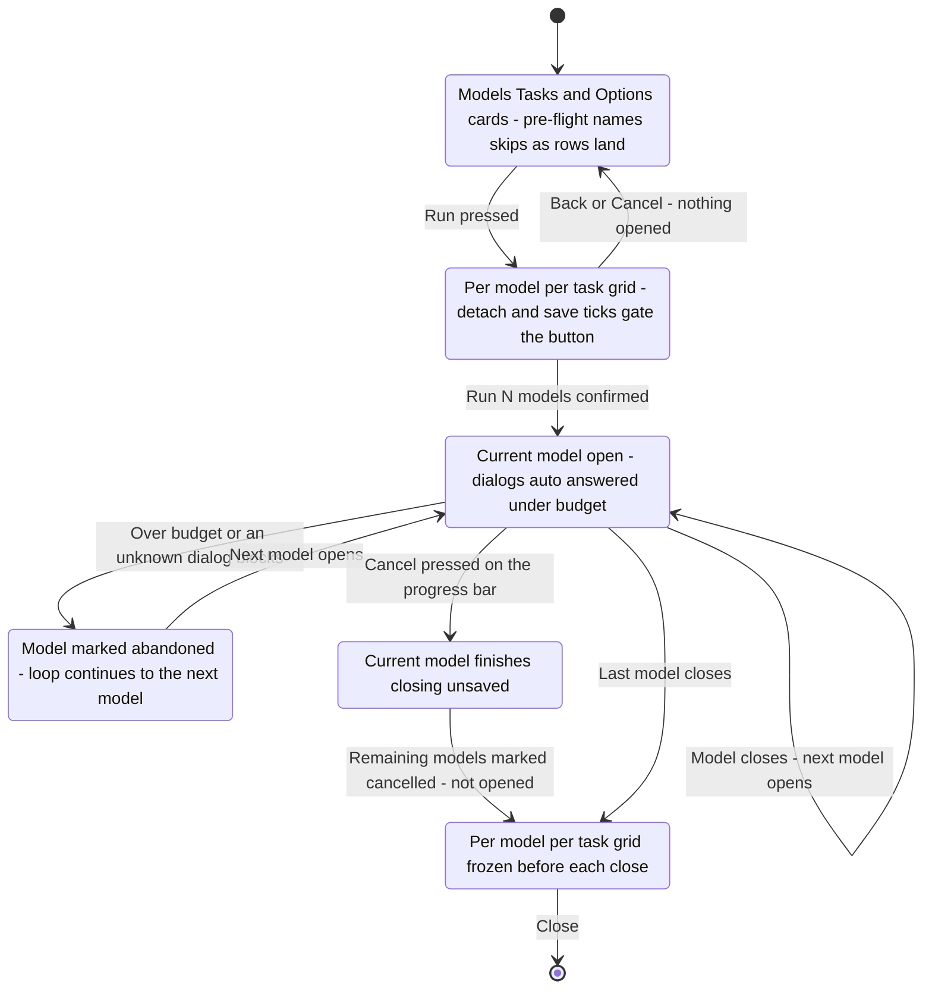

# Batch Runner — UI Mockup & Operation Diagrams

> Visual companion to handoff.md, which is authoritative. Mockups are ASCII wireframes; diagrams are Mermaid (rendered by GitHub).

## Window: Main window

```
┌──────────────────────────────────────────────────────────────────────────────────────────────┐
│ Batch Runner                                                                                    │
│ Runs curated tasks across many models. Centrals are never written.                              │
│                                                                                                   │
│ ┌─ Models ──────────────────────────────────────────────────────────────────────────────────┐  │
│ │ [ Add Folder... ] [ Add from Excel... ] [ Paste Paths ]      Search: [              ]      │  │
│ │ 14 models — 11 selected, 3 unchecked.                     [ Select All ]  [ Select None ]  │  │
│ ├─────────────────────────────────────────────────────────────────────────────────────────┤  │
│ │ [x] LP-Tower-E.rvt          resolved             saved in 2025                            │  │
│ │ [x] LP-Tower-M.rvt          resolved             saved in 2025                            │  │
│ │ [x] LP-Annex-M.rvt          resolved             saved in 2025                            │  │
│ │ [ ] LP-Tower-P.rvt          saved in 2026 — skipped                           (grey)      │  │
│ │ [ ] LP-Annex-E.rvt          missing — skipped                                 (grey)      │  │
│ │ ... 9 more                                                                                 │  │
│ └─────────────────────────────────────────────────────────────────────────────────────────┘  │
│                                                                                                   │
│ ┌─ Tasks ───────────────────────────────────────────────────────────────────────────────────┐  │
│ │ 3 tasks checked, read-only.                                                                │  │
│ │ [x] Export schedules to Excel   — 'Door Schedule', writes to the output folder only        │  │
│ │ [x] Print named set to PDF      — 'Issue 04', driverless export on 2022+                   │  │
│ │ [x] Health snapshot             — warning count, in-place families, link states            │  │
│ │ [ ] Reload links (write)        — needs the Save checkbox below                (grey)      │  │
│ └─────────────────────────────────────────────────────────────────────────────────────────┘  │
│                                                                                                   │
│ ┌─ Options ─────────────────────────────────────────────────────────────────────────────────┐  │
│ │ Output folder: [ Z:\Deliverables\2026-08-25\            ]  [ Browse... ]                  │  │
│ │ Per-model budget: [ 10 minutes   v ]                                                       │  │
│ │ [ ] Save detached copies to the output folder                                              │  │
│ └─────────────────────────────────────────────────────────────────────────────────────────┘  │
├──────────────────────────────────────────────────────────────────────────────────────────────┤
│ 14 models — 12 resolved, 1 missing (skipped), 1 saved in Revit 2026 (skipped). 3 tasks         │
│ checked, read-only.                                                                             │
│                                                                [ Run...  ]      [ Cancel ]       │
└──────────────────────────────────────────────────────────────────────────────────────────────┘
```

- Pre-flight runs as each row lands — missing files, newer-than-session saves, and cloud rows grey out in place with the reason in a tooltip while the list is still just a list.
- **Reload links** stays disabled until **Save detached copies...** is ticked in Options — the tool's one write task is armed explicitly, never on by default.
- **Run...** stays disabled, tooltip named, until at least one model and one task are checked.
- Attended print rows (pre-2022 sessions only) are flagged in place in the Tasks card rather than hidden.

## Window: Confirmation window

```
┌─ Batch Runner — Confirm Run ────────────────────────────────────────────────────────────────────┐
│ 12 models × 3 tasks — 2 rows pre-skipped (named). Budget 10 min per model.                       │
├──────────────────────────────────────────────────────────────────────────────────────────────┤
│ Model               Export schedules    Print set 'Issue 04'    Health snapshot                 │
│ LP-Tower-E.rvt        queued              queued                  queued                        │
│ LP-Tower-M.rvt        queued              queued                  queued                        │
│ LP-Annex-M.rvt        queued              queued                  queued                        │
│ LP-Tower-P.rvt        saved in 2026 — all tasks skipped                              (grey)      │
│ LP-Annex-E.rvt        missing — all tasks skipped                                    (grey)      │
│ ... 7 more                                                                                        │
│                                                                                                    │
│ [ ] A detached copy is opened; the central model is never touched.                               │
├──────────────────────────────────────────────────────────────────────────────────────────────┤
│ 12 models × 3 tasks — 2 rows pre-skipped (named). Budget 10 min per model.                        │
│                                                                [ Run 12 models ]      [ Back ]    │
└──────────────────────────────────────────────────────────────────────────────────────────────┘
```

- Pre-skipped rows repeat their pre-flight reason in the grid itself, so nothing here is a surprise; a batch-size warning line (not shown at this list length) appears above the grid once the list runs long.
- The detach acknowledgement shows because at least one queued row is workshared; a second restatement tick would appear only when a write task like Reload Links is armed — this run is read-only, so it does not.
- **Run 12 models** stays inert until every applicable tick is checked; **Back** returns to the Main window with nothing opened.

## Window: Run progress

```
┌─ Batch Runner — Running ────────────────────────────────────────────────────────────────────────┐
│ Model 6 of 12: LP-Tower-E — exporting schedules (2 of 3)…                                        │
│ [#########################-----------------------------------------------]                       │
├──────────────────────────────────────────────────────────────────────────────────────────────┤
│                                                                                 [ Cancel ]        │
└──────────────────────────────────────────────────────────────────────────────────────────────┘
```

- The one sanctioned `forms.ProgressBar` in the whole tool, and it is cancellable — the status line narrates the current model and task as the run proceeds.
- Cancelling finishes closing the current model without saving; every remaining model is marked "cancelled — not opened."
- The budget is only checked between tasks and between models, so a call truly stuck inside Revit cannot be interrupted by Cancel or by the budget itself — that model lands "abandoned: dialog" only once a human dismisses it by hand.

## Window: Report window

```
┌─ Batch Runner — Report ─────────────────────────────────────────────────────────────────────────┐
│ 11 models done, 1 abandoned (dialog) — 33 task results, 31 done.                                 │
├──────────────────────────────────────────────────────────────────────────────────────────────┤
│ Model              Export schedules   Print set 'Issue 04'  Health snapshot   Note               │
│ LP-Tower-E.rvt      done               done                  done             -                  │
│ LP-Tower-M.rvt      done               done                  done             opened with upgrade│
│ LP-Annex-M.rvt      abandoned          abandoned              abandoned       abandoned: dialog   │
│ LP-Tower-P.rvt      skipped (2026)     skipped (2026)         skipped (2026)  saved in 2026       │
│ LP-Annex-E.rvt      skipped (missing)  skipped (missing)      skipped (missing) file not found    │
│ ... 7 more                                                                                          │
├──────────────────────────────────────────────────────────────────────────────────────────────┤
│ 11 models done, 1 abandoned (dialog) — 33 task results, 31 done. Collected before each close;     │
│ nothing was read after closing.                                                                    │
│                                                   [ Write Report to Excel ]      [ Close ]         │
└──────────────────────────────────────────────────────────────────────────────────────────────┘
```

- Cells are named from the house bucket list — done, skipped with a reason such as "Print set 'Issue 04' not found in this model", failed with a one-line exception, or abandoned (budget or dialog); this mockup collapses to one status per model row, but each cell is truly reported at task granularity.
- The Note column carries per-model markers like "opened with upgrade" (an older file, upgraded in memory, is not a faithful copy of the original) and "detached copy saved: {path}".
- **Write Report to Excel** appends a new worksheet beside the input list in the source workbook; every model in this run was either closed unsaved or saved only as a detached copy — no central was touched.

## User operation flow



## States and modes


