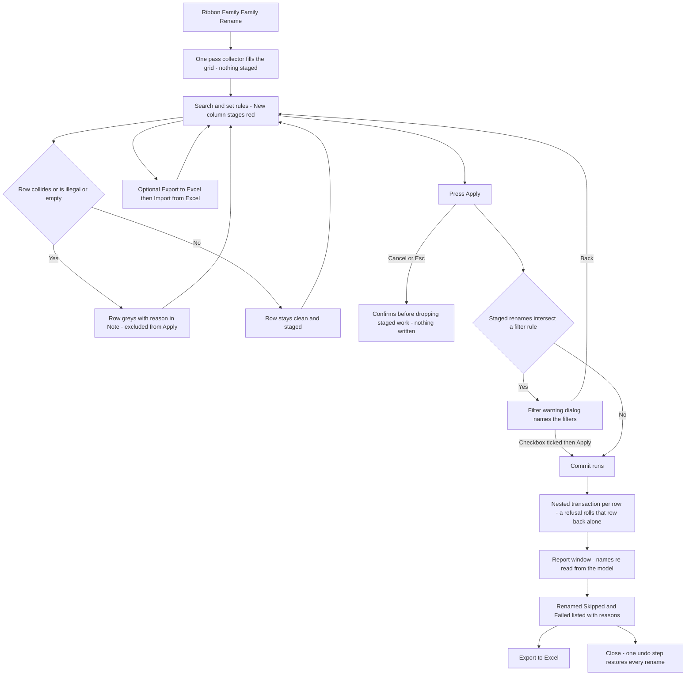

# Family Rename — UI Mockup & Operation Diagrams

> Visual companion to handoff.md, which is authoritative. Mockups are ASCII wireframes; diagrams are Mermaid (rendered by GitHub).

## Window: Main window

```
┌────────────────────────────────────────────────────────────────────────────────────────────────┐
│ Family Rename                                                                                     │
│ Renames families and types across the document. Rules stage; nothing writes until Apply.         │
│                                                                                                     │
│ Search: [                    ]                             [ Select All ]   [ Select None ]      │
│ 412 names — 17 staged, 2 collisions.                                                              │
│ ┌─────────────────────────────────────────────────────────────────────────────────────────────┐ │
│ │ Kind      Current name          New name                 Note                                 │ │
│ │ ▾ Furniture                                                                                     │ │
│ │ [x] Family   Copy of Desk        *Desk                    strip copy artifacts                 │ │
│ │ [ ] Family   Desk 2               Desk                    collision: converges on 'Desk' (grey)│ │
│ │ [x] Family   Family1              *Task Chair - Mesh       hand-edited                          │ │
│ │ ▾ Mechanical Equipment                                                                            │ │
│ │ [x] Family   AHU-01               AHU-01                  unchanged — acronym preserved         │ │
│ │ [x] Type     Duct Tap 45          Duct Tap 45              unchanged — bare digits off           │ │
│ │ [x] Type     MC Cable 2x12        MC Cable 2x12            unchanged — no rule matches           │ │
│ │ ... 406 more                                                                                      │ │
│ └─────────────────────────────────────────────────────────────────────────────────────────────┘ │
│                                                                                                     │
│ ┌─ Rules ────────────────────────────────────────────────────────────────────────────────────┐  │
│ │ Find [              ]  Replace [              ]   Prefix [    ](Add v)  Suffix [    ](Add v) │  │
│ │ Case [ Title              v]   [x] Collapse double spaces   [x] Strip copy artifacts          │  │
│ │                                                                [ ] also bare trailing digits  │  │
│ └────────────────────────────────────────────────────────────────────────────────────────────┘  │
├────────────────────────────────────────────────────────────────────────────────────────────────┤
│ 412 names loaded — 17 staged, 2 collisions skipped (see Note), 393 unchanged.                    │
│                        [ Export to Excel ]  [ Import from Excel... ]  [ Apply ]   [ Cancel ]     │
└────────────────────────────────────────────────────────────────────────────────────────────────┘
```

- `*` marks a New name cell staged red pending Apply; a hand-edit (Family1's target here) stages exactly the same way as a rule output.
- Collision rows grey out in place with the reason in both the Note column and a tooltip; **Apply** stays disabled with a tooltip until at least one clean row is staged.
- **Strip copy artifacts** removes the leading "Copy of" on Copy of Desk, but leaves Duct Tap 45 and MC Cable 2x12 alone because its "also bare trailing digits" sub-checkbox is unticked by default.
- Case is set to Title here, yet AHU-01 stays AHU-01 — acronyms are preserved rather than Title-cased.

## Window: Filter warning dialog

```
┌─ Family Rename ────────────────────────────────────────────────────────────────────┐
│ 2 view filters match names being renamed                                            │
│                                                                                        │
│ Filters: 'Furniture - Family1', 'Casework - Copy of Desk'                            │
│                                                                                        │
│ ┌──────────────────────────────────────────────────────────────────────────────┐   │
│ │ Apply 17 renames (one undo step)                                              │   │
│ └──────────────────────────────────────────────────────────────────────────────┘   │
│ ┌──────────────────────────────────────────────────────────────────────────────┐   │
│ │ Back                                                                          │   │
│ └──────────────────────────────────────────────────────────────────────────────┘   │
│                                                                                        │
│ [ ] These filters will stop matching the renamed families.                           │
└──────────────────────────────────────────────────────────────────────────────────────┘
```

- Shown only because two staged renames here (Copy of Desk to Desk, Family1 to Task Chair - Mesh) intersect a `ParameterFilterElement` rule string; the plain-collision case never reaches this dialog and commits directly.
- Native-mimicry TaskDialog with command links; the apply link stays inert until the verification checkbox is ticked.
- Choosing **Back** returns to the grid with nothing written — the filters themselves are never edited here, only named as follow-up work.

## Window: Report window

```
┌─ Family Rename — Report ──────────────────────────────────────────────────────────────────────┐
│ 15 renamed, 2 skipped (collision), 0 failed — names re-read from the model. One undo step.      │
│ 2 filters now need new rule strings.                                                             │
├─────────────────────────────────────────────────────────────────────────────────────────────┤
│ Filters needing new rule strings: 'Furniture - Family1', 'Casework - Copy of Desk'               │
│                                                                                                    │
│ Renamed (15)                                                                                       │
│   Desk (was Copy of Desk)                                                                          │
│   Task Chair - Mesh (was Family1)                                                                  │
│ Skipped (2)                                                                                          │
│   Desk 2 → Desk — skipped: collision, two rows converge on 'Desk'.                                 │
│ Failed (1)                                                                                            │
│   Room Tag Leader — Failed — rolled back: owned by jsmith.                                          │
│                                                                                                     │
│ Nested-family limit: renaming a family does not touch nested copies inside other families.        │
├─────────────────────────────────────────────────────────────────────────────────────────────┤
│ 15 renamed, 2 skipped, 1 failed.                                                                    │
│                                                                 [ Export to Excel ]   [ Close ]     │
└─────────────────────────────────────────────────────────────────────────────────────────────┘
```

- Final names are re-read from the committed model, never from the staged plan, so the report never claims a rename Revit refused.
- The affected-filters list repeats on top as follow-up work; Family Rename never rewrites filter rules itself — that surface belongs to Filter Manager.
- The failed row carries Revit's rejection message verbatim ("owned by jsmith" here), plus the checkout owner in a workshared document.

## User operation flow


