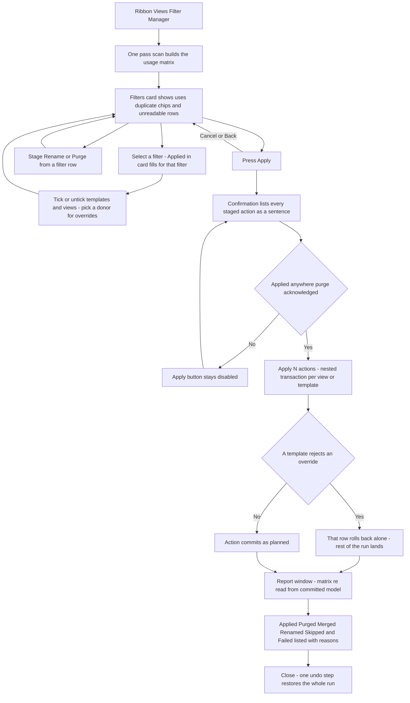

# Filter Manager — UI Mockup & Operation Diagrams

> Visual companion to handoff.md, which is authoritative. Mockups are ASCII wireframes; diagrams are Mermaid (rendered by GitHub).

## Window: Main window

```
┌────────────────────────────────────────────────────────────────────────────────────────────────┐
│ Filter Manager                                                                                     │
│ Every filter across every template and view. Merges are offered only between provably identical   │
│ filters.                                                                                            │
├─ Filters ───────────────────────────────────────────┬─ Applied in: 'Mech Supply' ─────────────────┤
│ Search: [                    ]                       │ Donor (copy overrides from):                │
│ 64 filters — 9 with 0 uses, 3 duplicate pairs        │   [ E-Power Plan               v]           │
│ proven, 7 unreadable (never auto-matched).           │ [ ] Hide Un-checked  [SelectAll][SelectNone]│
│                                                       │ [x] E-Power Plan             (template)     │
│ Name              Uses                    Note       │ [x] *E-Power Reflected       (template)     │
│>Mech Supply       3 templates, 7 views     -         │ [x] *E-Power Riser           (template)     │
│ Mech Supply 2     3 templates, 7 views  dup of Mech  │ [ ] RCP - Level 2 (view) via template (grey)│
│                                          Supply -     │ [ ] Site Lighting Plan (view)               │
│                                          proven       │                                              │
│                     [Rename] [Purge]                 │                                              │
│*Old Return        0 uses         [Rename] [Purge]    │                                              │
│ E-Power Schedule  rules unreadable                   │                                              │
│ ... 59 more                                          │                                              │
├───────────────────────────────────────────────────────┴───────────────────────────────────────────┤
│ 3 purges staged, 1 apply staged (donor: E-Power Plan), 1 merge staged. Nothing written.            │
│                                                                      [ Apply...  ]    [ Cancel ]    │
└────────────────────────────────────────────────────────────────────────────────────────────────┘
```

- `*` marks a staged apply, remove, rename, or purge; a purged row strikes through red in the real window (not representable in plain ASCII) rather than disappearing.
- Selecting a filter on the left (the `>` row) repopulates the entire Applied-in card on the right for that filter alone.
- Via-template rows, like RCP - Level 2 here, grey out with "controlled by template {name}" in the tooltip — they cannot be ticked directly, since the template decides.
- **Apply...** stays disabled with a tooltip until at least one action is staged.

## Window: Confirmation window

```
┌─ Filter Manager — Confirm ─────────────────────────────────────────────────────────────────────┐
│ 6 actions across 5 templates, 2 views. One undo step.                                            │
├─────────────────────────────────────────────────────────────────────────────────────────────┤
│ Purge                                                                                              │
│   Purge 'Old Return' — 0 uses.                                                                     │
│ Apply                                                                                               │
│   Apply 'Mech Supply' to 3 templates, overrides from E-Power Plan.                                 │
│ Merge                                                                                                │
│   Merge 'Mech Supply 2' into 'Mech Supply' — 7 views repointed, then deleted.                       │
│                                                                                                       │
│ [ ] Purging 'Old Supply' removes it from 4 views.                                                  │
├─────────────────────────────────────────────────────────────────────────────────────────────┤
│ 6 actions across 5 templates, 2 views. One undo step.                                              │
│                                                                  [ Apply 6 actions ]   [ Back ]     │
└─────────────────────────────────────────────────────────────────────────────────────────────┘
```

- Every staged action reads as a plain sentence grouped by kind, never a raw diff grid.
- The applied-anywhere purge acknowledgement gates only the rows it names ('Old Supply' here); the zero-use purge of 'Old Return' above needs no tick at all.
- **Apply 6 actions** stays inert until every applicable acknowledgement is ticked; **Back** returns to the Main window, still with nothing written.

## Window: Report window

```
┌─ Filter Manager — Report ──────────────────────────────────────────────────────────────────────┐
│ 2 purged, 1 merged (4 views repointed), 3 applies committed, 1 failed (rolled back alone) — 7    │
│ filters with 0 uses remain, re-counted from the model.                                            │
├─────────────────────────────────────────────────────────────────────────────────────────────┤
│ Applied (3)                                                                                          │
│   'Mech Supply' → E-Power Plan, E-Power Reflected, E-Power Riser                                    │
│ Purged (2)                                                                                            │
│   'Old Return', 'Old Supply'                                                                          │
│ Merged (1)                                                                                              │
│   'Mech Supply 2' into 'Mech Supply' — 7 views repointed                                              │
│ Failed (1)                                                                                              │
│   Apply to 'RCP Template' — failed, rolled back: {Revit's message}                                     │
├─────────────────────────────────────────────────────────────────────────────────────────────┤
│ 7 filters with 0 uses remain, re-counted from the model.                                              │
│                                                                                     [ Close ]          │
└─────────────────────────────────────────────────────────────────────────────────────────────┘
```

- Every count is re-read from the committed model, answering "what does the document look like now," never "what did I just click."
- The failed row rolls back alone — 'RCP Template' keeps its pre-existing filter list, and the rest of the run still lands.
- Expanders (not shown collapsed here) preserve open/closed state across rebuilds, matching the house report convention.

## User operation flow


