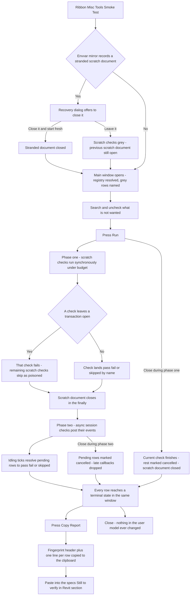
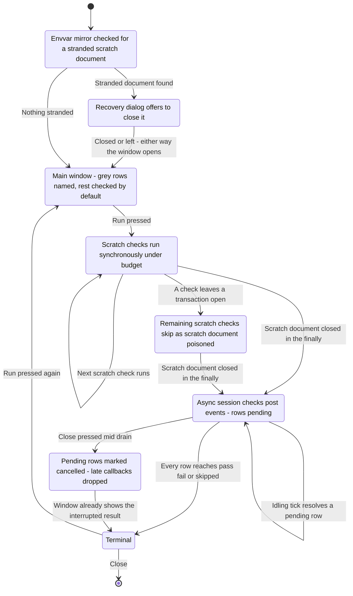

# Smoke Test — UI Mockup & Operation Diagrams

> Visual companion to handoff.md, which is authoritative. Mockups are ASCII wireframes; diagrams are Mermaid (rendered by GitHub).

## Window: Main window

```
┌────────────────────────────────────────────────────────────────────────────────────────────────┐
│ Smoke Test                                                                        (modeless)      │
│ Runs EasyBIM's in-Revit checks against a scratch document. Your models are never touched.         │
│                                                                                                      │
│ Search: [                    ]                              [ Select All ]   [ Select None ]      │
│ 38 checks — 31 selected, 4 unchecked, 3 grey (named).                                               │
│ ┌──────────────────────────────────────────────────────────────────────────────────────────────┐ │
│ │ ▾ No document (4)                                                                                │ │
│ │ [x] compat_elementid_shim      ElementId shims across API generations        pass               │ │
│ │ ▾ Scratch document (19)                                                                          │ │
│ │ [x] sheet_geometry_roundtrip   Seed a sheet and viewport, invert geometry     pass               │ │
│ │ [x] excel_roundtrip_ironpython Round-trip a temp file under IronPython       FAIL               │ │
│ │ [ ] titleblock_load            Load the bundled titleblock family     needs 2022+   (grey)      │ │
│ │ ▾ Session (15)                                                                                    │ │
│ │ [x] external_event_bridge      Post a no-op through a real ExternalEvent      pending            │ │
│ │ [x] my_ribbon_apply_remove     Cycle a scratch panel apply then remove        pending            │ │
│ │ [ ] dockpane_probe_clash       Clash Detection pane registration   no dockpane support (grey)   │ │
│ │ ▸ Details (state preserved across rebuilds)                                                       │ │
│ └──────────────────────────────────────────────────────────────────────────────────────────────┘ │
├────────────────────────────────────────────────────────────────────────────────────────────────┤
│ 29 of 31 done: 24 passed, 1 failed, 4 skipped (named), 2 pending — scratch document closed.        │
│                                               [ Run ]     [ Copy Report ]     [ Close ]             │
└────────────────────────────────────────────────────────────────────────────────────────────────┘
```

Copy Report clipboard output (not a window — plain text placed on the clipboard by the button above):

```
Revit 2024.2 build XXXXXXXX · pyRevit 4.8.x · EasyBIM a1b2c3d · scratch: metric, default template
PASS compat_elementid_shim (0.1 s)
PASS sheet_geometry_roundtrip (0.8 s)
FAIL excel_roundtrip_ironpython — budget exceeded (10 s)
SKIP titleblock_load — needs 2022+
PASS my_ribbon_apply_remove (1.2 s)
SKIP dockpane_probe_clash — needs dockable-pane support
not covered: worksharing, cloud, linked documents
```

- Result chips (pass / FAIL / pending) appear only after Run; before that every checked row is blank, and grey rows never run at all.
- Grey rows carry their reason in a tooltip — "needs 2022+", "no dockable-pane support in this pyRevit build" — and are never hidden, only greyed in place.
- The Details expander (state preserved across rebuilds) holds the full one-line exception for a failed row; the visible list shows only the short reason.
- **Copy Report** stays disabled until the run has produced at least one terminal row; the block it emits always opens with the fingerprint header shown above.

## Window: Recovery dialog

```
┌─ Smoke Test ────────────────────────────────────────────────────────────────────────┐
│ A previous Smoke Test run left a scratch document open.                              │
│ Leaving it open costs memory until Revit is closed.                                  │
│                                                                                          │
│ ┌────────────────────────────────────────────────────────────────────────────────┐   │
│ │ Close it and start fresh                                                        │   │
│ └────────────────────────────────────────────────────────────────────────────────┘   │
│ ┌────────────────────────────────────────────────────────────────────────────────┐   │
│ │ Leave it — I'll close Revit later                                               │   │
│ └────────────────────────────────────────────────────────────────────────────────┘   │
└──────────────────────────────────────────────────────────────────────────────────────┘
```

- Shown at launch only when the envvar mirror records a scratch document stranded by a previous run — for example, an engine crash mid-check rather than a normal close.
- Declining does not block the Main window from opening; scratch checks instead grey with "skipped — previous scratch document still open" and only session checks remain live.
- This is the tool's one recovery path — a stranded document is unsaved and invisible until closed, and the dialog states the memory cost plainly rather than hiding it.

## User operation flow



## States and modes


