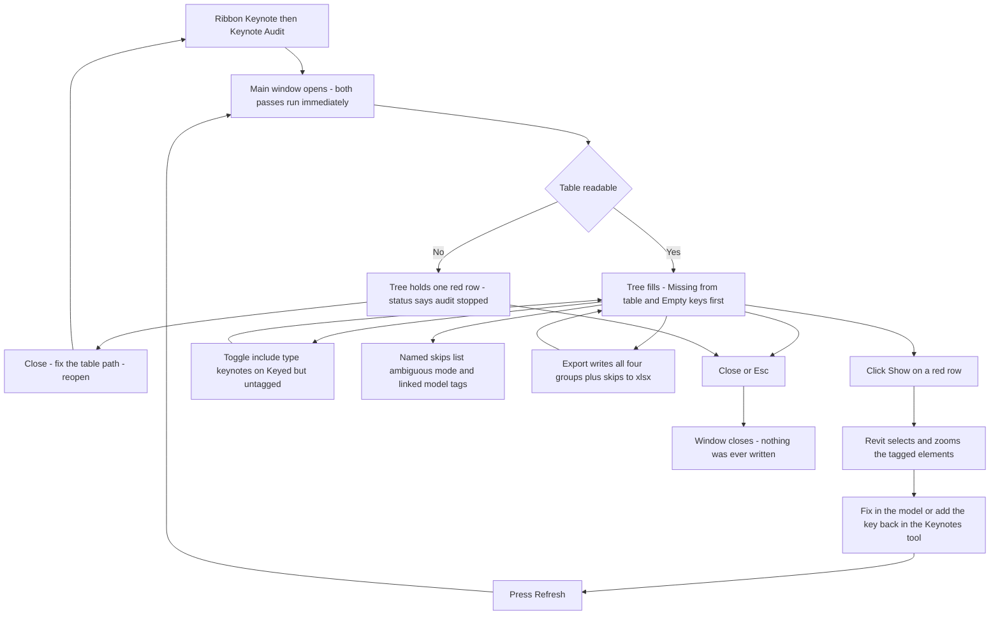

# Keynote Audit — UI Mockup & Operation Diagrams

> Visual companion to handoff.md, which is authoritative. Mockups are ASCII wireframes; diagrams are Mermaid (rendered by GitHub).

## Window: Main window (the only window)

```
┌─ Keynote Audit ──────────────────────────────────────────────────────────────────────────┐
│ Keynote Audit                                                                             │
│ Where the model and the keynote table disagree. Nothing is ever changed.                 │
├─ Table ────────────────────────────────────────────────────────────────────────────────┤
│ Office Keynotes.txt — 1,340 entries.                                                      │
├────────────────────────────────────────────────────────────────────────────────────────┤
│ Search: [                    ]                                                            │
│ ▾ Missing from table (9)                                                                  │
│    * K-0912 — used 7 times — mode: element                                    [ Show ]   │
│    * K-1187 — used 2 times — mode: material                                   [ Show ]   │
│ ▾ Empty keys (3)                                                                           │
│    * Tag id 512907 — host gone                                                 [ Show ]   │
│    * Tag id 488213 — key blank on host                                         [ Show ]   │
│ ▾ Unused entries (61)                    showing 200 of 1,340 — export carries all       │
│      09 30 00 Tiling — 14 unused children rolled up into this row                        │
│      K-2201 — Waterproofing Membrane — 0 uses                                             │
│ ▾ Keyed but untagged (12)                                   [ ] include type keynotes    │
│      K-0771 — Fire-Rated Glazing — 3 placed instances, no tag                 [ Show ]   │
│ ▹ Named skips (2)                                                                          │
├────────────────────────────────────────────────────────────────────────────────────────┤
│ 412 keynote tags read — 9 keys missing from the table, 3 empty. 61 of 1,340 table        │
│ entries unused. Nothing was changed.                                                       │
│                                                   [ Refresh ]   [ Export ]   [ Close ]    │
└────────────────────────────────────────────────────────────────────────────────────────┘
```

- `*`-marked rows are the two red groups — Missing from table and Empty keys — the only findings that mean a tag prints blank; Unused entries and Keyed but untagged render as plain inventory, never red.
- The Keyed-but-untagged header checkbox is off by default; ticking it re-runs only that pass, and its rows never add to the red counts in the footer.
- Search matches keys by token (typing "12" does not match "K-112") and table text by substring; expander state and search text both survive Refresh.
- A parent row like "09 30 00 Tiling" rolls an entire dead division up into one line, so a master office table never prints hundreds of unused rows.

When the table itself cannot be read, the whole tree collapses to the fail-closed finding and nothing else runs:

```
┌─ Keynote Audit ──────────────────────────────────────────────────────────────────────────┐
│ Keynote Audit                                                                             │
│ Where the model and the keynote table disagree. Nothing is ever changed.                 │
├─ Table ────────────────────────────────────────────────────────────────────────────────┤
│ (path unresolved)                                                                          │
├────────────────────────────────────────────────────────────────────────────────────────┤
│ * Keynote table could not be read.                                                        │
├────────────────────────────────────────────────────────────────────────────────────────┤
│ Keynote table could not be read — audit stopped. Fix the table path in Revit or the      │
│ Keynotes tool first.                                                                       │
│                                                   [ Refresh ]   [ Export ]   [ Close ]    │
└────────────────────────────────────────────────────────────────────────────────────────┘
```

- Checking tags against half a table would produce confident nonsense, so this is the audit's only finding when it fires — fail closed, one red row, nothing else attempted.
- Export has nothing to write in this state; Refresh re-tries the table path without closing the window.

## User operation flow


