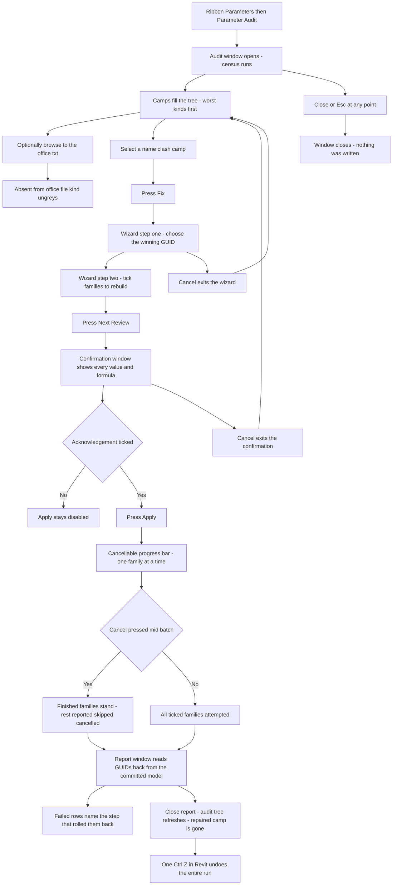
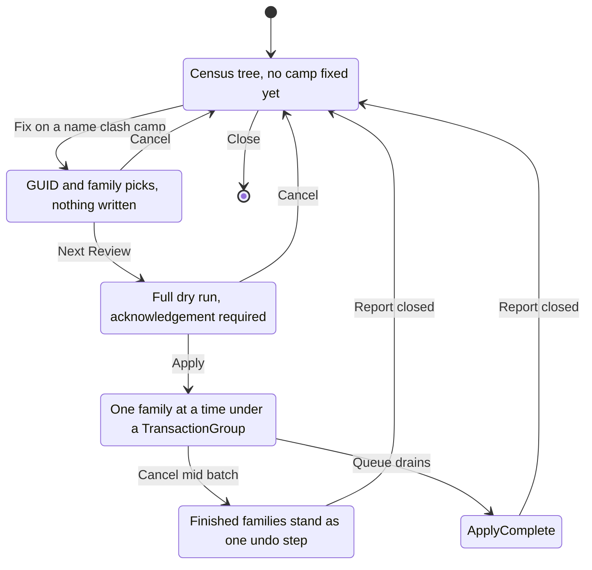

# Parameter Audit — UI Mockup & Operation Diagrams

> Visual companion to handoff.md, which is authoritative. Mockups are ASCII wireframes; diagrams are Mermaid (rendered by GitHub).

## Window: Audit window

```
┌─ Parameter Audit ─────────────────────────────────────────────────────────────────────────┐
│ Parameter Audit                                                                            │
│ Shared parameters that disagree about who they are.                                       │
│ Office file: [ EasyBIM Shared.txt                    ]                     [ Browse ]     │
├─────────────────────────────────────────────────────────────────────────────────────────┤
│ Search: [                    ]                                                             │
│ ▾ Same name, different GUIDs (4)                                                           │
│    ▾ Voltage                                                                               │
│         ...-a4f2  office file — Panelboard - Surface, Panelboard - Flush                  │
│                    referenced by 3 schedules, 1 filter · project binding      [ Show ]    │
│         ...-118c  — ACME-VAV, ACME-FCU — referenced by 1 schedule             [ Show ]    │
│    ▾ Fire Rating                                                                            │
│         ...-77e1  — Basic Wall, Curtain Wall — referenced by 2 schedules      [ Show ]    │
│ ▾ Same GUID, different names (1)                                                            │
│ ▾ Absent from office file (12)                                                              │
│ ▾ Bound to nothing (3)                                                                      │
├─────────────────────────────────────────────────────────────────────────────────────────┤
│ 214 shared parameters read — 4 name clashes across 19 families, 3 orphans. Nothing        │
│ changed yet.                                                                                │
│                                       [ Refresh ]   [ Fix... ]   [ Export ]   [ Close ]   │
└─────────────────────────────────────────────────────────────────────────────────────────┘
```

- Fix… stays disabled — reason in its tooltip — until one name-clash camp, such as Voltage's `...-a4f2` row, is selected in the tree; it never activates for the other three finding kinds.
- The "office file" tag only appears once a .txt is browsed to; before that, Absent from office file greys out entirely rather than guessing a winner.
- Show on a family row selects its placed instances via the bridge; Search and expander state both survive Refresh.

## Window: Fix wizard

Step one picks the winning definition:

```
┌─ Parameter Audit — Fix 'Voltage' ──────────────────────────────────────────┐
│ Step 1 of 2 — choose the winning GUID                                     │
│                                                                            │
│ (o) ...-a4f2   office file                                                │
│     Panelboard - Surface, Panelboard - Flush                             │
│     referenced by 3 schedules, 1 filter                                  │
│ ( ) ...-118c                                                              │
│     ACME-VAV, ACME-FCU                                                    │
│     referenced by 1 schedule                                             │
│                                                                            │
│                                                    [ Cancel ]   [ Next ] │
└────────────────────────────────────────────────────────────────────────────┘
```

Step two picks which families actually get rebuilt:

```
┌─ Parameter Audit — Fix 'Voltage' ──────────────────────────────────────────┐
│ Step 2 of 2 — choose families to rebuild                                  │
│                                                                            │
│ 7 of 9 families selected.                  [ Select All ]  [ Select None ]│
│ Search: [                    ]                                            │
│ [x] Panelboard - Surface                                                  │
│ [x] Panelboard - Flush                                                    │
│ [x] ACME-VAV                                                              │
│ [ ] ACME-FCU        storage type differs — value cannot be carried        │
│                                                                            │
│                                             [ Back ]   [ Next: Review ]  │
└────────────────────────────────────────────────────────────────────────────┘
```

- Step one's rows are radios, not checkboxes, because exactly one GUID must win; the office-file row is pre-selected whenever a .txt was browsed on the Audit window.
- ACME-FCU greys out rather than disappearing — its storage type cannot carry the losing value, and the tooltip says so.
- Back on step two returns to step one with picks preserved; Cancel on step one returns straight to the Audit window with nothing written.

## Window: Fix confirmation

```
┌─ Parameter Audit — Confirm Fix ─────────────────────────────────────────────────────────┐
│ Rebuild onto GUID ...-a4f2. Read every value and formula before Apply.                  │
│                                                                                            │
│ Panelboard - Surface                                                                      │
│    values to carry: Type A = 480, Type B = 208                                           │
│    formulas to clear and restore, in order: VoltageDrop = Voltage * 0.03                 │
│ Panelboard - Flush                                                                         │
│    values to carry: Type A = 480                                                          │
│    formulas to clear and restore: none                                                    │
│ ACME-VAV                                                                                   │
│    values to carry: Type A = 120                                                          │
│    formulas to clear and restore, in order: FlowText = Voltage plus " V"                 │
│                                                                                            │
│ Schedules bound to the losing GUID keep their columns only because the winner lands      │
│ under the same name.                                                                      │
│                                                                                            │
│ [ ] Rebuild 7 families onto GUID ...-a4f2. One undo step.                                 │
│                                                                     [ Apply ]  [ Cancel ]│
└──────────────────────────────────────────────────────────────────────────────────────────┘
```

- Apply stays disabled until the acknowledgement checkbox is ticked; Cancel here returns straight to the Audit window with nothing written, the same destination as Cancel on the wizard — nothing was ever written until Apply, so there is no intermediate state to preserve.
- Formulas list in the exact dependency order they will be restored in, since a cycle here fails at plan time, not as a surprise mid-Apply.

## Window: Fix report

```
┌─ Parameter Audit — Fix Report ───────────────────────────────────────────────────────────┐
│ Read-only. Every count is re-read from the committed model.                             │
│                                                                                            │
│ Family                    Result                                                         │
│ Panelboard - Surface      converged                                                      │
│ Panelboard - Flush        converged                                                      │
│ ACME-VAV                  failed — formula 'FlowText' would not re-set; group rolled back│
│ ACME-FCU                  skipped — storage type differs                                 │
│                                                                                            │
│ 6 rebuilt, 1 failed: 'ACME-VAV' — formula 'FlowText' would not re-set; its group rolled  │
│ back.                                                                                      │
│                                                                       [ Export ]  [ Close ]│
└──────────────────────────────────────────────────────────────────────────────────────────┘
```

- Failed and skipped stay visibly distinct — a plan-time skip is not a broken run; each Failed row names the exact step that rolled its own nested group back, never the rest of the batch.
- Closing this window refreshes the Audit window behind it; a fully converged camp is simply gone from the tree, while this partial run leaves the Voltage camp behind with only ACME-VAV still unresolved.

## User operation flow



## States and modes


