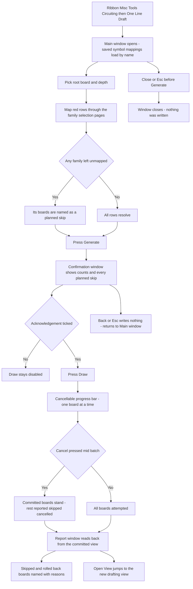

# One Line Draft — UI Mockup & Operation Diagrams

> Visual companion to handoff.md, which is authoritative. Mockups are ASCII wireframes; diagrams are Mermaid (rendered by GitHub).

## Window: Main window

```
┌─ One Line Draft ───────────────────────────────────────────────────────────────────────┐
│ One Line Draft                                                                          │
│ Draws a new drafting view. It will not update — re-run instead.                        │
├─ Scope ─────────────────────────────────────────────────────────────────────────────┤
│ Root board:  [ MSB-1                         v]        Depth: [ 3 ^v]                 │
│ View scale:  [ 1" = 20'-0"                   v]                                        │
│ [ ] Include branch circuits                                                            │
│     Feeders only. Branch circuits render as capped text stubs.                        │
├─ Symbols ───────────────────────────────────────────────────────────────────────────┤
│ Panelboard - Surface : 250A     →  EB Detail Panel : Std                    [ ... ]   │
│ Panelboard - Flush : 100A       →  EB Detail Panel : Std                    [ ... ]   │
│ * Transformer - Dry Type : 45KVA → (unmapped)                                [ ... ]   │
│ 5 of 6 board families mapped.                                                          │
├──────────────────────────────────────────────────────────────────────────────────────┤
│ 23 boards in scope under MSB-1, depth 3. 1 family unmapped — its 2 boards will be     │
│ skipped by name.                                                                        │
│                                                          [ Generate ]      [ Close ]   │
└──────────────────────────────────────────────────────────────────────────────────────┘
```

- The `*`-marked Transformer row renders red until mapped through the family-selection page behind its "…" button; it turns black the moment a detail component is chosen.
- Generate stays disabled — reason in its tooltip — while zero rows are mapped; here 5 of 6 already resolve, so it is enabled.
- Saved symbol mappings load by family and type name on open, never by ElementId, so they carry into the next project that uses the same office content.
- The window is pick-free and stays open after Draw finishes, so re-running after the next re-feed is two clicks.

## Window: Confirmation window

```
┌─ One Line Draft — Confirm ────────────────────────────────────────────────────────────┐
│ This creates a new drafting view; it will not update when the model changes.          │
│                                                                                          │
│ 23 boards, 22 feeders, 46 labels planned.                                               │
│ Skipped: 2 boards — no symbol mapped for 'Transformer - Dry Type'.                      │
│                                                                                          │
│ [ ] This creates a new drafting view; it will not update when the model changes.       │
│                                                                     [ Draw ]   [ Back ]│
└──────────────────────────────────────────────────────────────────────────────────────┘
```

- Draw stays disabled until the acknowledgement checkbox is ticked; Back returns to the Main window with nothing written, and so does Esc.
- Every planned skip is named here, before a single symbol is placed — the same boards reappear by name in the report if nothing changes before Draw.

## Window: Report window

```
┌─ One Line Draft — Report ───────────────────────────────────────────────────────────┐
│ Read-only. Every count is re-read from the committed view.                          │
│                                                                                        │
│ Placed:      21 boards, 20 feeders                                                   │
│ Skipped:     2 boards — no symbol mapped for 'Transformer - Dry Type'                │
│ Rolled back: 0                                                                        │
│                                                                                        │
│ View 'One Line Draft — MSB-1 — 2026-08-25 14:02' created: 21 boards, 20 feeders      │
│ drawn. 2 skipped (no symbol mapped — listed). One undo step.                         │
│                                                       [ Open View ]        [ Close ] │
└──────────────────────────────────────────────────────────────────────────────────────┘
```

- A truncated branch also draws a marker inside the new view itself reading "+ 14 more boards — re-run deeper" — not shown here since this run fit within its depth and node caps.
- If every board is skipped or fails, the view rolls back entirely and this window instead reads "Nothing drawn — no symbol mapping resolved. The view was rolled back; the model is untouched." with no Open View button.
- Open View rides `RequestViewChange`, so jumping to the new drafting view is safe to click straight from this read-only report.

## User operation flow


