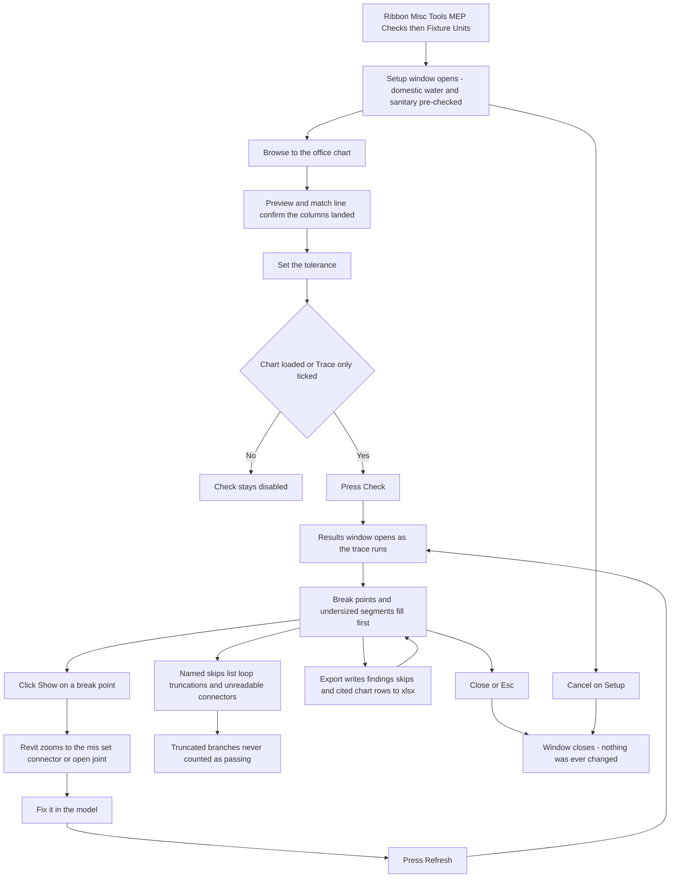

# Fixture Units — UI Mockup & Operation Diagrams

> Visual companion to handoff.md, which is authoritative. Mockups are ASCII wireframes; diagrams are Mermaid (rendered by GitHub).

## Window: Setup window

```
┌─ Fixture Units ─────────────────────────────────────────────────────────────────────────┐
│ Fixture Units                                                                            │
│ Read-only. Finds where the rollup breaks; never resizes a pipe.                        │
├─ Systems ────────────────────────────────────────────────────────────────────────────┤
│ [x] Domestic Cold Water                                                                  │
│ [x] Domestic Hot Water                                                                   │
│ [x] Sanitary                                                                              │
│ [ ] Storm                                                                                 │
│ 4 of 12 system types selected.                        [ Select All ]  [ Select None ]  │
│ Search: [                    ]                                                            │
├─ Chart ──────────────────────────────────────────────────────────────────────────────┤
│ Office chart: [ Plumbing Fixture Unit Chart.xlsx           ]               [ Browse ]   │
│ WSFU     MIN SIZE    MATERIAL    FIXTURE TYPE                                            │
│ 1-8      1/2 in      Copper      flush tank                                              │
│ 9-24     3/4 in      Copper      flush tank                                              │
│ 25-96    1 1/2 in    Copper      flush tank                                              │
│ Matched 3 classifications, 2 materials, 14 size bands.                                   │
├─ Tolerance ──────────────────────────────────────────────────────────────────────────┤
│ Divergence tolerance (FU): [ 0.5 ]             [ ] Trace only, no chart                 │
├───────────────────────────────────────────────────────────────────────────────────────┤
│ Branches the walk cannot finish are truncated by name, never guessed across.            │
│                                                               [ Check ]     [ Cancel ]  │
└───────────────────────────────────────────────────────────────────────────────────────┘
```

- Check stays disabled until a chart loads, unless "Trace only, no chart" is explicitly ticked — the chart check is skipped on purpose, never silently half-run.
- Unmatched chart rows would list in DimGray under the preview so a bad header is caught here (not shown — this chart matched every column).
- Domestic cold/hot water and sanitary are pre-checked by classification; every other system type starts unticked.

## Window: Results window

```
┌─ Fixture Units — Results ──────────────────────────────────────────────────────────────┐
│ Fixture Units                                                                            │
│ Read-only. Finds where the rollup breaks; never resizes a pipe.                        │
├───────────────────────────────────────────────────────────────────────────────────────┤
│ Search: [                    ]                                                            │
│ ▾ Break points (3)                                                                         │
│     Joint at id 512907 — traced 42.5, Revit reads 12.0                       [ Show ]   │
│     Joint at id 500213 — traced 18.0, Revit reads 6.0                        [ Show ]   │
│ ▾ Undersized (7)                                                                           │
│     2 in run at 96 WSFU — chart minimum 2 1/2 in, row 'Copper / flush tank'  [ Show ]   │
│ ▾ Rollup absent (4)                                                                        │
│     Pipe id 480221 — system not well-connected here                         [ Show ]   │
│ ▾ Zero-FU fixtures (2)                                                                     │
│     Water Closet id 441098 — connector carries no value                     [ Show ]   │
│ ▹ Named skips (2)                                                                          │
├───────────────────────────────────────────────────────────────────────────────────────┤
│ Traced 96 branches — 3 rollup breaks, 7 undersized segments, 2 branches truncated at   │
│ loops (named). Nothing was changed.                                                      │
│                                                 [ Refresh ]   [ Export ]    [ Close ]   │
└───────────────────────────────────────────────────────────────────────────────────────┘
```

- Named skips list things like "HWR loop — branch truncated at guard"; a truncated branch is never counted as passing, and the footer restates the truncation count on its own.
- On a Revit version where fixture-side values are unreadable, the header states once which seed path ran, and Zero-FU rows read "leaf pipe reads zero — fixture value or joint" instead of a clean fixture-side reading.
- Show selects and zooms the joint or segment via `ExternalEventBridge`; the window is modeless and stays open beside Revit while the fix is made.
- Chart, search, and expander state all survive Refresh, which re-scans the live model and re-runs the traversal.

## User operation flow


