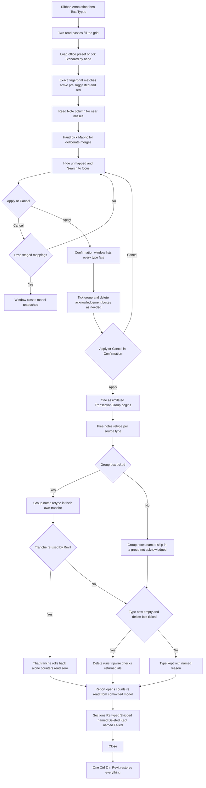

# Text Types — UI Mockup & Operation Diagrams

> Visual companion to handoff.md, which is authoritative. Mockups are ASCII
> wireframes; diagrams are Mermaid (rendered by GitHub).

## Window: Text Types (Main)

```
┌─ Text Types ────────────────────────────────────────────────────────────────────────────────────┐
│ Text Types                                                                                      │
│ Every text type, its usage count, and a staged remap onto the standards. Nothing                │
│ writes until Apply.                                                                             │
│                                                                                                 │
│ ┌─ Standards ──────────────────────────────────────────────────────────────────────────┐        │
│ │ Preset: [ Office Standard – Text                ▾ ]   [ Load ]  [ Save… ]  [ Delete ]│        │
│ │ Source: This computer                              3 of 14 types marked as standards.│        │
│ │ "Arial 1.8mm" named in preset — missing from this model.                             │        │
│ └──────────────────────────────────────────────────────────────────────────────────────┘        │
│                                                                                                 │
│ ┌─ Types ──────────────────────────────────────────────────────────────────────────────────────┐│
│ │ [ ] Hide unmapped          Search: [                    ]                                    ││
│ │                                                                                              ││
│ │ ┌─────┬───────────────────┬─────────┬───────┬───────┬───────┬──────────────┬────────────────┐││
│ │ │ Std │ Type              │ Font    │ Size  │ Width │ Count │ Map to       │ Note           │││
│ │ ├─────┼───────────────────┼─────────┼───────┼───────┼───────┼──────────────┼────────────────┤││
│ │ │ [x] │ Arial 2.5mm       │ Arial   │ 2.5mm │ 1.00  │   118 │ —            │                │││
│ │ │ [x] │ Calibri 3mm       │ Calibri │ 3mm   │ 1.00  │    64 │ —            │                │││
│ │ │ [ ] │ *ARIAL 2.5 Copy 1 │ Arial   │ 2.5mm │ 1.00  │    47 │ *Arial 2.5mm │                │││
│ │ │ [ ] │ *3/32" Arial (2)  │ Arial   │ 2.5mm │ 1.00  │    26 │ *Arial 2.5mm │                │││
│ │ │ [ ] │ *Arial NoBox      │ Arial   │ 2.5mm │ 1.00  │     9 │ *Arial 2.5mm │ box visibility │││
│ │ │ [ ] │ Arial 2.5 Copy 2  │ Arial   │ 2.5mm │ 1.00  │    15 │ (none)       │ background     │││
│ │ │ [ ] │ Arial 3mm Bold    │ Arial   │ 3mm   │ 1.00  │     6 │ (none)       │ bold weight    │││
│ │ └─────┴───────────────────┴─────────┴───────┴───────┴───────┴──────────────┴────────────────┘││
│ │                                                                                              ││
│ │ … 7 more rows not shown (1 standard, 6 mapped) …                                             ││
│ └──────────────────────────────────────────────────────────────────────────────────────────────┘│
│                                                                                                 │
│ 14 text types — 3 standards, 9 mapped, 2 near-misses left unmapped (see Note).                  │
│ 312 notes will re-type.                                                                         │
│                                                                      [  Apply…  ]   [  Cancel  ]│
└─────────────────────────────────────────────────────────────────────────────────────────────────┘
```

- Rows marked with a leading `*` (ARIAL 2.5 Copy 1, 3/32" Arial (2), Arial
  NoBox) render solid red in the live window — staged remaps pending Apply.
  The two unmapped near-miss rows print in the normal row colour.
- Header title is SemiBold ~30px; the line under it ("Every text type…") is
  the DimGray 13px subtitle. Neither weight nor colour survives into ASCII.
- The Count cell carries a tooltip breakdown not shown here, e.g. "26 notes —
  14 in groups, 2 owned by jsmith"; every rogue row's tooltip also carries
  the rest of the fingerprint — bold, colour, background, border, arrowhead.
- Rows the run cannot touch (e.g. every note on a type checked out by
  another user) grey out with the reason in a tooltip instead of a Note
  entry. Apply… stays disabled, tooltip explaining why, until at least one
  row is mapped.

## Window: Text Types – Confirm

```
┌─ Text Types – Confirm ───────────────────────────────────────────────────┐
│ 312 notes across 9 types → 3 standards. 7 types will be deleted; 2 kept —│
│ still used by notes in groups.                                           │
│                                                                          │
│ ARIAL 2.5 Copy 1 → Arial 2.5mm — 47 notes; type will be deleted.         │
│ 3/32" Arial (2) → Arial 2.5mm — 12 of 26 notes; 14 in groups; type kept. │
│ … 7 more type lines …                                                    │
│                                                                          │
│ Instance formatting — bold runs, leaders, wrapping width — survives the  │
│ swap; the base look becomes the target's.                                │
│                                                                          │
│ [ ] Re-typing a note inside a group changes every instance of that group │
│ [ ] Emptied source types are deleted; the type selector loses them.      │
│                                                                          │
│                                                [  Apply  ]   [  Cancel  ]│
└──────────────────────────────────────────────────────────────────────────┘
```

- Small modal stacked over the Main window; the grid behind it stays
  staged, nothing has written to the model yet.
- Both checkboxes are unticked by default and are gates, not blockers:
  unticked group turns that type's group-held notes into a named skip;
  unticked delete simply keeps every source type alive after retyping.
- Each of the 9 mapped types gets its own fate line like the two shown
  here; this mockup abbreviates the full list to fit.
- Cancel returns to the Main window with every staged mapping intact.

## Window: Text Types – Report

```
┌─ Text Types – Report ─────────────────────────────────────────────────────────────────┐
│                                                                                       │
│ ┌──────────┬────────────────────────────────┬───────┬────────────────────────────────┐│
│ │ Section  │ Type                           │ Notes │ Detail                         ││
│ ├──────────┼────────────────────────────────┼───────┼────────────────────────────────┤│
│ │ Re-typed │ Arial 2.5mm ← ARIAL 2.5 Copy 1 │    33 │ retyped to Arial 2.5mm         ││
│ │ Re-typed │ Arial 2.5mm ← Arial NoBox      │     9 │ retyped to Arial 2.5mm         ││
│ │ Re-typed │ Calibri 3mm ← Calibri 3mm Copy │    58 │ retyped to Calibri 3mm         ││
│ │ …        │ 6 more re-typed rows           │       │                                ││
│ │ Skipped  │ ARIAL 2.5 Copy 1               │    14 │ in a group, not acknowledged   ││
│ │ Deleted  │ Arial NoBox                    │     — │ type deleted, 9 notes retyped  ││
│ │ Deleted  │ Calibri 3mm Copy               │     — │ type deleted, 58 notes retyped ││
│ │ …        │ 4 more deleted types           │       │                                ││
│ │ Kept     │ ARIAL 2.5 Copy 1               │    14 │ still used — see Skipped above ││
│ │ Kept     │ Arial 5mm Title                │     2 │ still used, owned by jsmith    ││
│ │ Failed   │ (none in this run)             │     — │                                ││
│ └──────────┴────────────────────────────────┴───────┴────────────────────────────────┘│
│                                                                                       │
│ 312 notes re-typed, 14 skipped (in groups), 7 types deleted, 2 kept —                 │
│ counts read back from the model. One undo step.                                       │
│                                                                                       │
│                                                                            [  Close  ]│
└───────────────────────────────────────────────────────────────────────────────────────┘
```

- Read-only WPF table, never a stacked message box; every count shown is
  re-read from the committed model after Apply, never carried over from
  the plan.
- Failed would print Revit's own error message verbatim per tranche, with
  that tranche's counters reading zero — this run has none, so the section
  reads empty.
- Skipped and Kept can name the same type for two different reasons — one
  row for the notes that did not retype, another for why the type itself
  survives; ARIAL 2.5 Copy 1 shows both here.
- Close is the only control. One Ctrl+Z in Revit undoes the whole
  assimilated TransactionGroup, retyped notes and deleted types alike.

## User operation flow


